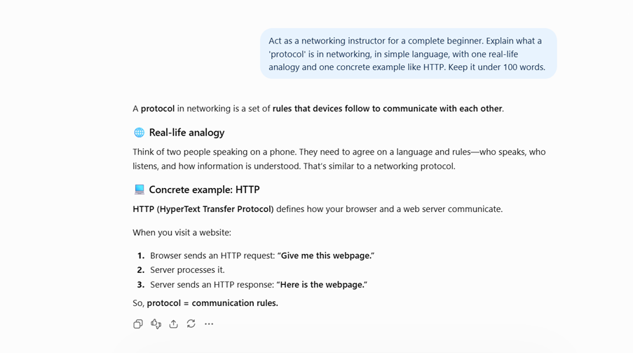
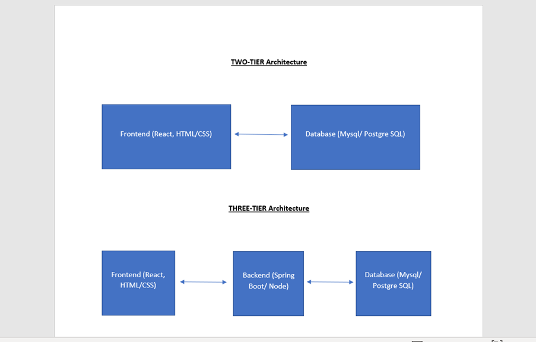
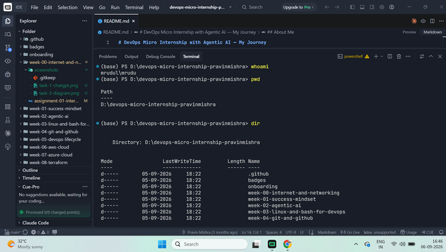

# Week 00 - Internet and Networking

Part of the DevOps Micro Internship (DMI) Cohort 3 with Agentic AI

---

# 🧑‍💻 Task 1: Using ChatGPT as Your Learning Assistant

## Scenario

You're new to DevOps and will frequently encounter technical questions. ChatGPT can be your learning companion.

## Your Task

Write a clear ChatGPT prompt to help you understand:

> "What is a protocol in networking? Explain with a simple real-life example."

Take a screenshot of your interaction showing:

* Your detailed prompt (with clear expectations)
* ChatGPT's simplified response with an example

## Screenshot

Save your screenshot in the `screenshots` folder and update the file name below.




Replace `task-1-chatgpt.png` with your actual screenshot file name.

---

## What I Learned (2–3 lines)

I learned that a networking protocol is a set of rules that devices follow to communicate with each other over a network connection. 
I also understood that protocols such as HTTP define how information is requested and exchanged between a client and a server in a web browser.

---

# 🌐 Task 2: Internet and Networking

## Scenario

Your friend is launching an online bookstore named **EpicReads**.

He asked you to explain how users globally can access his website hosted in Finland.

## Your Task

Write a short explanation (**100–150 words**) that includes:

* Packet Switching
* IP Address
* TCP/IP
* HTTP/HTTPS

💡 **Tip:** You may use ChatGPT (as demonstrated in Task 1) to refine your explanation.

## Answer

When someone in the USA opens the EpicReads website hosted in Finland, their request travels across the world — through undersea cables and many routers — to reach the server. The data is broken into small pieces called packets, and these packets can travel through different routes across the Internet to reach the server. The server then sends back the response, which is broken into packets and sent back to the user's device. This is called packet switching.

The server has an IP address, which helps the network identify where the website is located. TCP/IP provides the basic rules for sending and receiving this data between the user's device and the server. Finally, HTTP or HTTPS is used for communication between the browser and the website. HTTPS is more secure because it encrypts the data being exchanged between the user's device and the server, preventing unauthorized access.

---

# 🏗️ Task 3: Application Architecture & Stack

## Scenario

EpicReads bookstore has two application versions:

### Two-Tier Application

* Frontend
* Database

### Three-Tier Application

* Frontend
* Backend
* Database

## Your Task

* Draw simple diagrams (hand-drawn or tool-based such as draw.io)
* Label each layer clearly
* List at least two common technologies or tools used for each layer
* Submit a screenshot or photo clearly showing your own drawing

## Diagram Screenshot / Photo

Save your diagram image in the `screenshots` folder and update the file name below.




Replace `task-3-diagram.png` with your actual diagram file name.

---

## Technologies Used

### Frontend

* React (JavaScript library for building user interfaces)
* HTML, CSS, and JavaScript

### Backend

* Spring Boot (Java framework)
* Node.js with Express

### Database

* MySQL
* PostgreSQL

---

# 🌍 Task 4: Domain Name & DNS (Basic Concepts)

## Scenario

Your friend's bookstore **EpicReads** is currently accessible through:

```text
52.172.142.222:3000
```

He purchased the domain:

```text
epicreads.com
```

## Your Task

In **50–100 words**, explain in your own words:

1. What is DNS (Domain Name System)?
2. Which DNS record type should be used to connect the domain to the given IP, and why?

## Answer

DNS (Domain Name System) is like Internet's phonebook. It helps convert a domain name that is easy for people to remember, such as epicreads.com, into the IP address of the server where the website is hosted. 
For EpicReads, an A record should be used because it connects the domain name epicreads.com to the IPv4 address 52.172.142.222. 
The port number 3000 is separate from DNS and is handled by the application or web server as it is used to identify the specific service or application running on the server.

---

# 💻 Task 5: Visual Studio Code Setup (Hands-on)

## Your Task

Install Visual Studio Code (if not already installed).

Take a screenshot of your VS Code environment showing:

* Terminal open inside VS Code
* Running a basic command:

### Windows

```powershell
dir
```

### Linux / macOS

```bash
pwd
ls
```

* Your selected VS Code theme clearly visible

⚠️ **Important:** The screenshot must show your username or another identifiable detail to confirm it is your environment.

## Screenshot

Save your screenshot in the `screenshots` folder and update the file name below.




Replace `task-5-vscode.png` with your actual screenshot file name.

---

# 🔗 Task 6: Publish Your Assignment as a LinkedIn Post

## Objective

Publishing on LinkedIn helps you:

* Build your professional online presence
* Reinforce your learning
* Document your DevOps journey publicly

## Your Task

Summarize your answers from Tasks 1–5 into a LinkedIn post.

Clearly structure your post into the following sections:

* ChatGPT
* Internet & Networking
* App Architecture
* DNS
* VS Code Setup

Add the following credit note at the end of your post:

> **P.S. This post is part of the DevOps Micro Internship (DMI) with Agentic AI — Cohort 3 — by Pravin Mishra. My graded progress is public: https://dmi.pravinmishra.com/s/YOUR-GITHUB-USERNAME.html · Start your DevOps journey: https://dmi.pravinmishra.com/?utm_source=student&utm_medium=ps-linkedin&utm_campaign=cohort3**

---

## LinkedIn Post URL

Paste your LinkedIn post URL here: https://www.linkedin.com/posts/kuntal-tarwatkar-413653102_devops-devopsengineering-cloudcomputing-activity-7502331460188598273-gD9D?utm_source=share&utm_medium=member_desktop&rcm=ACoAABoUk48BjJ6tcAJGJOvvM2Qscd7M-agXhXg

---

## LinkedIn Post Backup Copy

Paste the full text of your LinkedIn post here:

🚀 𝗪𝗲𝗲𝗸 𝟬𝟬 𝗗𝗼𝗻𝗲 — 𝗗𝗲𝘃𝗢𝗽𝘀 𝗠𝗶𝗰𝗿𝗼 𝗜𝗻𝘁𝗲𝗿𝗻𝘀𝗵𝗶𝗽 | 𝗦𝗲𝗹𝗳-𝗣𝗮𝗰𝗲𝗱 𝗘𝗻𝗴𝗶𝗻𝗲𝗲𝗿 𝗧𝗿𝗮𝗰𝗸

I've officially started the 𝗗𝗲𝘃𝗢𝗽𝘀 𝗠𝗶𝗰𝗿𝗼 𝗜𝗻𝘁𝗲𝗿𝗻𝘀𝗵𝗶𝗽 — Self-Paced Engineer Track, and Week 00 was all about strengthening the fundamentals of Internet, networking, application architecture, DNS, and development tools.
Here's what I worked on this week:

🤖 𝗖𝗵𝗮𝘁𝗚𝗣𝗧
 I explored how to use ChatGPT as a learning assistant by creating structured prompts and using simple real-world examples to understand technical concepts. One of the concepts I worked on was 𝗻𝗲𝘁𝘄𝗼𝗿𝗸𝗶𝗻𝗴 𝗽𝗿𝗼𝘁𝗼𝗰𝗼𝗹𝘀 and how they help different devices communicate with each other.

🌐 𝗜𝗻𝘁𝗲𝗿𝗻𝗲𝘁 & 𝗡𝗲𝘁𝘄𝗼𝗿𝗸𝗶𝗻𝗴
 I worked through the fundamentals of how data moves across the Internet, including:
 🔹 𝗣𝗮𝗰𝗸𝗲𝘁 𝗦𝘄𝗶𝘁𝗰𝗵𝗶𝗻𝗴
 🔹 𝗜𝗣 𝗔𝗱𝗱𝗿𝗲𝘀𝘀𝗲𝘀
 🔹 𝗧𝗖𝗣/𝗜𝗣
 🔹 𝗛𝗧𝗧𝗣/𝗛𝗧𝗧𝗣𝗦
 This helped me better understand what happens behind the scenes when we access a website.

🏗️ 𝗔𝗽𝗽𝗹𝗶𝗰𝗮𝘁𝗶𝗼𝗻 𝗔𝗿𝗰𝗵𝗶𝘁𝗲𝗰𝘁𝘂𝗿𝗲
 I explored 𝗧𝘄𝗼-𝗧𝗶𝗲𝗿 and 𝗧𝗵𝗿𝗲𝗲-𝗧𝗶𝗲𝗿 Application Architecture and understood how the different layers interact.
 Two-Tier: Frontend → Database
 Three-Tier: Frontend → Backend → Database
 I also explored technologies commonly used across these layers, including React, Spring Boot, Node.js, PostgreSQL, and MySQL.

🌍 𝗗𝗡𝗦
 I learned how DNS translates a human-readable domain name into an IP address, and why an 𝗔 𝗿𝗲𝗰𝗼𝗿𝗱 is used to connect a domain to an IPv4 address. I also understood the difference between an IP address and a port, and how they serve different purposes.

💻 𝗩𝗦 𝗖𝗼𝗱𝗲 𝗦𝗲𝘁𝘂𝗽
 I set up my VS Code environment and worked with the integrated terminal to execute basic commands as part of the hands-on setup.
Week 00 focused on fundamentals, but the bigger goal is to turn these concepts into 𝗽𝗿𝗮𝗰𝘁𝗶𝗰𝗮𝗹 𝗗𝗲𝘃𝗢𝗽𝘀 𝗲𝗻𝗴𝗶𝗻𝗲𝗲𝗿𝗶𝗻𝗴 𝘀𝗸𝗶𝗹𝗹𝘀 through consistent hands-on work.

Looking forward to going deeper into Linux, Git, cloud, containers, CI/CD, Kubernetes, Infrastructure as Code, monitoring, and automation.

𝗟𝗲𝗮𝗿𝗻𝗶𝗻𝗴 → 𝗕𝘂𝗶𝗹𝗱𝗶𝗻𝗴 → 𝗨𝗻𝗱𝗲𝗿𝘀𝘁𝗮𝗻𝗱𝗶𝗻𝗴 → 𝗜𝗺𝗽𝗿𝗼𝘃𝗶𝗻𝗴 🚀

#DevOps #DevOpsEngineering #CloudComputing #LearningInPublic #AgenticAI

P.S. This post is part of the DevOps Micro Internship (DMI) — Self-Paced Engineer Track — by Pravin Mishra. 
My graded progress is public: https://dmi.pravinmishra.com/s/tarwatkarkuntal315.html 
Start your DevOps journey: https://dmi.pravinmishra.com/?utm_source=student&utm_medium=ps-linkedin&utm_campaign=self-paced
 
#DMIByPravinMishra

---

# Reflection – Week 0

### What did you find easy?

I found the basic networking and DNS concepts easy to understand after going through the examples. Creating the application architecture diagrams was also easy once I understood the difference between two-tier and three-tier architecture.

---

### What was difficult?

The difficult part for me was understanding how all the networking concepts are connected. I understood IP address, DNS, ports, TCP/IP, and HTTP/HTTPS separately, but it took some time to understand how they work together when we open a website.

---

### What will you improve next week?

Next week, I want to focus more on practical work. I want to practice Linux commands, Git, networking, and other DevOps tools so that I can understand these concepts better by actually working with them.

---

## 📌 About DMI & CloudAdvisory

DevOps Micro Internship (DMI) is a project-based DevOps program run by Pravin Mishra (The CloudAdvisory) focused on real-world execution, systems thinking, and career readiness.

It helps learners build strong DevOps foundations with hands-on experience.


## 📌 Resources

- 🌐 **DMI Official Website:** https://dmi.pravinmishra.com?utm_source=github&utm_medium=readme  
- 🎓 **University:** https://university.pravinmishra.com?utm_source=github&utm_medium=readme  
- 💬 **Discord Community:** https://discord.pravinmishra.com?utm_source=github&utm_medium=readme  
- 📝 **Blog:** https://dmi.pravinmishra.com/blog?utm_source=github&utm_medium=readme  
- ▶️ **YouTube Playlist (DMI Cohort 3):** https://www.youtube.com/playlist?list=PLFeSNDtI4Cho  
- 🔗 **Pravin Mishra (LinkedIn):** https://www.linkedin.com/in/pravin-mishra-aws-trainer/  
- 🏢 **CloudAdvisory (LinkedIn):** https://www.linkedin.com/company/thecloudadvisory/

---

*This submission is part of DevOps Micro Internship (DMI) Cohort 3 — Agentic AI Track*