# Assignment 3 — Production Maintenance Drill (OPS Checklist)

Part of the DevOps Micro Internship (DMI) Cohort 3 with Agentic AI

---

## Purpose

In this assignment, you will treat your already deployed React application (on Ubuntu VM with Nginx) as a live production system. You will perform structured operational checks covering network validation, service health, log analysis, resource monitoring, configuration verification, and incident simulation with recovery — mirroring real on-call DevOps responsibilities.

---

# Task 1 — Server Access & Networking Validation

## Goal

Verify that the deployed React application is reachable from the browser and confirm basic network connectivity of the Ubuntu VM.

### Evidence

#### Screenshot 1 — Browser showing the React app with your Full Name visible on the UI

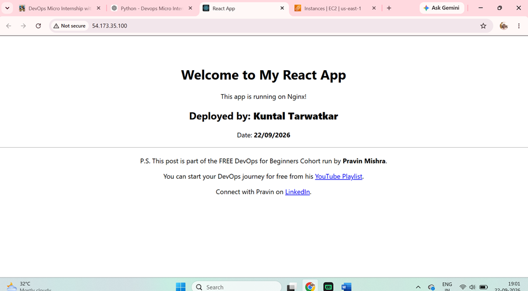

---

#### Screenshot 2 — Output of `ip a`

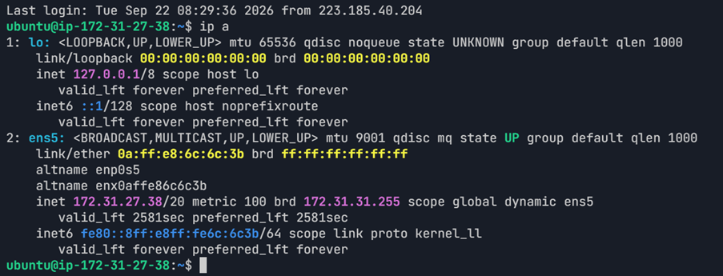

---

#### Screenshot 3 — Output of `sudo ss -tulpen`

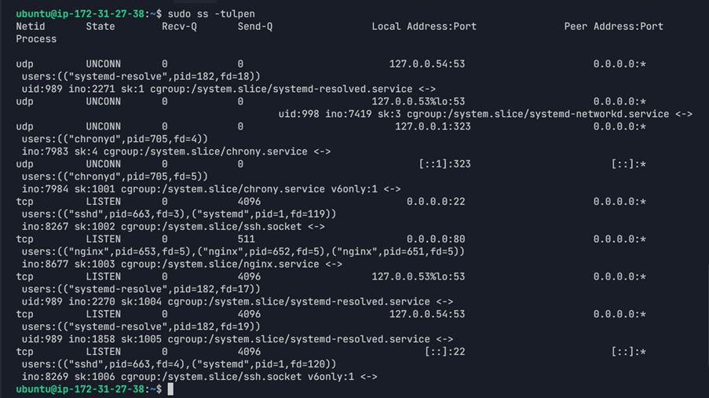

---

#### Screenshot 4 — Output of `sudo ufw status`

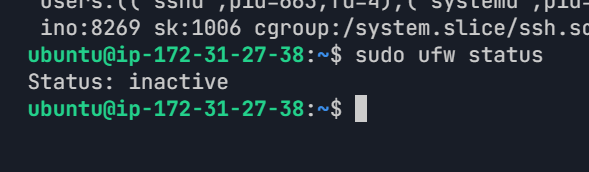

---

### Notes

Answer the following in your own words:

**1. What proves Nginx is listening on 0.0.0.0:80?**

The `sudo ss -tulpen` output shows `0.0.0.0:80` in LISTEN state and the process is `nginx`. This confirms that Nginx is listening for HTTP connections on port 80.

---

**2. What proves SSH is active on port 22?**

The `sudo ss -tulpen` output shows `0.0.0.0:22` in LISTEN state and the process is `sshd`. This confirms that SSH is active on port 22.

---

**3. Did you find any unexpected open ports? Explain briefly.**

No major unexpected external ports are open. Ports 22 and 80 are required for SSH access and the web application. The other ports shown are bound to localhost or internal services such as DNS and time synchronization.

---

# Task 2 — Service Health & Systemd Validation (Nginx)

## Goal

Verify that Nginx is properly installed, running, enabled at boot, and safely configured.

### Evidence

#### Screenshot 1 — Output of `systemctl status nginx --no-pager`

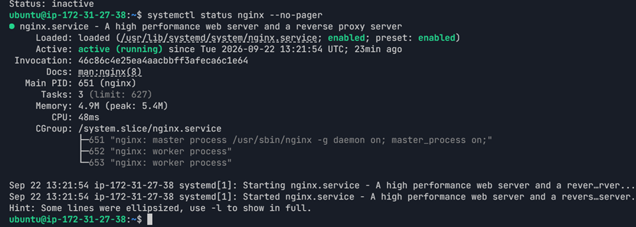

---

#### Screenshot 2 — Output of `sudo nginx -t`

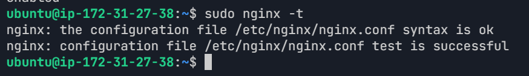

---

#### Screenshot 3 — Output of `sudo ss -lptn '( sport = :80 )'`

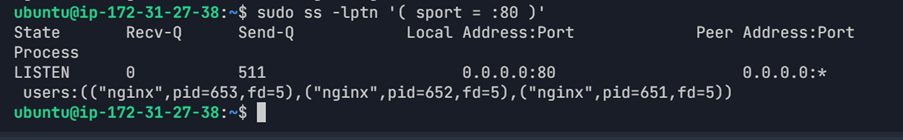

---

### Notes

Answer the following in your own words:

**1. What happens if Nginx fails to restart in production?**

The website may become unavailable because Nginx will not be able to serve the application. Users may receive connection errors or the site may stop responding.

---

**2. What's your basic rollback plan?**

First, check the Nginx configuration with `nginx -t` and review the error logs. If a recent configuration change caused the issue, restore the previous working configuration and restart Nginx. Then verify the application URL and confirm that the service is active.

---

# Task 3 — Logs & Request Trace

## Goal

Verify real traffic flow and analyze logs to understand system behavior and errors.

### Evidence

#### Screenshot 1 — Output of `sudo tail -n 30 /var/log/nginx/access.log`

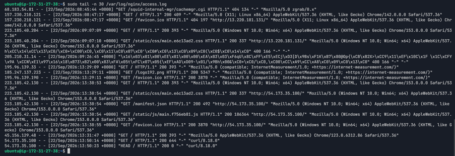

---

#### Screenshot 2 — Output of `sudo tail -n 30 /var/log/nginx/error.log`

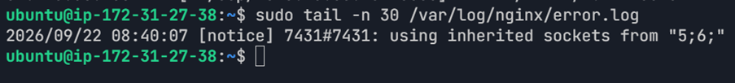

---

#### Screenshot 3 — Output of `sudo journalctl -u nginx --no-pager -n 50`

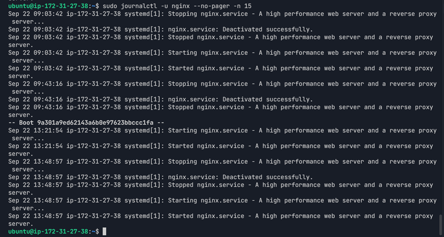

---

### Notes

Answer the following in your own words:

**1. Were there any errors in the logs?**

- If yes, mention 1–2 example error lines from the logs and explain what each one means in simple terms.
- If no, explain what it means if the error log is empty or shows no recent errors during your check.

The Nginx error log does not show any actual errors. It contains a startup notice about inherited sockets. The access log also shows successful `200` responses for the application and curl requests.

---

**2. If there were no errors, what does that indicate about the system?**

It indicates that Nginx was running normally during the check and was able to serve requests successfully. The successful `200` responses show that the web application was responding correctly.

---

**3. Based on the access logs, were your curl requests visible in the log entries? What does that prove about traffic flow?**

Yes. The access log shows a `GET /` request with status `200` and user agent `curl/8.18.0`. It also shows the `HEAD /` request with status `200`. This proves that the curl requests reached the server, were handled by Nginx, and received successful responses.

---

# Task 4 — System Resource Health Check (Capacity Red Flags)

## Goal

Assess server capacity and detect potential performance or failure risks.

### Evidence

#### Screenshot 1 — Output of `uptime`

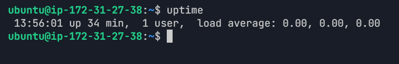

---

#### Screenshot 2 — Output of `free -h`

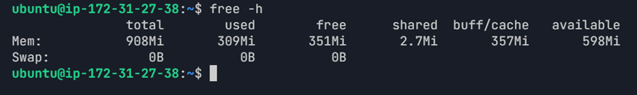

---

#### Screenshot 3 — Output of `df -h`

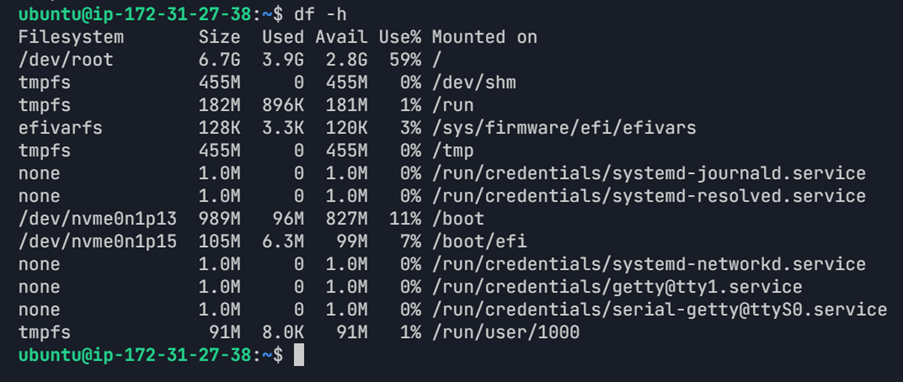

---

#### Screenshot 4 — Output of `sudo du -sh /var/* | sort -h`

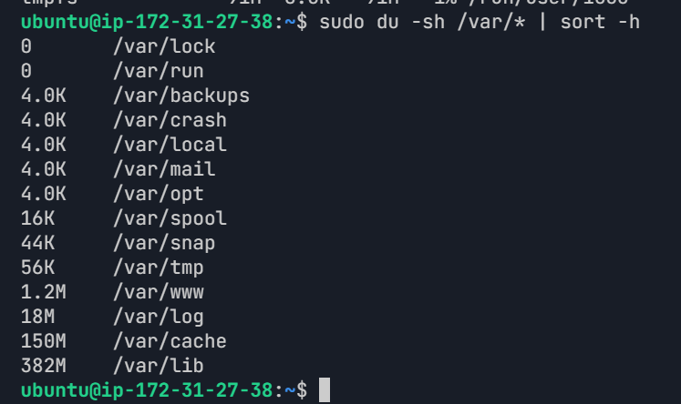

---

### Notes

Answer the following in your own words:

**1. Which resource looks most critical right now? (CPU/load, memory, or disk) Explain why.**

Disk usage is the most noticeable resource at the moment because the root filesystem is at 59% usage. Memory is still available, and the system load is low, so there is no immediate resource problem.

---

**2. What happens if disk becomes 100% full in a production server?**

If the disk becomes full, the system may not be able to write logs, create temporary files, update packages, or store application data. This can cause services such as Nginx or other system processes to fail.

---

# Task 5 — Configuration & Deployment Verification

## Goal

Ensure the correct React build is deployed and Nginx is serving it properly.

### Evidence

#### Screenshot 1 — Output of `ls -lah /var/www/html | head -n 20`

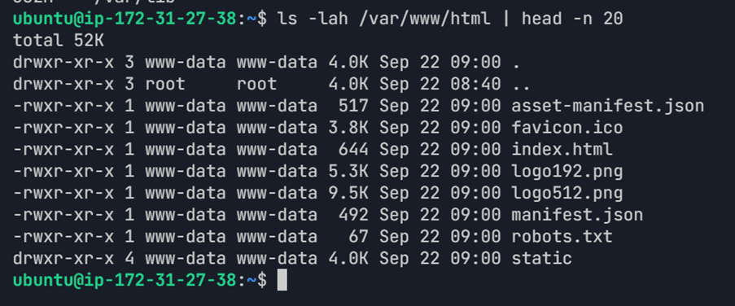

---

#### Screenshot 2 — Output of `grep -R "Deployed by" -n /var/www/html 2>/dev/null | head`

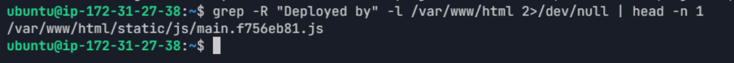

---

#### Screenshot 3 — Output of `grep -n "try_files" /etc/nginx/sites-available/default`

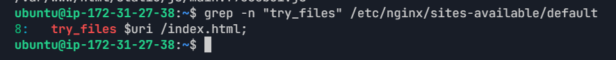

---

### Notes

Answer the following in your own words:

**1. How do you confirm that the correct version of the application is deployed?**

The deployed version was confirmed by checking the files in `/var/www/html`, finding the "Deployed by" text in the React build, and checking the Nginx configuration. The web root contains the React build files, and Nginx uses `/var/www/html` with `try_files $uri /index.html;`. The application was also verified through the browser.

---

# Task 6 — Nginx Configuration Failure Simulation

## Goal

Simulate a real-world Nginx misconfiguration and recover the service safely.

### Evidence

#### Screenshot 1 — Output of `sudo nginx -t` showing the syntax error (broken config)

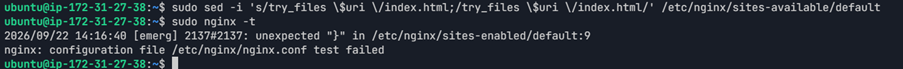

---

#### Screenshot 2 — Output of `sudo nginx -t` showing syntax ok (fixed config)

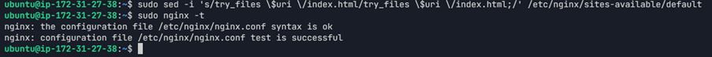

---

#### Screenshot 3 — Output of `curl -I http://<public-ip>` confirming recovery (200 OK)

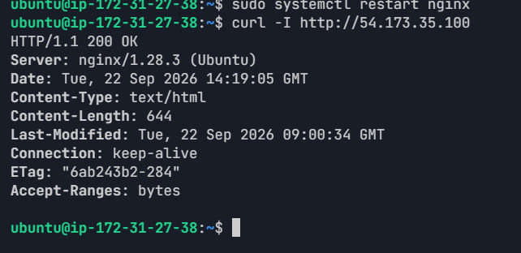

---

### Notes

Answer the following in your own words:

**1. What caused the configuration failure?**

The semicolon was removed from the try_files directive in the Nginx configuration. Because of this syntax error, nginx -t failed.

---

**2. How did you fix the issue?**

I restored the missing semicolon and ran sudo nginx -t again. The configuration test passed successfully, so I restarted Nginx and verified the application with curl.

---

**3. How can you avoid this kind of issue in real production systems?**

Nginx configuration should always be tested with nginx -t before restarting or reloading the service. Configuration changes should also be reviewed carefully and kept under version control.

---

# Task 7 — Web Application Failure Simulation

## Goal

Simulate missing deployment content and recover the application safely.

### Evidence

#### Screenshot 1 — Output of `curl -I http://<public-ip>` showing failure (non-200 response)

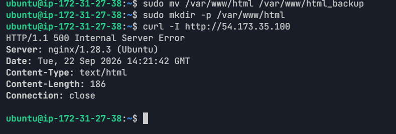

---

#### Screenshot 2 — Output of `curl -I http://<public-ip>` confirming recovery (200 OK)

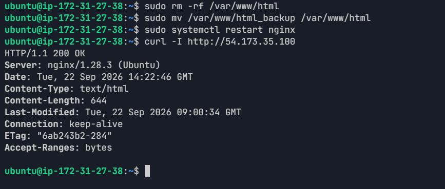

---

### Notes

Answer the following in your own words:

**1. What caused the application to break in this scenario?**

The /var/www/html directory containing the deployed React application was temporarily moved, so Nginx could not find the application files and returned a 500 Internal Server Error.

---

**2. How did you fix the issue and restore the application?**

I restored the original /var/www/html directory from the backup, restarted Nginx, and verified the application using curl. The response changed back to HTTP/1.1 200 OK.

---

**3. What steps would you take to prevent this kind of issue in real production systems?**

Deployment files should be backed up before making changes, and deployment steps should be tested carefully. A rollback copy can help restore the application quickly if a deployment causes a failure.

---

# Task 8 — Security & Reliability Review

## Goal

Review and reflect on the security and reliability practices applied during this assignment.

### Security & Reliability Notes

Answer the following in your own words:

**1. Why is SSH key-based authentication more secure than sharing passwords?**

SSH key-based authentication is more secure because it uses a private key and a public key instead of relying only on a password. The private key stays with the user and should not be shared.

---

**2. Why should only required ports be open on a production server?**

Only required ports should be open to reduce the server's exposure to unwanted network access. In this setup, SSH port 22 is needed for administration and HTTP port 80 is needed for the web application.

---

**3. Why is it important for Nginx to be enabled on boot?**

Nginx should be enabled on boot so that it starts automatically when the server restarts. This helps the web application become available without manually starting Nginx.

---

**4. What are the risks of sharing secrets, keys, or credentials publicly?**

Sharing secrets, private keys, or credentials publicly can allow unauthorized people to access systems or services. These details should be kept private and should never be committed to a public repository.

---

**5. Why should cloud resources be stopped or terminated when they are no longer needed?**

Unused cloud resources can consume credits or create charges depending on the service and account limits. Stopping or terminating resources that are no longer needed helps control costs and keeps the environment clean.

---

# LinkedIn Post (Required)

## Evidence

#### LinkedIn Post URL

Paste your LinkedIn post URL here:

https://www.linkedin.com/feed/update/urn:li:activity:7508173390705266689/

---

#### Screenshot — Published LinkedIn post

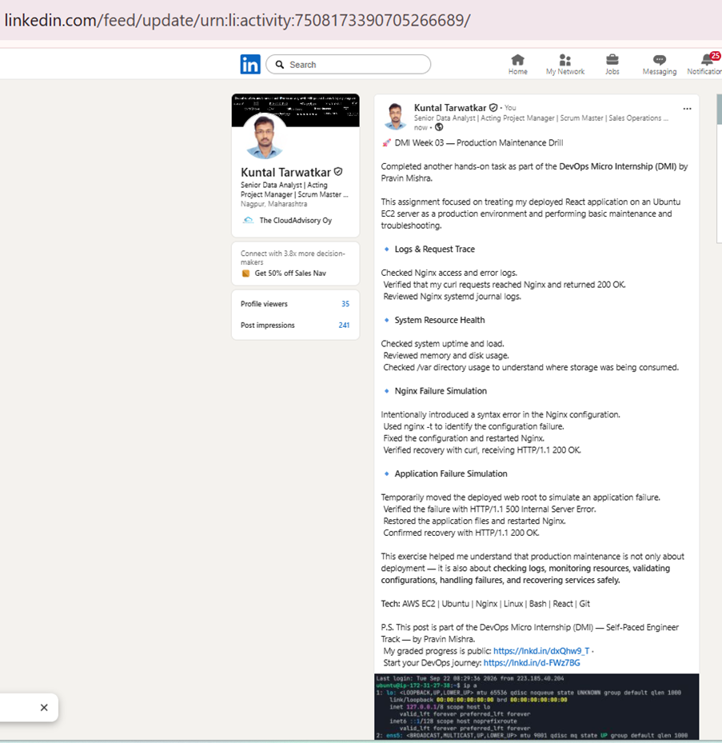

---

# Submission Instructions

- Add all required screenshots in your submission
- Full name must be visible in required screenshots
- Do not expose sensitive information (keys, passwords, account IDs)

---

# Completion Checklist

- [x] Task 1: Screenshots (browser, ip a, ss -tulpen, ufw status) + Notes answered
- [x] Task 2: Screenshots (nginx status, nginx -t, ss port 80) + Notes answered
- [x] Task 3: Screenshots (access log, error log, journalctl) + Notes answered
- [x] Task 4: Screenshots (uptime, free -h, df -h, du -sh) + Notes answered
- [x] Task 5: Screenshots (ls html, grep deployed by, grep try_files) + Notes answered
- [x] Task 6: Screenshots (nginx -t fail, nginx -t pass, curl recovery) + Notes answered
- [x] Task 7: Screenshots (curl failure, curl recovery) + Notes answered
- [x] Task 8: Security & Reliability Notes answered
- [x] LinkedIn post published and URL submitted
- [x] Full Name visible in all required screenshots
- [x] No sensitive data exposed

---

## 📌 About DMI & CloudAdvisory

DevOps Micro Internship (DMI) is a project-based DevOps program run by Pravin Mishra (The CloudAdvisory) focused on real-world execution, systems thinking, and career readiness.

It helps learners build strong DevOps foundations with hands-on experience.

---

## 📌 Resources

- 🌐 DMI Official Website: https://dmi.pravinmishra.com?utm_source=github&utm_medium=readme  
- 🎓 University: https://university.pravinmishra.com?utm_source=github&utm_medium=readme  
- 💬 Discord Community: https://discord.pravinmishra.com?utm_source=github&utm_medium=readme  
- 📝 Blog: https://dmi.pravinmishra.com/blog?utm_source=github&utm_medium=readme  
- ▶️ YouTube Playlist: https://www.youtube.com/playlist?list=PLFeSNDtI4Cho  
- 🔗 Pravin Mishra (LinkedIn): https://www.linkedin.com/in/pravin-mishra-aws-trainer/  
- 🏢 CloudAdvisory (LinkedIn): https://www.linkedin.com/company/thecloudadvisory/

---

*This submission is part of DevOps Micro Internship (DMI) Cohort 3 — Agentic AI Track.*