# Assignment 5 — Bash Script Automation Drill (OPS Checklist)

Part of the DevOps Micro Internship (DMI) Cohort 3 with Agentic AI

---

## Purpose

In this assignment, you will practice Bash scripting by building a series of small automation scripts covering environment setup, variables, arrays, loops, file conditionals, if-else logic, and functions. These scripts form the foundation of real-world Linux automation used in DevOps, cloud, and production support environments.

---

# Task 1 — Bash Environment & Workspace Setup

## Goal

Verify that Bash is available on your system and create a clean workspace for this assignment.

### Evidence

#### Screenshot 1 — Output of `echo $SHELL` and `bash --version`

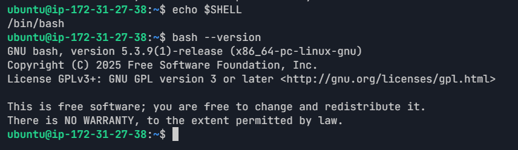

---

#### Screenshot 2 — Output of `pwd` and `ls -lah` showing the scripts directory

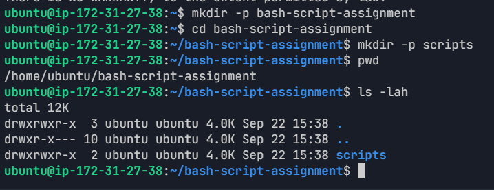

---

### Notes

Answer the following in your own words:

**1. What is Bash?**

Bash is a command-line shell used to run commands and scripts in Linux. It helps us perform tasks like creating files, managing directories, and automating repeated work.

---

**2. What is the difference between shell and Bash?**

A shell is a program that allows us to interact with the operating system through commands. Bash is one specific type of shell and is commonly used in Linux systems.

---

**3. Why is it important to confirm the Bash version before writing scripts?**

Bash version compatibility is crucial for scripts to work as expected. Different versions of Bash may have slight differences in syntax and features, and it's important to ensure that the scripts are compatible with the version you are using.

---

# Task 2 — Your First Bash Script

## Goal

Create your first Bash script, make it executable, and run it from the terminal.

### Evidence

#### Screenshot 1 — Content of `first-script.sh`

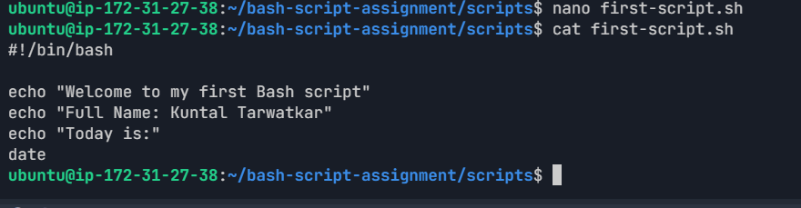

---

#### Screenshot 2 — Output of `./first-script.sh`

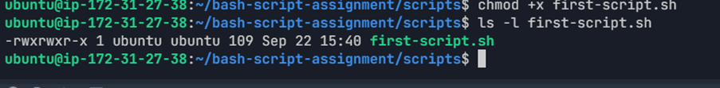

---

#### Screenshot 3 — Output of `ls -l first-script.sh` showing executable permission

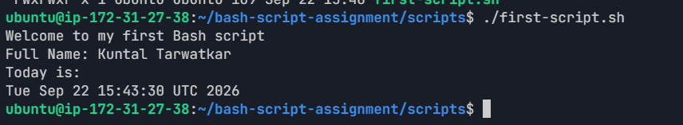

---

### Notes

Answer the following in your own words:

**1. What is the purpose of `#!/bin/bash`?**

It tells the system to use Bash to run the script.

---

**2. Why do we use `chmod +x` before running a script?**

It gives the script execute permission so we can run it directly using ./first-script.sh.
---

**3. What is the difference between running a script using `./script.sh` and `bash script.sh`?**

./script.sh runs the script directly and requires execute permission. bash script.sh starts Bash and asks it to run the script, so the execute permission is not required.

---

# Task 3 — Variables: User Information Script

## Goal

Use variables to store and display user-related information.

### Evidence

#### Screenshot 1 — Content of `user-info.sh`

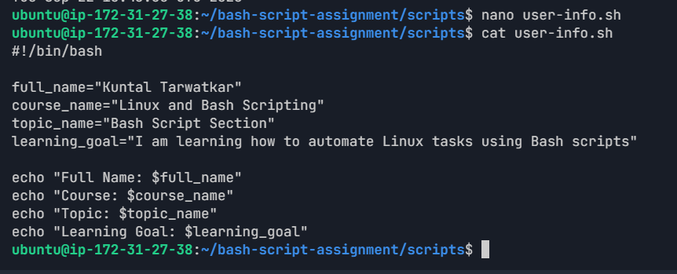


---

#### Screenshot 2 — Output of `./user-info.sh`

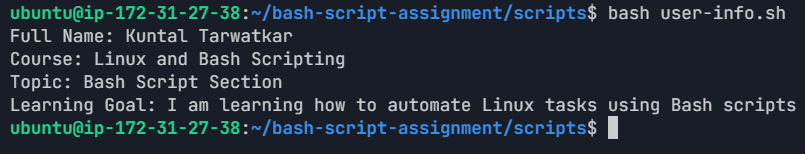


---

### Notes

Answer the following in your own words:

**1. What is a variable in Bash?**

A variable stores a value that can be used later in a script. For example, full_name stores my name.

---

**2. Why should we avoid spaces around the `=` sign when creating variables?**

Bash treats spaces as separators between commands and arguments. Therefore, name="Kuntal" is correct, while name = "Kuntal" is not a valid variable assignment.

---

**3. How do you access the value stored inside a Bash variable?**

We use $ before the variable name, such as $full_name.

---

# Task 4 — Arrays & Loops: Tools Checklist Script

## Goal

Use arrays and loops to print a checklist of tools used in Bash scripting.

### Evidence

#### Screenshot 1 — Content of `tools-checklist.sh`

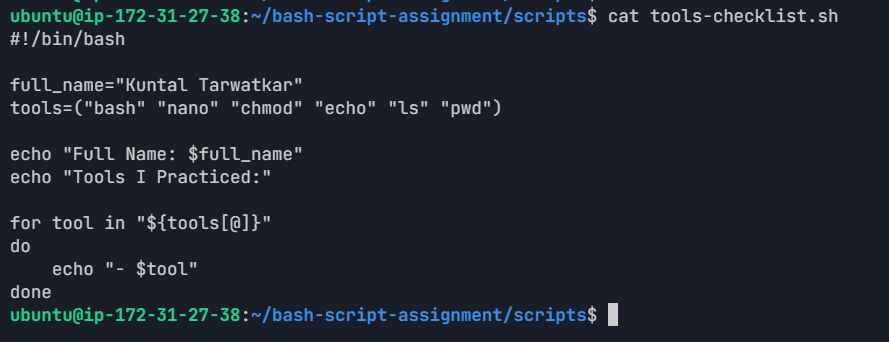


---

#### Screenshot 2 — Output of `./tools-checklist.sh`

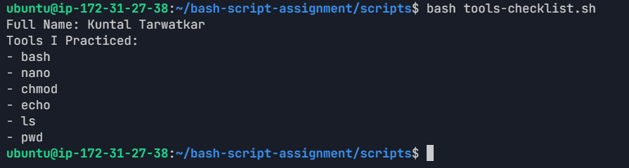

---

### Notes

Answer the following in your own words:

**1. What is an array in Bash?**

A Bash array stores multiple values under one variable name. In this task, the array stores the tools I practiced.

---

**2. Why are arrays useful in scripts?**

Arrays are useful when we need to work with multiple related values. A loop can process each value without writing the same command many times.

---

**3. What does `"${tools[@]}"` mean?**

It accesses all the elements stored in the tools array.

---

**4. What is the purpose of the `for` loop in this script?**

The for loop goes through each tool in the array and prints it.

---

# Task 5 — Loops: Number Counter Script

## Goal

Use loops to repeat a task multiple times.

### Evidence

#### Screenshot 1 — Content of `counter.sh`

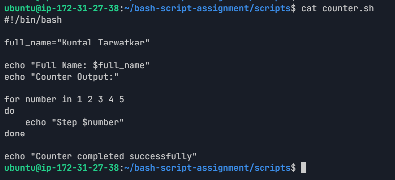

---

#### Screenshot 2 — Output of `./counter.sh`

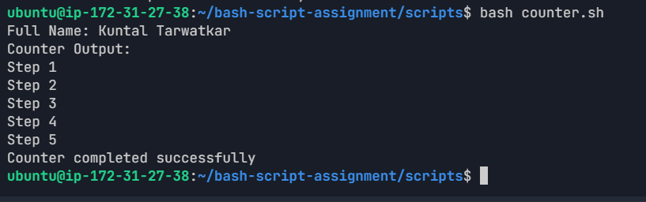


---

### Notes

Answer the following in your own words:

**1. What is a loop?**

A loop is a way to repeat the same set of commands multiple times. In my script, the loop goes through the numbers 1 to 5 and prints each step.

---

**2. Why do we use loops in Bash scripting?**

Loops allow us to repeat the same operation multiple times without writing the same command separately for every repetition. They are useful for automating repeated tasks.

---

**3. How many times did the loop run in your script?**

The loop ran **5 times**, once for each number from 1 to 5.

---

**4. What would you change if you wanted the loop to run 10 times?**

I would change the numbers in the loop from:

```bash
for number in 1 2 3 4 5 6 7 8 9 10

```

---

# Task 6 — Files & Conditionals: File Validation Script

## Goal

Use file checks and conditionals to verify whether files and directories exist.

### Evidence

#### Screenshot 1 — Output of `ls -lah ../test-folder`

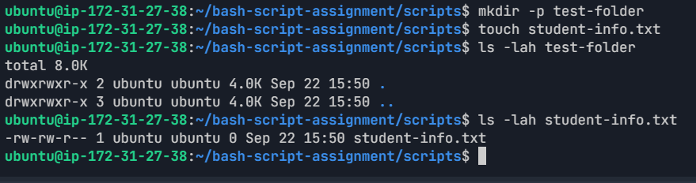


---

#### Screenshot 2 — Content of `file-check.sh`

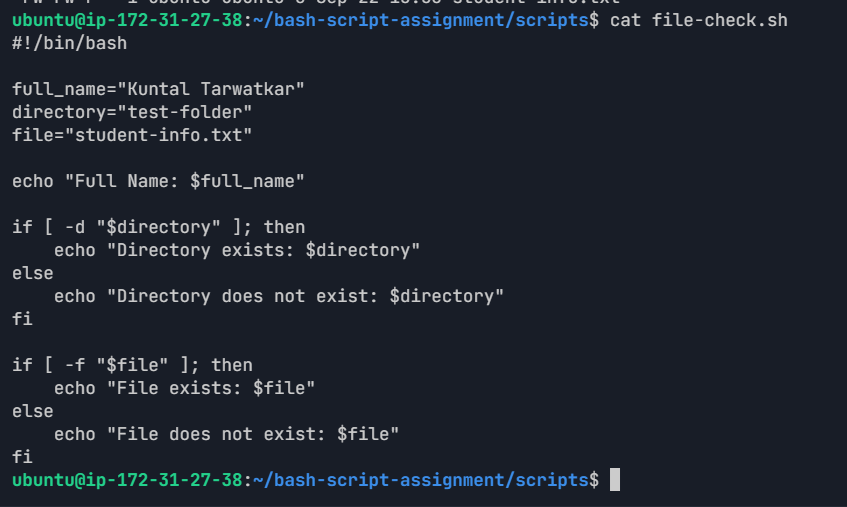

---

#### Screenshot 3 — Output of `./file-check.sh`

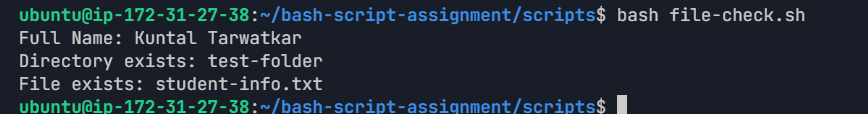

---

### Notes

Answer the following in your own words:

**1. What does `-d` check in Bash?**

-d checks whether the specified path exists and is a directory.

---

**2. What does `-f` check in Bash?**

-f checks whether the specified path exists and is a regular file.

---

**3. Why should file and directory paths be stored in variables?**

It makes the script easier to read and update. We can change the path in one place instead of changing it in multiple conditions.

---

**4. What happens if the file does not exist?**

The -f condition becomes false, so the else section runs and the script prints that the file does not exist.

---

# Task 7 — Conditionals: Pass or Retry Script

## Goal

Use if-else conditionals to make decisions based on a variable value.

### Evidence

#### Screenshot 1 — Content of `score-check.sh` with `score=85`

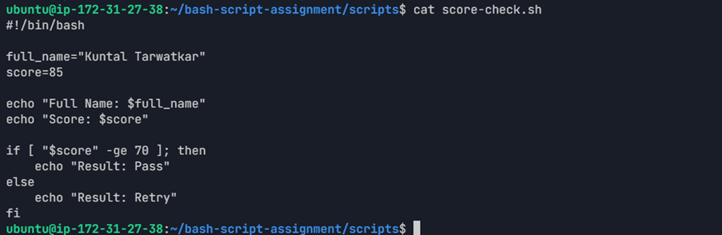

---

#### Screenshot 2 — Output showing `Result: Pass`

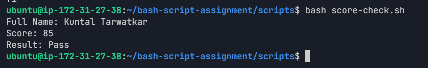

---

#### Screenshot 3 — Content of `score-check.sh` with `score=55`

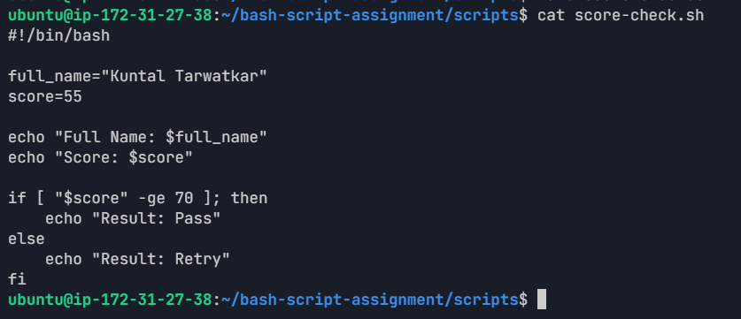

---

#### Screenshot 4 — Output showing `Result: Retry`

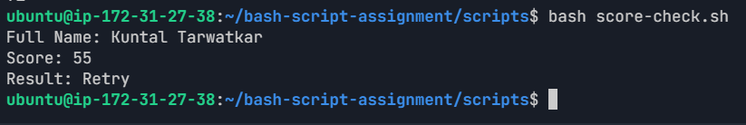

---

### Notes

Answer the following in your own words:

**1. What is the purpose of if-else in Bash?**

It allows a script to make a decision based on a condition.

---

**2. What does `-ge` mean?**

-ge means "greater than or equal to" when comparing numbers.

---

**3. Why should conditions be tested with different values?**

We tested both values to make sure the script works for both conditions. With 85 it returned Pass, and with 55 it returned Retry.

---

**4. How can conditionals help in automation scripts?**

It can be used to make decisions automatically, such as checking whether a server is healthy, whether a file exists, or whether a value meets a required condition.

---

# Task 8 — Functions: Final Bash Automation Script

## Goal

Create a final Bash script using functions to organize reusable code.

### Evidence

#### Screenshot 1 — Content of `final-automation.sh`

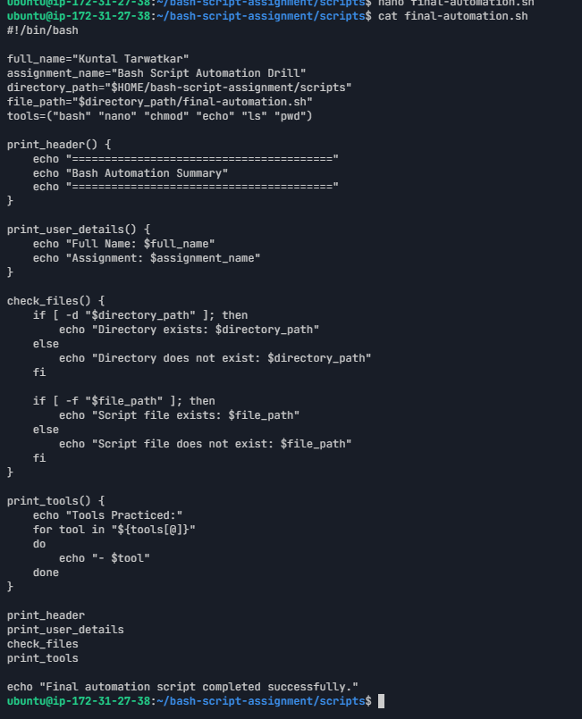

---

#### Screenshot 2 — Output of `./final-automation.sh`

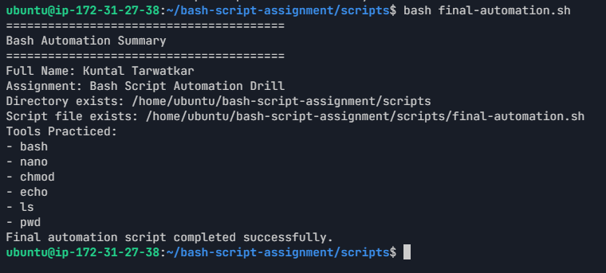

---

#### Screenshot 3 — Output of `ls -lah` showing all created scripts

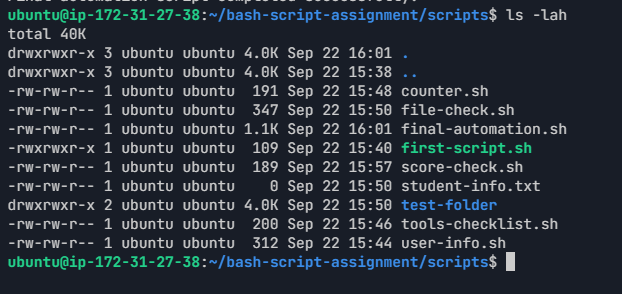

---

### Notes

Answer the following in your own words:

**1. What is a function in Bash?**

A function is a group of commands given a name. We can call the function whenever we need to perform that particular operation.

---

**2. Why are functions useful in scripts?**

Functions make scripts easier to organize and maintain. They also prevent us from repeating the same commands.

---

**3. Which functions did you create in this script?**

I created four functions:

print_header
print_user_details
check_files
print_tools

---

**4. How does this final script combine variables, arrays, loops, conditionals, files, and functions?**

The final script uses variables, an array, a for loop, if-else conditions, file and directory checks, and functions. It combines these concepts into one script that performs several checks and prints a final summary.

---

# LinkedIn Post (Required)

## Evidence

#### LinkedIn Post URL

Paste your LinkedIn post URL here:

https://www.linkedin.com/feed/update/urn:li:activity:7508204012416974849/

---

#### Screenshot — Published LinkedIn post

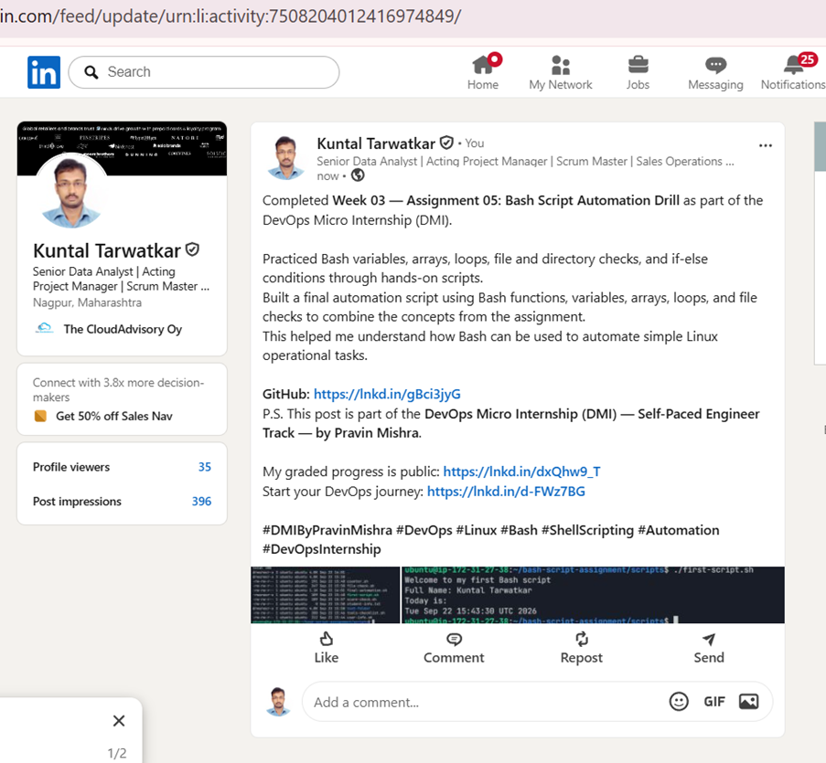

---

# Submission Instructions

- Add all required screenshots in your submission
- Full name must be visible in required screenshots
- All script files must be created and run successfully
- Required notes must be answered clearly for every task
- Do not expose sensitive information (keys, passwords, credentials)

---

# Completion Checklist

- [x] Task 1: Environment setup verified, workspace created (Screenshots 1–2, Notes answered)
- [x] Task 2: First script created, executed, permissions verified (Screenshots 1–3, Notes answered)
- [x] Task 3: Variables script created and run (Screenshots 1–2, Notes answered)
- [x] Task 4: Arrays and loops script created and run (Screenshots 1–2, Notes answered)
- [x] Task 5: Counter loop script created and run (Screenshots 1–2, Notes answered)
- [x] Task 6: File validation script created and run (Screenshots 1–3, Notes answered)
- [x] Task 7: Pass/Retry conditional script tested with both values (Screenshots 1–4, Notes answered)
- [x] Task 8: Final automation script created and run (Screenshots 1–3, Notes answered)
- [x] All scripts run without errors
- [x] Full Name visible in all required screenshots
- [x] LinkedIn post published and URL submitted
- [x] No sensitive data exposed

---

## 📌 About DMI & CloudAdvisory

DevOps Micro Internship (DMI) is a project-based DevOps program run by Pravin Mishra (The CloudAdvisory) focused on real-world execution, systems thinking, and career readiness.

It helps learners build strong DevOps foundations with hands-on experience.

---

## 📌 Resources

- 🌐 DMI Official Website: https://dmi.pravinmishra.com?utm_source=github&utm_medium=readme  
- 🎓 University: https://university.pravinmishra.com?utm_source=github&utm_medium=readme  
- 💬 Discord Community: https://discord.pravinmishra.com?utm_source=github&utm_medium=readme  
- 📝 Blog: https://dmi.pravinmishra.com/blog?utm_source=github&utm_medium=readme  
- ▶️ YouTube Playlist: https://www.youtube.com/playlist?list=PLFeSNDtI4Cho  
- 🔗 Pravin Mishra (LinkedIn): https://www.linkedin.com/in/pravin-mishra-aws-trainer/  
- 🏢 CloudAdvisory (LinkedIn): https://www.linkedin.com/company/thecloudadvisory/

---

*This submission is part of DevOps Micro Internship (DMI) Cohort 3 — Agentic AI Track.*