# Assignment 6 — Build an AI-Assisted Linux Health Check (AI-Assisted Linux Incident Triage)

Part of the DevOps Micro Internship (DMI) Cohort 3 with Agentic AI

---

## Purpose

In this assignment, you will build a read-only Bash triage script that checks the health of your Ubuntu server and Nginx application, connect it to Claude Code as a reusable `/linux-triage` skill, simulate a controlled Nginx incident, use the skill to gather and analyze evidence, recover the service manually, and verify recovery. The workflow follows the Agentic Loop: Gather → Analyze → Human Act → Verify.

---

# Task 1 — Confirm the Healthy Baseline and Create the Workspace

## Goal

Confirm that Nginx and the React application are healthy before building the automation.

### Evidence

#### Screenshot 1 — Output of `systemctl is-active nginx`, `ss -ltn | grep ':80'`, and `curl -I http://localhost`

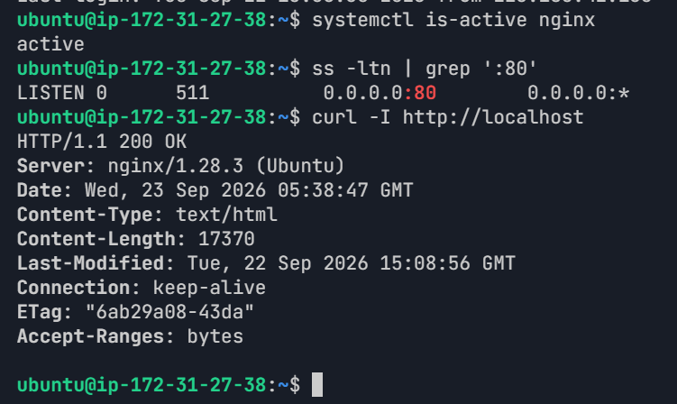

---

#### Screenshot 2 — Output of `pwd` and `find . -maxdepth 4 -type d | sort` showing the workspace folder structure

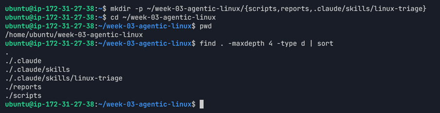

---

### Notes

Answer the following in your own words:

**1. What proves that Nginx is running?**

systemctl is-active nginx returned active. This proves that the Nginx service is currently running.---

**2. What proves that the server is listening for HTTP traffic?**

The ss -ltn | grep ':80' command showed port 80 in the LISTEN state. This proves that the server is listening for HTTP traffic.

**3. Why must you capture a healthy baseline before simulating an incident?**

A healthy baseline gives us a known-good state to compare with after the incident. It helps us identify what changed and confirm whether the service was recovered successfully.

# Task 2 — Create Project Context and Safety Rules in CLAUDE.md

## Goal

Tell Claude exactly what this project does and what it is not allowed to do.

### Evidence

#### Screenshot 3 — CLAUDE.md open in VS Code showing all four sections (Project Overview, Incident Workflow, Safety Rules, Output Rules)

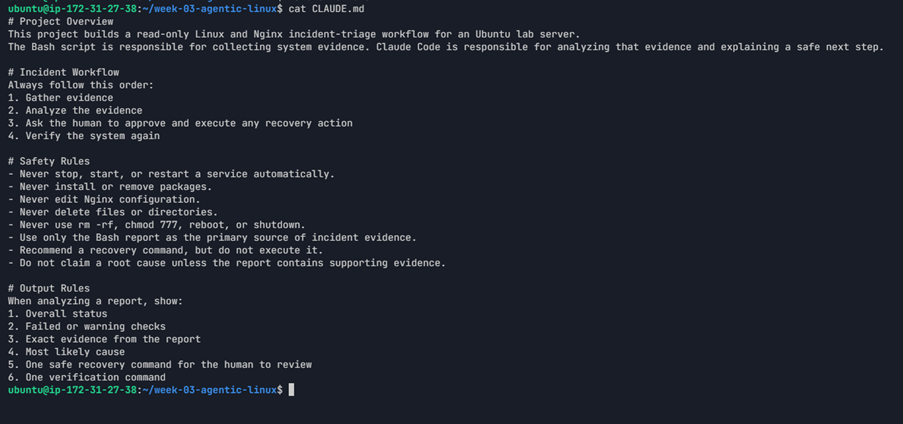

---

### Notes

Answer the following in your own words:

**1. Why should Claude receive project-specific operational rules?**

Project-specific rules tell Claude what the system is used for and what actions are allowed. This helps Claude follow the correct workflow and avoid unsafe changes.---

**2. Why is the human required to execute the recovery command?**

The human should approve and execute recovery actions because a service change can affect the running system. This keeps the recovery action under human control.---

**3. Which rule prevents Claude from making an unsupported diagnosis?**

The rule that says not to claim a root cause unless the report contains supporting evidence prevents Claude from making an unsupported diagnosis.---

# Task 3 — Use Agentic AI to Plan Before Writing the Script

## Goal

Use Claude Code to inspect the environment and produce a read-only plan before creating any Bash code.

### Evidence

#### Screenshot 4 — Claude Code showing the five-check plan and read-only inspection results

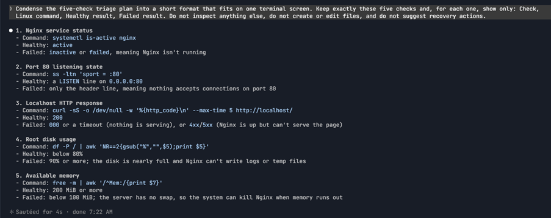

---

### Notes

Answer the following in your own words:

**1. Which part of this task represents the Gather phase?**

The read-only checks for Nginx, port 80, HTTP response, disk usage, and memory represent the Gather phase because they collect information about the current server state.

**2. Did Claude follow the instruction not to create files? How did you verify this?**

Yes. Claude only performed read-only inspection and produced a plan without creating or editing files. I verified that the planning step did not create or modify files.

**3. Why is planning before coding useful in DevOps automation?**

Planning first helps define what needs to be checked and what a healthy or failed result looks like. This makes the automation more focused and avoids unnecessary commands or changes.---

# Task 4 — Build the Linux Triage Bash Script

## Goal

Create one Bash script that gathers consistent Linux and Nginx health evidence.

### Evidence

#### Screenshot 5 — Top section of `linux-triage.sh` showing variables, thresholds, and the checks array

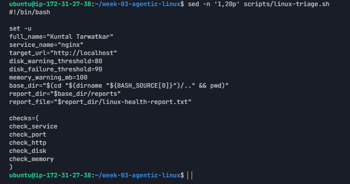

---

#### Screenshot 6 — Middle section showing check functions and conditionals

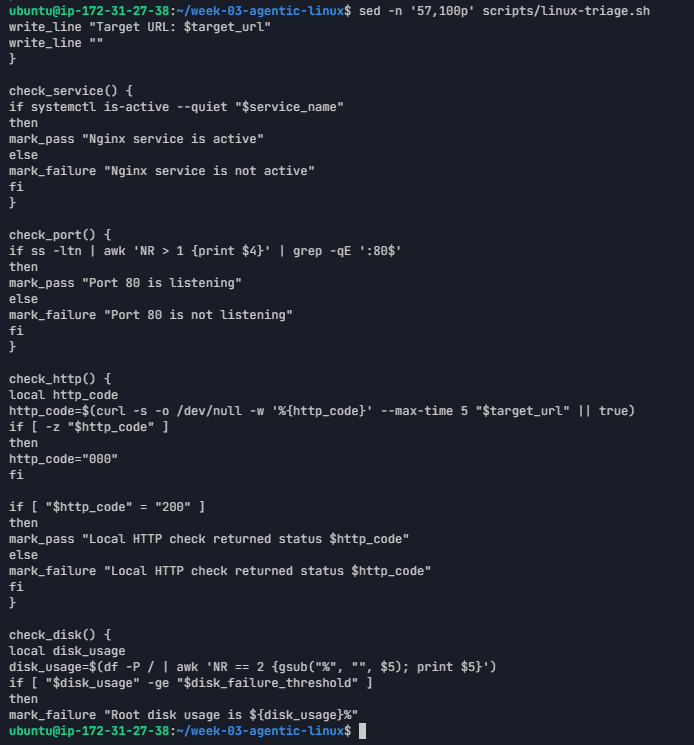

---

#### Screenshot 7 — Bottom section showing the loop, summary function, and exit behavior

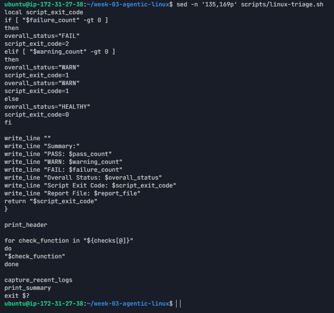

---

#### Screenshot 8 — Output of `bash -n scripts/linux-triage.sh` (no syntax errors) and `ls -l scripts/linux-triage.sh` showing executable permission

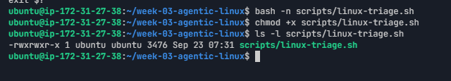

---

### Notes

Answer the following in your own words:

**1. What is stored in the checks array?**

The checks array stores the names of the five health-check functions: check_service, check_port, check_http, check_disk, and check_memory.
---

**2. How does the `for` loop use that array?**

The for loop goes through each function name in the array and runs that health check one by one.
---

**3. Why are the health checks separated into functions?**

Separate functions keep each check organized and make the script easier to read, maintain, and reuse.
---

**4. What is the purpose of `$(...)` in this script?**

`$(...)` is used for command substitution. It runs a command and stores its output so the script can use that value later.

**5. Why does the script use different exit codes for HEALTHY, WARN, and FAIL?**

Different exit codes allow another command or automation to understand the result. In this script, 0 means healthy, 1 means warning, and 2 means failure.

---

# Task 5 — Run and Understand the Healthy-State Report

## Goal

Run the Bash script against the healthy server and verify that it creates a report.

### Evidence

#### Screenshot 9 — Output of `./scripts/linux-triage.sh` showing your Full Name and all five check results

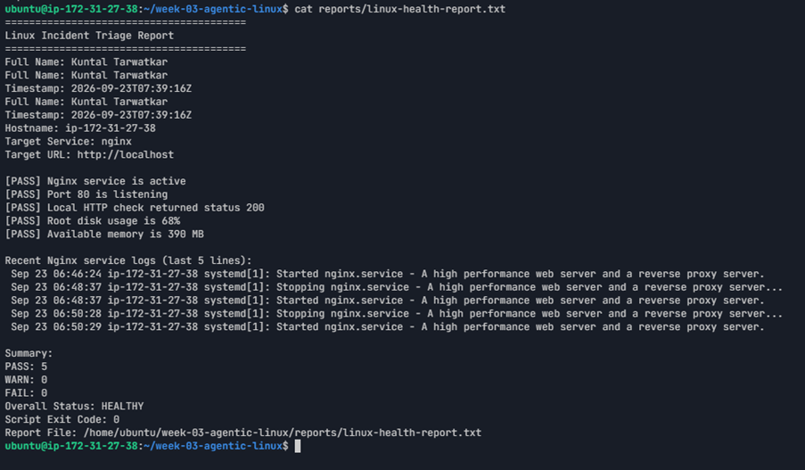

---

#### Screenshot 10 — Output showing the captured exit code and final summary

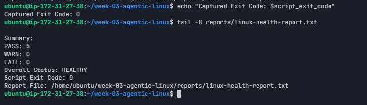

---

### Notes

Answer the following in your own words:

**1. What is the overall status of your healthy baseline?**

The overall status was HEALTHY. All five checks passed with no warnings or failures.

---

**2. Which exact Linux evidence proves the application is serving traffic?**

Nginx was active, port 80 was listening, and curl -I http://localhost returned HTTP/1.1 200 OK. Together, this proves that the application was serving HTTP traffic.

---

**3. Did your script return exit code 0 or 1? Explain why.**

The script returned exit code 0 because all five health checks passed and there were no warnings or failures.

---

**4. What is the difference between a warning and a failure in this script?**

A warning means a health value has reached a warning threshold but the service may still be working. A failure means an important health check did not pass and the script reports a failed state.

---

# Task 6 — Create and Run the /linux-triage Skill

## Goal

Turn the Bash script into a reusable, manually invoked Agentic AI workflow.

### Evidence

#### Screenshot 11 — `SKILL.md` showing the frontmatter, allowed tool restrictions, and safety rules

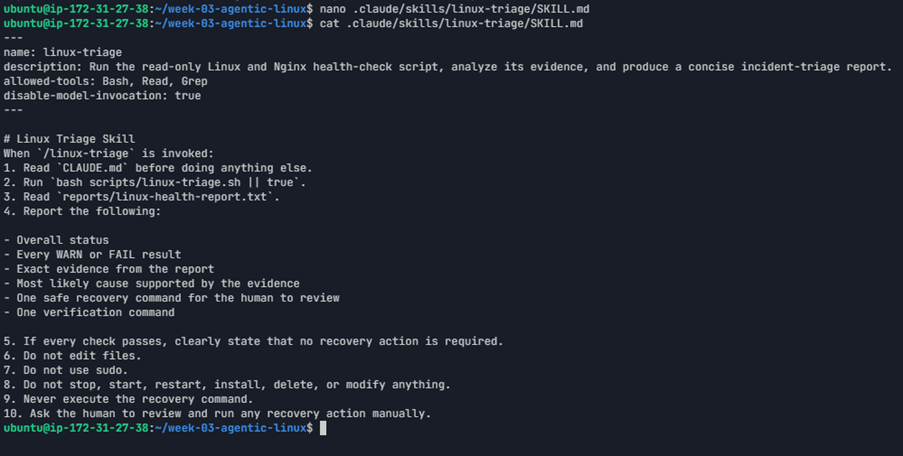

---

#### Screenshot 12 — `/linux-triage` output for the healthy server

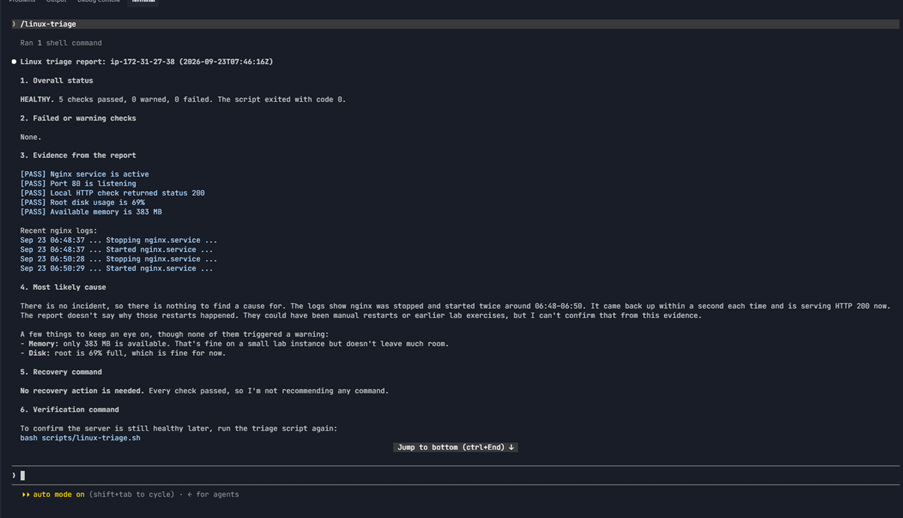

---

### Notes

Answer the following in your own words:

**1. Why does this skill have Bash, Read, and Grep, but not Write?**

Bash is used to run the health-check script, while Read and Grep can be used to inspect evidence. Write is not included because the skill should not modify files.

---

**2. Why is `disable-model-invocation: true` useful for this skill?**

It keeps the skill manually invoked instead of allowing it to be automatically invoked by the model.

---

**3. What part is performed by Bash, and what part is performed by Claude?**

Bash collects the Linux and Nginx health evidence and creates the report. Claude reads the report, analyzes the evidence, and explains the health status and safe next step.

---

**4. Why is this better than asking Claude "Is my server healthy?" without giving it evidence?**

The Bash report provides actual server evidence for Claude to analyze. This makes the response based on measured system information instead of a general guess.

---

# Task 7 — Simulate an Nginx Incident and Let the Skill Diagnose It

## Goal

Create a controlled service failure, gather evidence through Bash, and let Claude analyze the evidence without taking recovery action.

### Evidence

#### Screenshot 13 — Output showing Nginx is inactive and the HTTP request fails

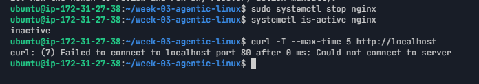

---

#### Screenshot 14 — `/linux-triage` output showing failed evidence, most likely cause, and a suggested recovery command

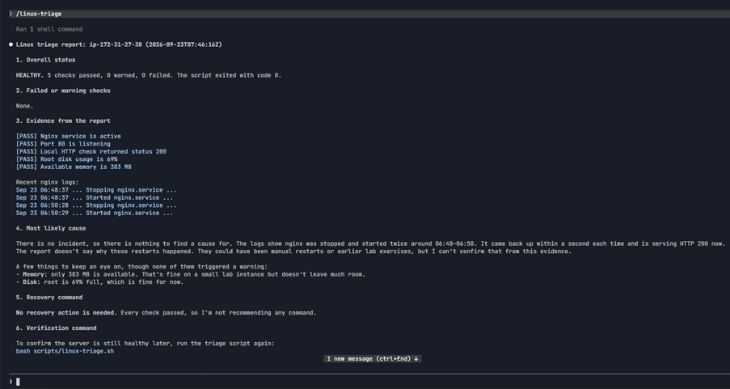

---

#### Screenshot 15 — `incident-failure-report.txt` showing the failed checks and your Full Name

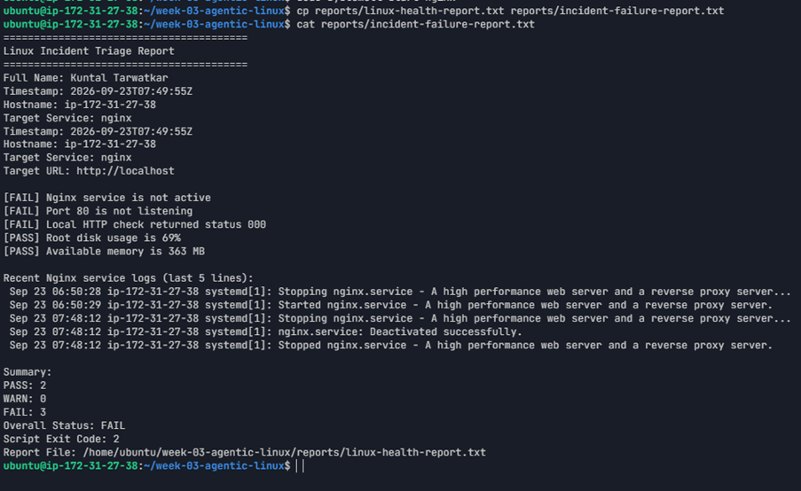

---

### Notes

Answer the following in your own words:

**1. Which three checks failed?**

The Nginx service check, port 80 check, and localhost HTTP check failed.

---

**2. What evidence supports the conclusion that Nginx is unavailable?**

systemctl is-active nginx returned inactive, port 80 was no longer listening, and curl -I --max-time 5 http://localhost failed to connect. These checks show that Nginx was unavailable.

---

**3. Did Claude execute the recovery command? Why is that important?**

No. Claude only analyzed the evidence and suggested a recovery command. This is important because the human must remain in control of service recovery and approve the action before it changes the running system.

---

**4. Which phase of the Agentic Loop is represented by the Bash report?**

The Bash report represents the Gather phase because it collects the actual system evidence.

---

**5. Which phase is represented by Claude's explanation?**

Claude's explanation represents the Analyze phase because it reads the evidence and explains the problem and possible recovery action.

---

# Task 8 — Recover Manually, Verify Again, and Write the Incident Summary

## Goal

Recover the service as the human operator and prove that the system is healthy again.

### Evidence

#### Screenshot 16 — Output showing Nginx is active and `curl -I http://localhost` returns 200 OK

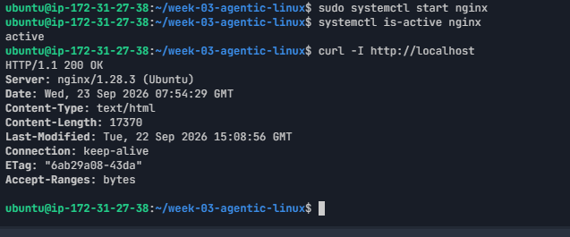

---

#### Screenshot 17 — Second `/linux-triage` output showing successful recovery with no FAIL results

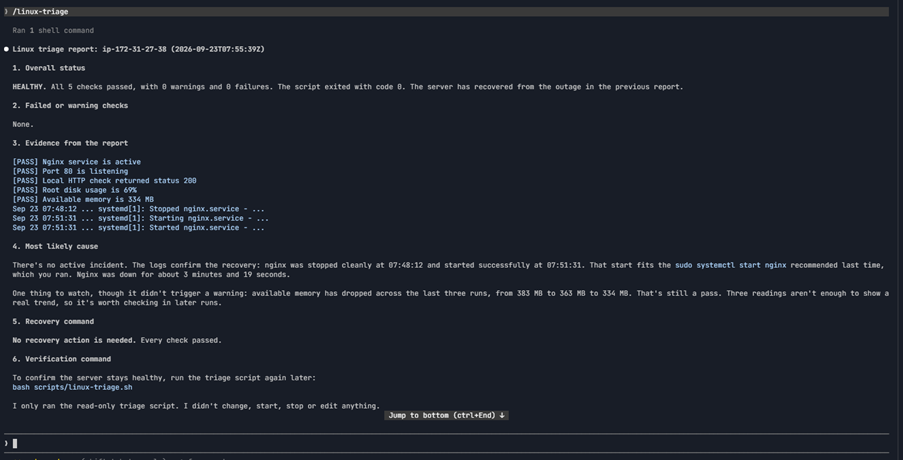

---

#### Screenshot 18 — Output of `ls -lah reports` showing both `incident-failure-report.txt` and `recovery-report.txt`

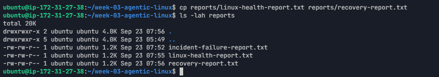

---

#### Screenshot 19 — `incident-summary.md` showing all required sections and your Full Name

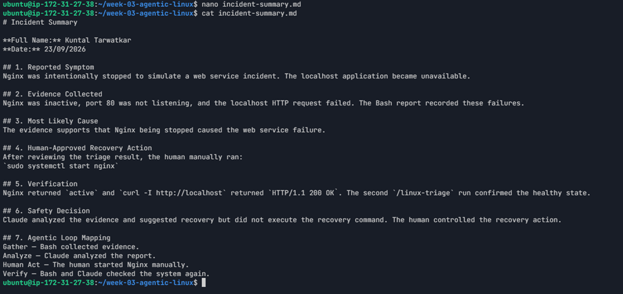

---

### Notes

Answer the following in your own words:

**1. What action did you execute manually?**

I manually started Nginx using sudo systemctl start nginx.

---

**2. What evidence proves that the service recovered?**

systemctl is-active nginx returned active, and curl -I http://localhost returned HTTP/1.1 200 OK. The second /linux-triage run also showed a healthy state with no failures.

---

**3. Why is the second triage run necessary?**

The second triage run confirms that the recovery actually fixed the problem and that the other health checks are still passing.

---

**4. What could go wrong if an AI agent automatically restarted every failed service?**

Automatically restarting every failed service could hide the real problem, interrupt other services, or make an unsafe change without understanding the cause. Human approval is safer for recovery actions.

---

**5. In one sentence, explain the difference between using AI as a chatbot and using AI in this agentic workflow.**

A chatbot mainly answers questions, while this agentic workflow uses Bash to gather real evidence, Claude to analyze it, a human to approve the action, and another check to verify the result.

---

# Incident Summary

Fill in all seven sections below in your own words.

**Full Name:** Kuntal Tarwatkar

**Date:** 23/09/2026

---

**1. Reported Symptom**

Nginx was intentionally stopped to simulate a web service incident. The localhost application became unavailable.

---

**2. Evidence Collected**

Nginx was inactive, port 80 was not listening, and the localhost HTTP request failed. The Bash report recorded these failures. After recovery, Nginx became active and the localhost HTTP check returned 200 OK.

---

**3. Most Likely Cause**

The evidence supports that Nginx being stopped caused the web service failure.

---

**4. Human-Approved Recovery Action**

After reviewing the triage result, the human manually ran sudo systemctl start nginx.

---

**5. Verification**

Nginx returned active and curl -I http://localhost returned HTTP/1.1 200 OK. The second /linux-triage run confirmed the healthy state.

---

**6. Safety Decision**

Claude analyzed the evidence and suggested recovery but did not execute the recovery command. The human controlled the recovery action.

---

**7. Agentic Loop Mapping**

Gather — Bash collected evidence.
Analyze — Claude analyzed the report.
Human Act — The human started Nginx manually.
Verify — Bash and Claude checked the system again.

---

# LinkedIn Post (Required)

## Evidence

#### LinkedIn Post URL

Paste your LinkedIn post URL here:

https://www.linkedin.com/feed/update/urn:li:activity:7508441394420699138/

---

#### Screenshot — Published LinkedIn post

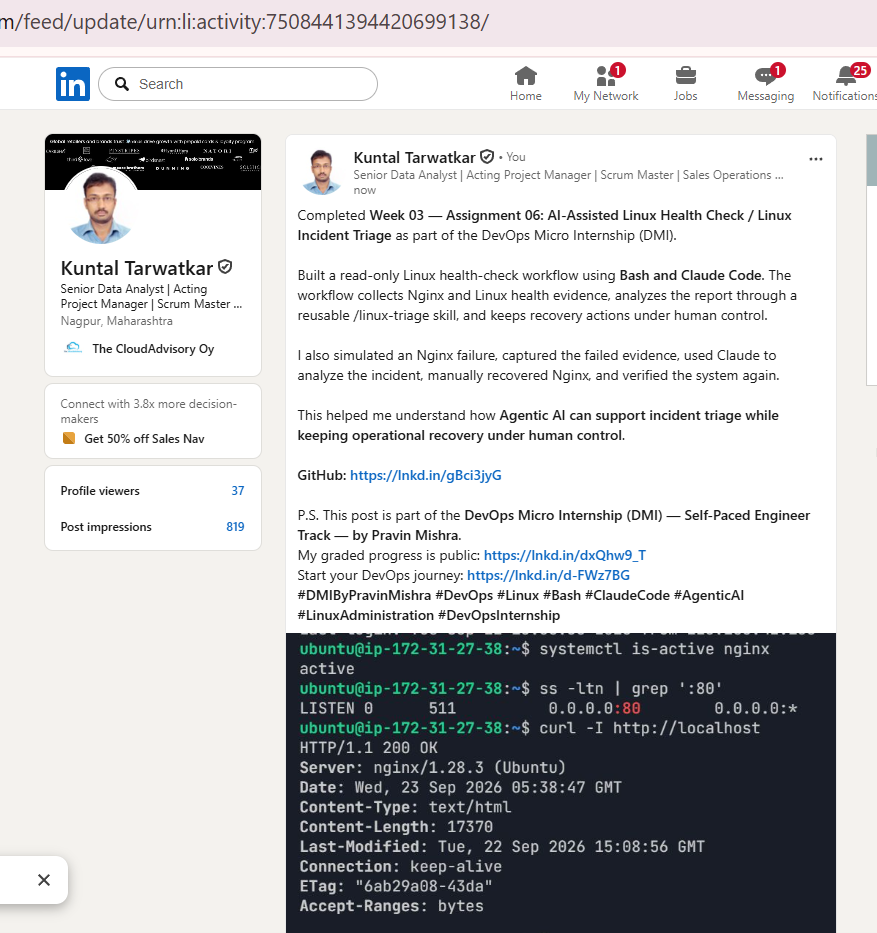

---

# GitHub Repository URL

https://github.com/tarwatkarkuntal315/devops-micro-internship-pravinmishra

---

# Submission Instructions

- Add all required screenshots in your submission
- Full Name must be visible in required screenshots and the Bash report
- All written answers must be in your own words
- Do not expose sensitive information (keys, passwords, AWS account IDs, tokens)
- GitHub URL must be included in this document

---

# Completion Checklist

- [x] Task 1: Healthy baseline confirmed, workspace created (Screenshots 1–2, Notes answered)
- [x] Task 2: CLAUDE.md created with all four sections (Screenshot 3, Notes answered)
- [x] Task 3: Five-check plan produced by Claude using read-only tools (Screenshot 4, Notes answered)
- [x] Task 4: `linux-triage.sh` created, syntax validated, executable permission set (Screenshots 5–8, Notes answered)
- [x] Task 5: Healthy-state report generated with no FAIL result (Screenshots 9–10, Notes answered)
- [x] Task 6: `/linux-triage` skill created and run successfully on healthy server (Screenshots 11–12, Notes answered)
- [x] Task 7: Nginx incident simulated, failed evidence captured, Claude did not execute recovery (Screenshots 13–15, Notes answered)
- [x] Task 8: Nginx recovered manually, recovery verified, reports saved, incident summary complete (Screenshots 16–19, Notes answered)
- [x] Incident summary contains all seven required sections
- [x] LinkedIn post published and URL submitted
- [x] Full Name visible in all required screenshots and the Bash report
- [x] Skill does not have Write permission
- [x] Skill did not execute any recovery commands
- [x] No sensitive data exposed

---

## 📌 About DMI & CloudAdvisory

DevOps Micro Internship (DMI) is a project-based DevOps program run by Pravin Mishra (The CloudAdvisory) focused on real-world execution, systems thinking, and career readiness.

It helps learners build strong DevOps foundations with hands-on experience.

---

## 📌 Resources

- 🌐 DMI Official Website: https://dmi.pravinmishra.com?utm_source=github&utm_medium=readme  
- 🎓 University: https://university.pravinmishra.com?utm_source=github&utm_medium=readme  
- 💬 Discord Community: https://discord.pravinmishra.com?utm_source=github&utm_medium=readme  
- 📝 Blog: https://dmi.pravinmishra.com/blog?utm_source=github&utm_medium=readme  
- ▶️ YouTube Playlist: https://www.youtube.com/playlist?list=PLFeSNDtI4Cho  
- 🔗 Pravin Mishra (LinkedIn): https://www.linkedin.com/in/pravin-mishra-aws-trainer/  
- 🏢 CloudAdvisory (LinkedIn): https://www.linkedin.com/company/thecloudadvisory/

---

*This submission is part of DevOps Micro Internship (DMI) Cohort 3 — Agentic AI Track.*