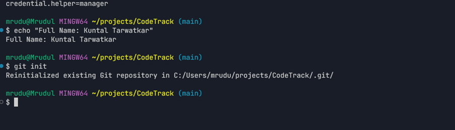
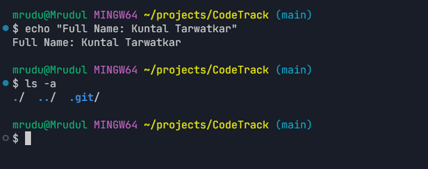
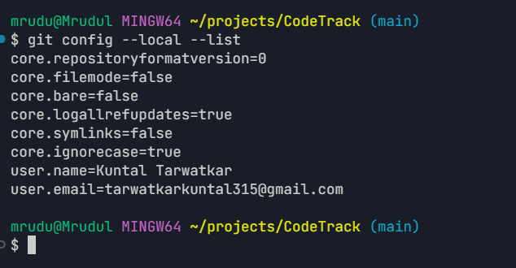
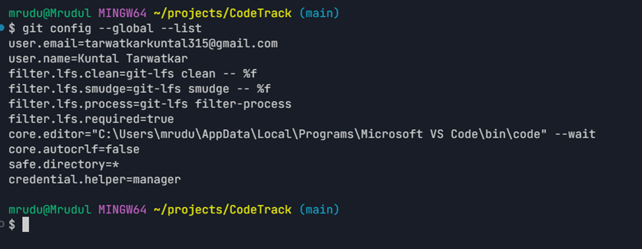
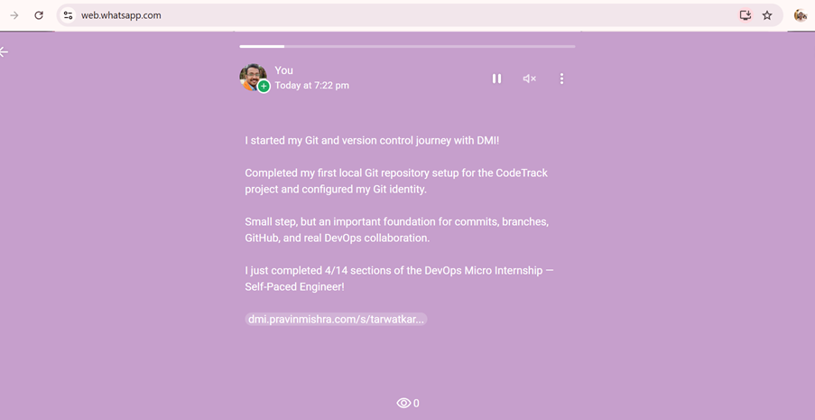

# Assignment 1 — CodeTrack: Initial Git Setup (Local Only)

Part of the DevOps Micro Internship (DMI) Cohort 3 with Agentic AI

---

## Purpose

In this assignment, you will set up Git correctly on your local machine before starting the CodeTrack project. You will create a local repository and configure your Git identity at both the repository level (local) and the machine level (global). This assignment is local only — you will not push anything to GitHub yet.

---

# Task 1 — Create the CodeTrack Project and Initialize Git

## Goal

Create a `CodeTrack` project folder and initialize it as a Git repository.

### Evidence

#### Screenshot 1 — Output of `git init` inside `CodeTrack` showing "Initialized empty Git repository"

---

#### Screenshot 2 — Output of `ls -a` showing the `.git` folder

---

### Notes

**1. What is the `.git` folder, and why does it matter?**

The `.git` folder stores the Git repository information, including its history and configuration. It is created when we run `git init`. It matters because Git uses this folder to track changes and manage commits, branches, and other version control operations.

---

# Task 2 — Configure Git Identity Locally (Repository-Only)

## Goal

Set your Git username and email for the `CodeTrack` repository only, using `git config --local`.

### Evidence

#### Screenshot 3 — Output of `git config --local --list` showing your `user.name` and `user.email`

The local Git identity configured for the CodeTrack repository is:

- **user.name:** Kuntal Tarwatkar
- **user.email:** tarwatkarkuntal315@gmail.com

---

---

# Task 3 — Configure Git Identity Globally

## Goal

Set a global Git username and email for this machine using `git config --global`. Note that CodeTrack's local settings still take priority over these.

### Evidence

#### Screenshot 4 — Output of `git config --global --list` showing your `user.name` and `user.email`

The global Git identity configured on the machine is:

- **user.name:** Kuntal Tarwatkar
- **user.email:** tarwatkarkuntal315@gmail.com

The local configuration inside CodeTrack can override the global configuration when both are present.

---

# Task 4 — Share Your Git Setup Progress

The Git setup progress was shared on WhatsApp Status using the DMI-generated progress message and link.

### Screenshot 5 — Published WhatsApp Status

---

# Submission Instructions

- Add all required screenshots in your submission
- Full Name must be visible in required screenshots
- Do not expose passwords, access tokens, or private keys

---

# Completion Checklist

- [x] `CodeTrack` folder created and initialized as a Git repository (Screenshots 1–2)
- [x] Explanation of the `.git` folder written in your own words
- [x] Local `user.name` and `user.email` configured and verified (Screenshot 3)
- [x] Global `user.name` and `user.email` configured and verified (Screenshot 4)
- [x] No sensitive data exposed

---

## 📌 About DMI & CloudAdvisory

DevOps Micro Internship (DMI) is a project-based DevOps program run by Pravin Mishra (The CloudAdvisory) focused on real-world execution, systems thinking, and career readiness.

It helps learners build strong DevOps foundations with hands-on experience.

---

## 📌 Resources

- 🌐 DMI Official Website: https://dmi.pravinmishra.com?utm_source=github&utm_medium=readme  
- 🎓 University: https://university.pravinmishra.com?utm_source=github&utm_medium=readme  
- 💬 Discord Community: https://discord.pravinmishra.com?utm_source=github&utm_medium=readme  
- 📝 Blog: https://dmi.pravinmishra.com/blog?utm_source=github&utm_medium=readme  
- ▶️ YouTube Playlist: https://www.youtube.com/playlist?list=PLFeSNDtI4Cho  
- 🔗 Pravin Mishra (LinkedIn): https://www.linkedin.com/in/pravin-mishra-aws-trainer/  
- 🏢 CloudAdvisory (LinkedIn): https://www.linkedin.com/company/thecloudadvisory/

---

*This submission is part of DevOps Micro Internship (DMI) Cohort 3 — Agentic AI Track.*
