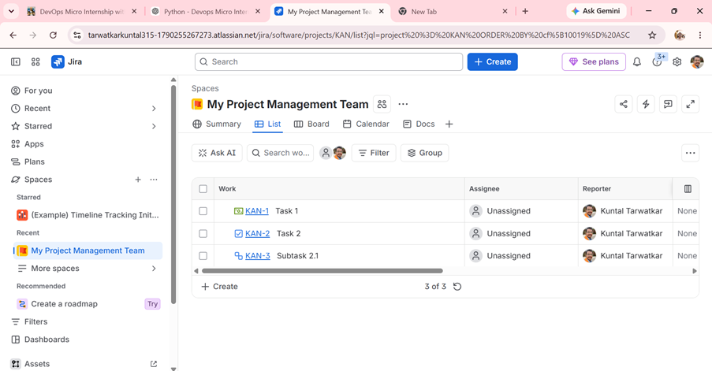
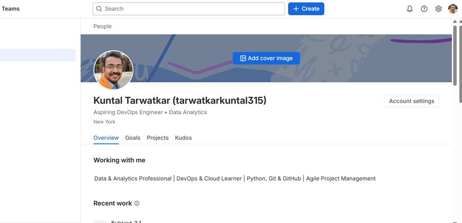
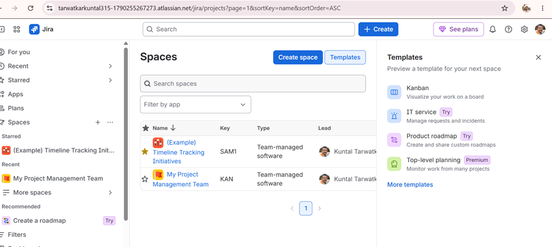
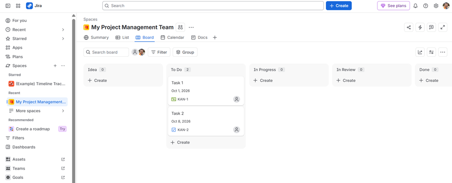
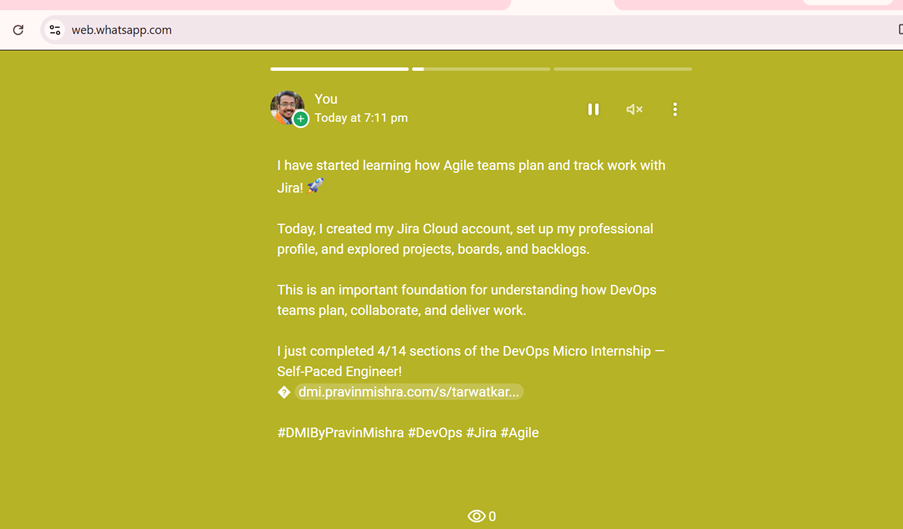

# Assignment 1 — Create Your Jira Account & Setup Profile

Part of the DevOps Micro Internship (DMI) Cohort 3 with Agentic AI

---

## Purpose

In this assignment, you will create or access a Jira Software Cloud account, verify your Atlassian identity when required, set up a professional profile, and explore the Jira dashboard and project areas. This prepares you for real-world Agile and DevOps collaboration, where Jira is commonly used to plan work, assign tickets, and track progress. You will explore the workspace only — you will not create any issues in this assignment.

---

# Task 1 — Sign Up for Jira Software Cloud

## Goal

Create or access your Jira Cloud account and reach the Jira Software workspace successfully.

### Evidence

#### Screenshot 1 — Jira welcome page, dashboard, or main workspace after successful login, with your name or avatar visible

---

# Task 2 — Verify Your Atlassian Account

## Goal

Confirm your email address if Atlassian requests verification.

### Evidence

#### Screenshot 2 (if applicable) — Confirmation screen after email verification, or the inbox showing the Atlassian verification email subject

> I signed up using Google, and Atlassian did not require separate email verification.

---

### Notes

If you signed up with Google and no separate email verification was required, include the following statement instead of Screenshot 2:

> I signed up using Google, and Atlassian did not require separate email verification.

Add any additional notes here.

---

# Task 3 — Set Up Your Professional Jira Profile

## Goal

Update your Jira profile with your full name, a job title or role (e.g. "Aspiring DevOps Engineer"), and a short professional bio.

### Evidence

#### Screenshot 3 — Updated profile page showing your full name, role/title, and bio

My Jira profile was updated with:

- Full Name: Kuntal Tarwatkar
- Role/Title: Aspiring DevOps Engineer • Data Analytics
- Bio: Data & Analytics Professional | DevOps & Cloud Learner | Python, Git & GitHub | Agile Project Management
  
---

# Task 4 — Explore the Jira Dashboard and Projects

## Goal

Locate the project list and open a project's Board or Backlog, and view Project settings, without creating, editing, or deleting any issues.

### Evidence

#### Screenshot 4 — "View all projects" page showing at least one project

I opened the project list and confirmed that the available spaces included `My Project Management Team`.

---

#### Screenshot 5 — Opened project showing either the Board or Backlog screen

I opened `My Project Management Team` and explored the Kanban Board. The Board showed the work columns including Idea, To Do, In Progress, In Review, and Done.

I also opened the Space settings and viewed the available settings without making any changes.

No Jira issues were created, edited, moved, or deleted during this assignment.

---

#### Screenshot 6 — Published WhatsApp Status showing Jira setup message and generated DMI leaderboard progress link

I published a WhatsApp Status describing my Jira setup and included the generated DMI leaderboard progress message and link.

The DMI progress message showed that I had completed 4/14 sections of the DevOps Micro Internship at the time of sharing.

---

# Submission Instructions

- Add all five required screenshots, unless separate email verification was not required
- If Screenshot 2 is not applicable, include the Google sign-in note instead
- Your full name or profile avatar must be visible where specifically required
- Do not expose passwords, verification codes, private email content, account recovery information, or other sensitive information
- You may hide or blur your email address if it appears in a screenshot

---

# Completion Checklist

- [x] Task 1: Jira Software Cloud account created or existing account accessed (Screenshot 1)
- [x] Task 2: Email verification completed, or a Google sign-in note included (Screenshot 2 or Notes)
- [x] Task 3: Professional profile updated with full name, role/title, and bio (Screenshot 3)
- [x] Task 4: Projects page, Board or Backlog, and Project settings explored without making changes (Screenshots 4 & 5)
- [x] No Jira issues created
- [x] Full Name visible in required screenshots
- [x] No sensitive data exposed

---

## 📌 About DMI & CloudAdvisory

DevOps Micro Internship (DMI) is a project-based DevOps program run by Pravin Mishra (The CloudAdvisory) focused on real-world execution, systems thinking, and career readiness.

It helps learners build strong DevOps foundations with hands-on experience.

---

## 📌 Resources

- 🌐 DMI Official Website: https://dmi.pravinmishra.com?utm_source=github&utm_medium=readme  
- 🎓 University: https://university.pravinmishra.com?utm_source=github&utm_medium=readme  
- 💬 Discord Community: https://discord.pravinmishra.com?utm_source=github&utm_medium=readme  
- 📝 Blog: https://dmi.pravinmishra.com/blog?utm_source=github&utm_medium=readme  
- ▶️ YouTube Playlist: https://www.youtube.com/playlist?list=PLFeSNDtI4Cho  
- 🔗 Pravin Mishra (LinkedIn): https://www.linkedin.com/in/pravin-mishra-aws-trainer/  
- 🏢 CloudAdvisory (LinkedIn): https://www.linkedin.com/company/thecloudadvisory/

---

*This submission is part of DevOps Micro Internship (DMI) Cohort 3 — Agentic AI Track.*
