# Assignment 2 — Stand Up Scrum in Jira for the DevOps Micro-Internship Website

Part of the DevOps Micro Internship (DMI) Cohort 3 with Agentic AI

---

## Purpose

In this assignment, you will configure a private, team-managed Scrum Space in Jira Cloud for a DevOps Micro-Internship Website improvement and deployment initiative. You will build the complete work hierarchy and delivery workflow: Space → Epic → Stories → Sub-tasks → Labels → Sprint → Filters → Reports.

---

# Task 1 — Create the Jira Space (Team-Managed Scrum)

## Goal

Create a private, team-managed Scrum Space named `DevOps Micro-Internship Website – <YourName>`.

### Evidence

#### Screenshot 1 — Space confirmation or Space sidebar showing the Space name and key

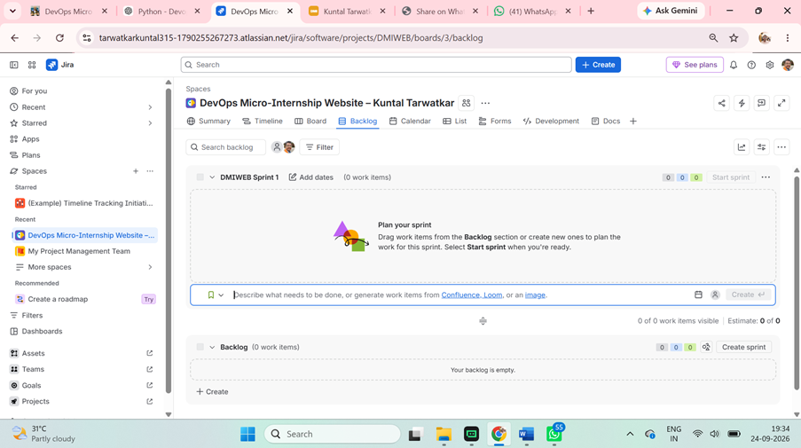

---

# Task 2 — Create Your First Epic from the Backlog

## Goal

Create the Epic `Polish DMI Website UI & Deploy` to group the website UI and deployment work.

### Evidence

#### Screenshot 2 — Backlog showing the Epic panel enabled and the Epic visible

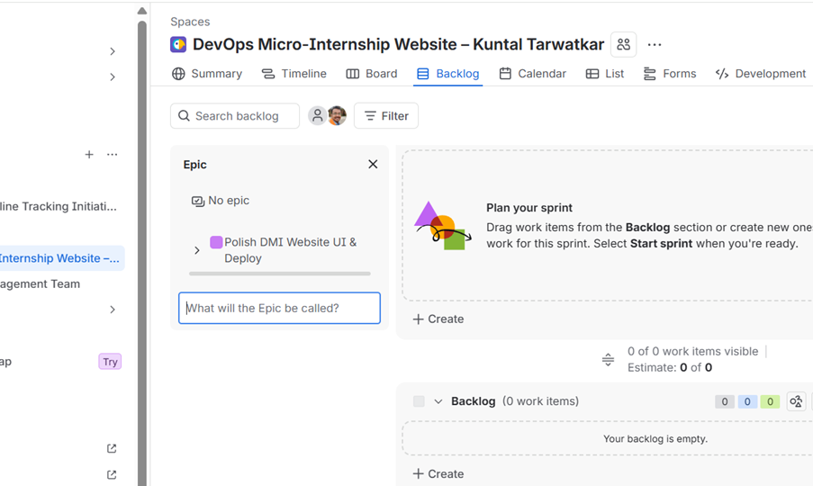

---

# Task 3 — Seed the Product Backlog with Six Stories

## Goal

Create all six required Stories (S1–S6) under the Epic, assign every Story to yourself, and add the required description, Fibonacci story point estimate, and label. Enter the Gherkin acceptance criteria directly below the Story description in the same description box.

### Evidence

#### Screenshot 3 — Backlog showing the Epic and all six Stories under it

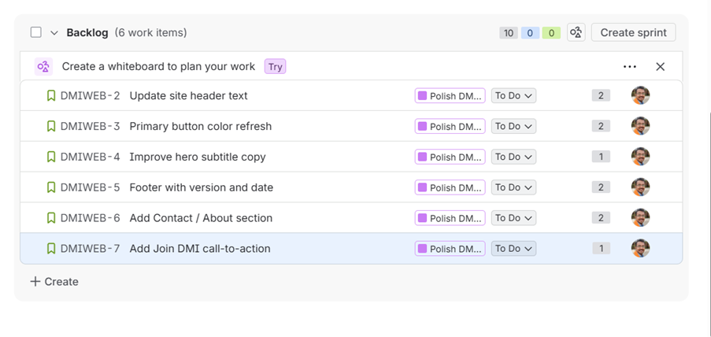

---

#### Screenshot 4 — One opened Story showing its Story point estimate, acceptance criteria, and label

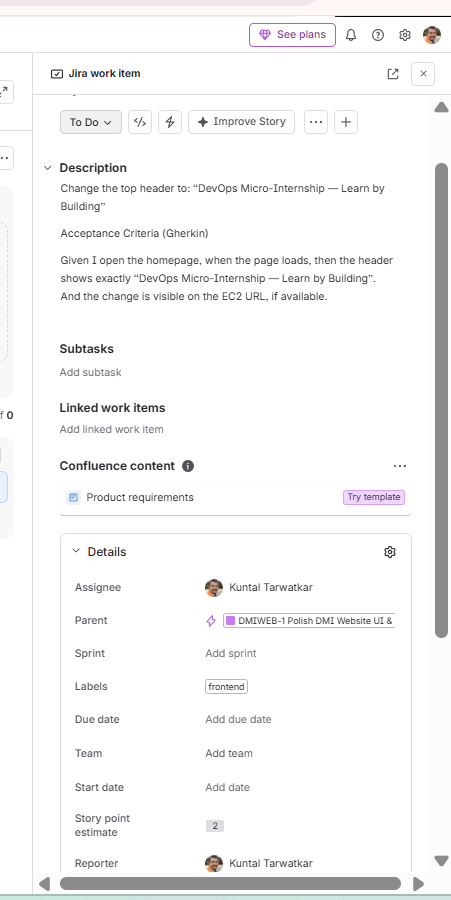

---

# Task 4 — Add Sub-tasks to at Least Two Stories

## Goal

Break down S2 (Primary button color refresh) and S4 (Footer with version and date) into the four required execution Sub-tasks each: Edit HTML/CSS, Test locally, Deploy to EC2, Verify and screenshot.

### Evidence

#### Screenshot 5 — S2 showing all four Sub-tasks

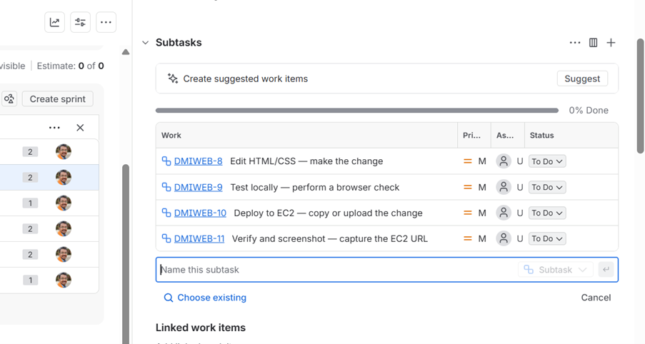

---

#### Screenshot 6 — S4 showing all four Sub-tasks

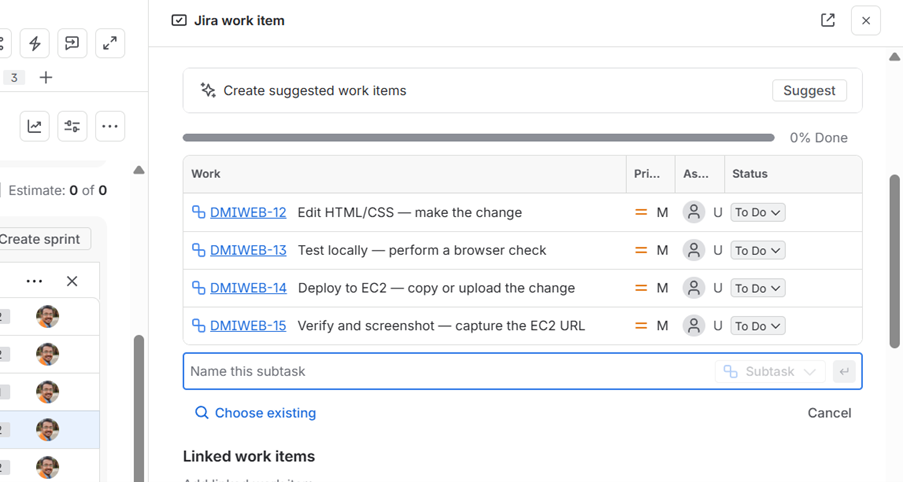

---

# Task 5 — Tag Stories by Workstream

## Goal

Apply the `frontend` label to S1, S2, S3, S5, and S6, and the `devops` label to S4, so every Story has at least one label.

### Evidence

#### Screenshot 7 — Backlog or Story details showing labels applied to at least two visible Stories

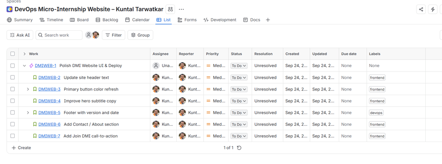

---

# Task 6 — Create and Start Sprint 1

## Goal

Create a one-week Sprint, move two or three Stories into it (approximately 3–5 Story Points), set the required Sprint Goal, and start the Sprint.

### Evidence

#### Screenshot 8 — Sprint 1 before starting, showing the selected Stories and Story Points

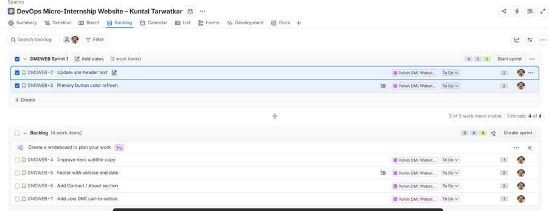

---

#### Screenshot 9 — Active Sprint board showing the started Sprint and Sprint Goal

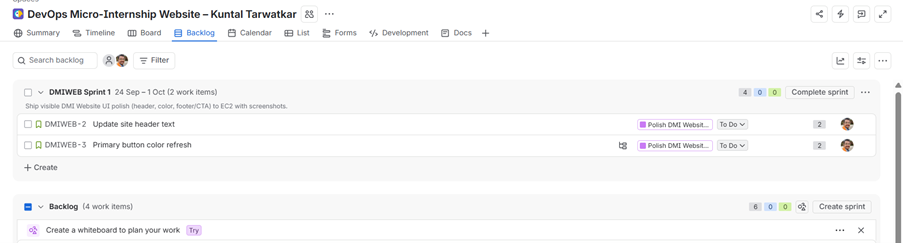

---

# Task 7 — Filter Stories, Sub-tasks, and Status

## Goal

Filter Jira work by the `frontend` and `devops` labels and review Stories with Sub-tasks and their current statuses.

### Evidence

#### Screenshot 10 — Filter for label = frontend showing the filtered results

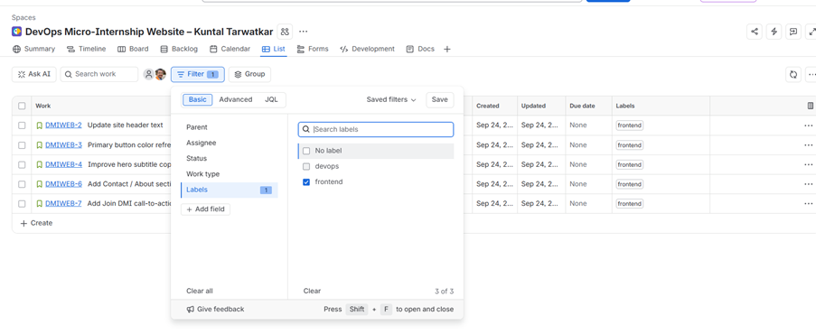

---

#### Screenshot 11 — Filter for label = devops showing the filtered results

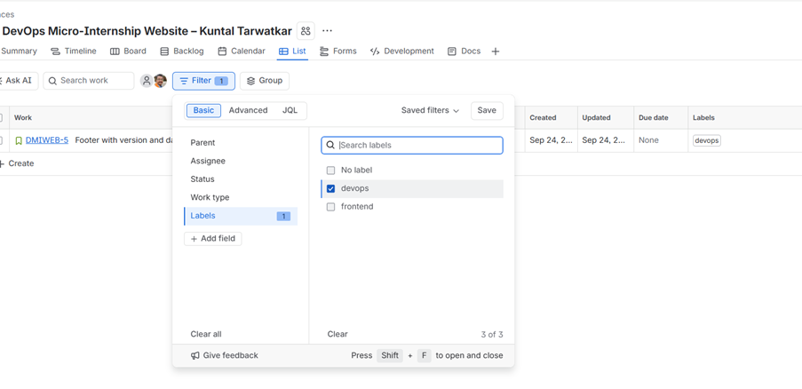

---

# Task 8 — Open the Burndown Report

## Goal

Locate the Burndown Chart for Sprint 1 so it is ready for later progress tracking. It is acceptable if the chart has little or no data since the Sprint has just started.

### Evidence

#### Screenshot 12 — Burndown Chart page opened for Sprint 1

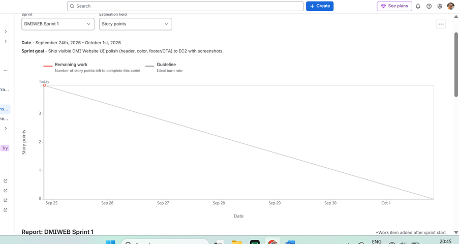

---

# LinkedIn Requirement

The Scrum project setup progress was shared on LinkedIn using the DMI Leaderboard generated progress link.

**LinkedIn post:**  
https://www.linkedin.com/feed/update/urn:li:activity:7508908003996303360/

### Screenshot 13 — Published LinkedIn post

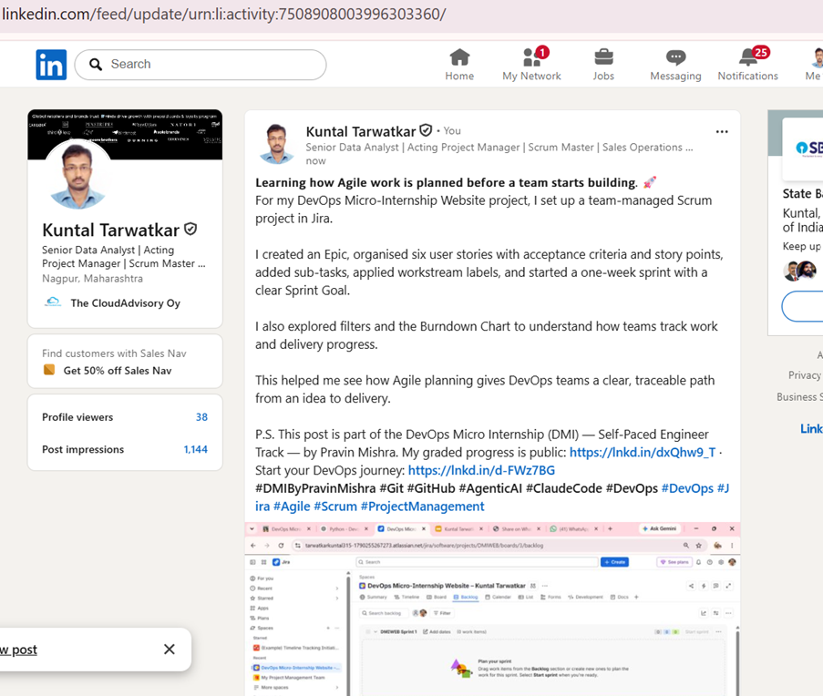

**Result:** The LinkedIn post was published with the Scrum/Jira project update and the generated DMI leaderboard progress link.

---

# Submission Instructions

- Add all 12 required screenshots in the specified order
- Full name must be visible in required screenshots
- Do not expose passwords, verification codes, private email content, account recovery details, or other sensitive information
---

# Completion Checklist

- [x] Task 1: Private team-managed Scrum Space created with your name (Screenshot 1)
- [x] Task 2: Epic "Polish DMI Website UI & Deploy" created (Screenshot 2)
- [x] Task 3: All six Stories connected to the Epic, assigned to you, with descriptions/acceptance criteria/points/labels (Screenshots 3 & 4)
- [x] Task 4: Four Sub-tasks created under both S2 and S4 (Screenshots 5 & 6)
- [x] Task 5: Frontend and devops labels applied to all Stories (Screenshot 7)
- [x] Task 6: One-week Sprint 1 started with the required Sprint Goal (Screenshots 8 & 9)
- [x] Task 7: Frontend and devops filters demonstrated (Screenshots 10 & 11)
- [x] Task 8: Burndown Chart opened for Sprint 1 (Screenshot 12)
- [x] Full Name visible in required screenshots
- [x] No sensitive data exposed

---

## 📌 About DMI & CloudAdvisory

DevOps Micro Internship (DMI) is a project-based DevOps program run by Pravin Mishra (The CloudAdvisory) focused on real-world execution, systems thinking, and career readiness.

It helps learners build strong DevOps foundations with hands-on experience.

---

## 📌 Resources

- 🌐 DMI Official Website: https://dmi.pravinmishra.com?utm_source=github&utm_medium=readme  
- 🎓 University: https://university.pravinmishra.com?utm_source=github&utm_medium=readme  
- 💬 Discord Community: https://discord.pravinmishra.com?utm_source=github&utm_medium=readme  
- 📝 Blog: https://dmi.pravinmishra.com/blog?utm_source=github&utm_medium=readme  
- ▶️ YouTube Playlist: https://www.youtube.com/playlist?list=PLFeSNDtI4Cho  
- 🔗 Pravin Mishra (LinkedIn): https://www.linkedin.com/in/pravin-mishra-aws-trainer/  
- 🏢 CloudAdvisory (LinkedIn): https://www.linkedin.com/company/thecloudadvisory/

---

*This submission is part of DevOps Micro Internship (DMI) Cohort 3 — Agentic AI Track.*
