# Assignment 1 — Create an Azure Virtual Machine using Terraform

Part of the DevOps Micro Internship (DMI) Cohort 3 with Agentic AI

---

## Purpose

In this assignment, you will use Terraform to provision a complete Azure Virtual Machine environment, including a resource group, virtual network, subnet, public IP, network interface, and a Linux-based virtual machine. You will set up and verify the required local tools, define the infrastructure in Terraform, initialize the project, review and apply the plan, verify the running VM through Azure CLI, capture the public IP output, and destroy the resources after testing.

---

# Task 0 — Set Up and Verify the Terraform and Azure CLI Environment

## Goal

Prepare your local environment for Terraform deployment by installing Terraform, Azure CLI, and the HashiCorp Terraform extension in VS Code, signing in to your Azure account, and confirming that all required tools are working correctly.

### Evidence

#### Screenshot 1 — Terminal showing successful `terraform version` output

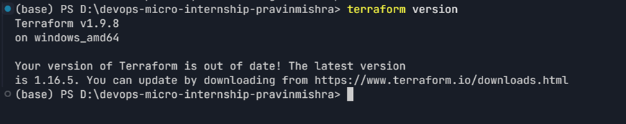

---

#### Screenshot 2 — Terminal showing successful `az version` output

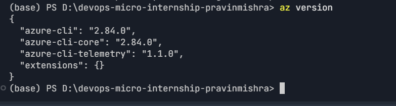

---

#### Screenshot 3 — VS Code Extensions panel showing the HashiCorp Terraform extension installed and enabled

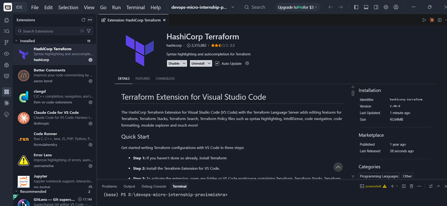

---

# Task 1 — Create a New Terraform Project and Define the Infrastructure

## Goal

Create a new Terraform project and define the complete Azure Virtual Machine environment in `main.tf` by using the official Terraform Registry documentation.

### Evidence

#### Screenshot 4 — VS Code showing the AzureRM provider configuration and resource group configuration in `main.tf`

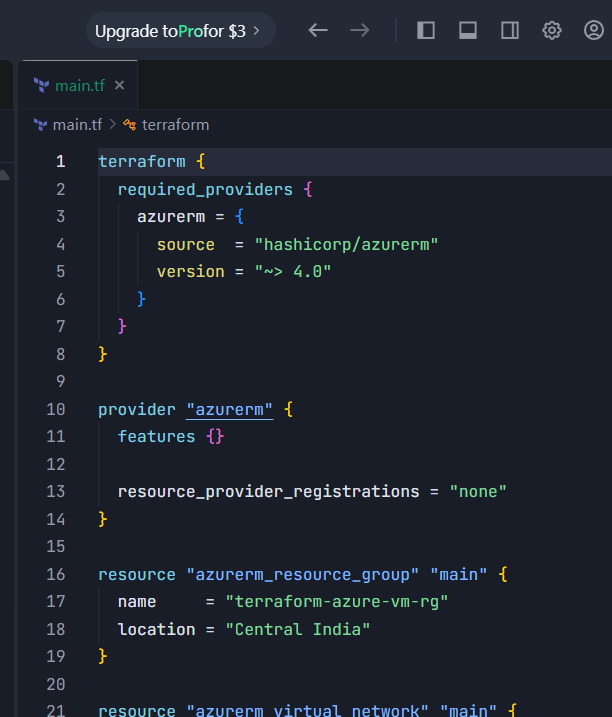

---

#### Screenshot 5 — VS Code showing the Linux virtual machine configuration and public IP `output` block in `main.tf`. Ensure that the VM password is hidden or redacted

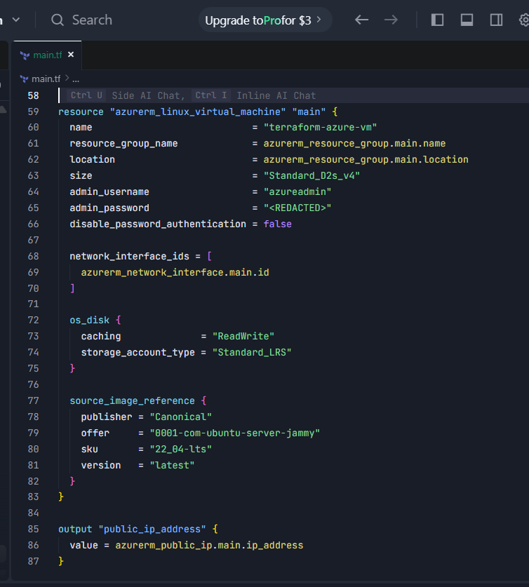

---

# Task 2 — Initialize Terraform

## Goal

Initialize the Terraform working directory and download the required provider components.

### Evidence

#### Screenshot 6 — Terminal showing the successful `terraform init` output

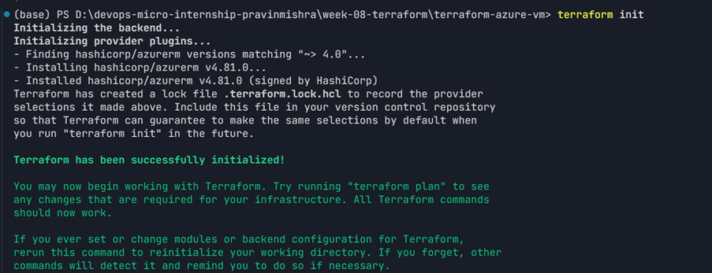

---

# Task 3 — Plan and Apply the Configuration

## Goal

Review the Terraform execution plan and provision the Azure resources.

### Evidence

#### Screenshot 7 — Terraform plan summary showing the proposed resources

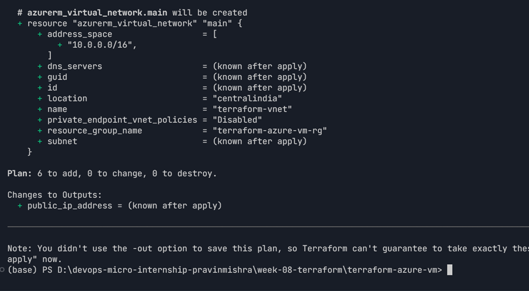

---

#### Screenshot 8 — Terraform apply output showing successful completion

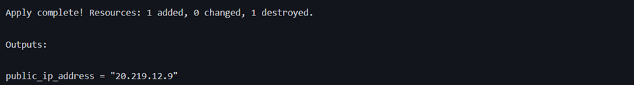

---

#### Screenshot 9 — Terraform output showing the public IP address of the VM

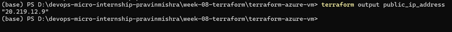

### Question

VM Public IP Address: `20.219.12.9`

---

# Task 4 — Verify the Deployment

## Goal

Confirm through Azure CLI that the virtual machine was created successfully and is currently running.

### Evidence

#### Screenshot 10 — Azure CLI output showing the deployed VM name and `VM running` status

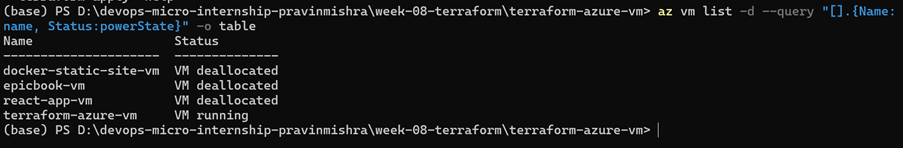

---

# Task 5 — Destroy the Resources

## Goal

Remove all Azure resources created by Terraform after completing the deployment and verification.

### Evidence

#### Screenshot 11 — Terminal showing successful `terraform destroy` completion

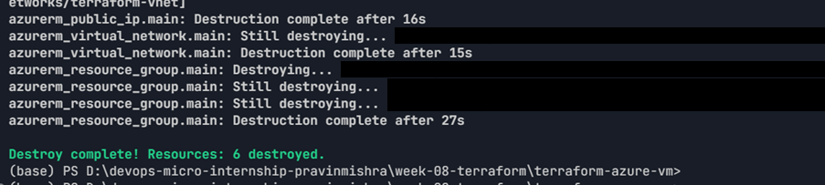

---

# Task 6 — Share Your Terraform Progress on WhatsApp

## Goal

Share your Azure Terraform deployment progress and DMI learning progress in one WhatsApp Status.

### Evidence

#### Screenshot 12 — Published WhatsApp Status showing the assignment screenshot, Terraform caption, DMI Leaderboard rank, and personal progress link

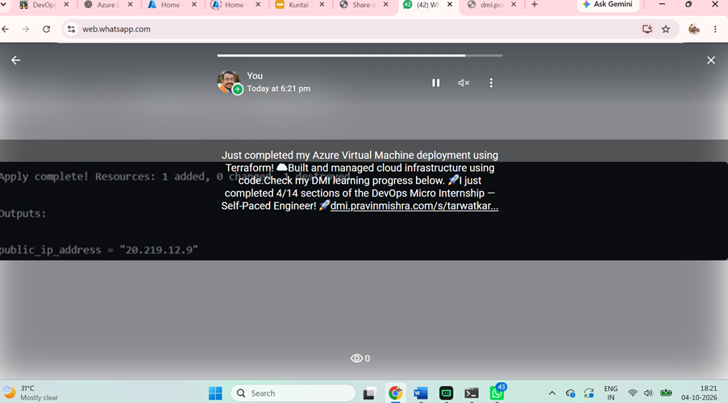

---

# Submission Instructions

- Complete all tasks in sequence and include all required screenshots specified in Tasks 0–6.
- Do not expose passwords, keys, account IDs, or other sensitive information in screenshots.

---

# Completion Checklist

- [x] Installed Terraform and verified it using `terraform version`
- [x] Installed Azure CLI and verified it using `az version`
- [x] Signed in to Azure using `az login`
- [x] Confirmed the correct Azure subscription
- [x] Installed and enabled the HashiCorp Terraform extension in VS Code
- [x] Created the `terraform-azure-vm` project directory and `main.tf`
- [x] Added the Terraform and AzureRM provider configuration
- [x] Defined the resource group, virtual network, subnet, public IP, and network interface
- [x] Defined the Linux virtual machine with username and password-based authentication
- [x] Added the Terraform output for the VM public IP address
- [x] Completed `terraform init` successfully
- [x] Reviewed the Terraform execution plan using `terraform plan`
- [x] Completed `terraform apply` successfully
- [x] Captured and recorded the VM public IP using `terraform output`
- [x] Verified that the VM is running using Azure CLI
- [x] Completed `terraform destroy` successfully
- [x] Shared Terraform deployment progress on WhatsApp by following Task 6
- [x] Captured a screenshot of the published WhatsApp Status
- [x] Captured all required screenshots
- [x] Checked that no passwords, keys, account IDs, or other sensitive information are visible in the screenshots

---

## 📌 About DMI & CloudAdvisory

DevOps Micro Internship (DMI) is a project-based DevOps program run by Pravin Mishra (The CloudAdvisory) focused on real-world execution, systems thinking, and career readiness.

It helps learners build strong DevOps foundations with hands-on experience.

---

## 📌 Resources

- 🌐 DMI Official Website: https://dmi.pravinmishra.com?utm_source=github&utm_medium=readme
- 🎓 University: https://university.pravinmishra.com?utm_source=github&utm_medium=readme
- 💬 Discord Community: https://discord.pravinmishra.com?utm_source=github&utm_medium=readme
- 📝 Blog: https://dmi.pravinmishra.com/blog?utm_source=github&utm_medium=readme
- ▶️ YouTube Playlist: https://www.youtube.com/playlist?list=PLFeSNDtI4Cho
- 🔗 Pravin Mishra (LinkedIn): https://www.linkedin.com/in/pravin-mishra-aws-trainer/
- 🏢 CloudAdvisory (LinkedIn): https://www.linkedin.com/company/thecloudadvisory/

---

*This submission is part of DevOps Micro Internship (DMI) Cohort 3 — Agentic AI Track.*