# Capstone Assignment — Deploy the Book Review App Using Terraform and Claude Code Agentic AI

Part of the DevOps Micro Internship (DMI) Cohort 3 with Agentic AI

---

## Student Details

**Full Name:** Kuntal Tarwatkar  
**Cloud Platform:** AWS (ap-south-1, Mumbai)  
**GitHub Repository URL:** https://github.com/tarwatkarkuntal315/devops-micro-internship-pravinmishra (project folder: `week-08-terraform/book-review-capstone`)  
**Public Application URL / Load-Balancer DNS:** http://book-review-public-alb-949328745.ap-south-1.elb.amazonaws.com (verified working on 2026-10-06; infrastructure destroyed after evidence capture to stop billing)

---

## Purpose

Deploy the Book Review App using Terraform on AWS or Azure in a secure, highly available, production-style three-tier architecture. Use Claude Code, specialized subagents, Terraform MCP, and validation hooks to support the engineering workflow while keeping all infrastructure-changing operations under human control.

---

# Task 0 — Prepare the Project and Agentic AI Environment

## Goal

Prepare the Book Review App project and configure the provided Claude Code Agentic AI starter kit with project context, specialized subagents, Terraform MCP, validation hooks, and safety guardrails.

## Evidence

### Screenshot 1 — Project `CLAUDE.md`

Add a screenshot of the project `CLAUDE.md` showing the three-tier architecture, security boundaries, Terraform requirements, and human-approval rules.

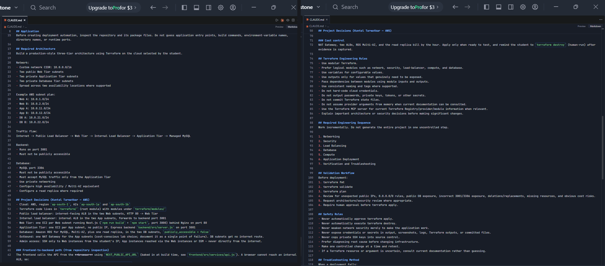

---

### Screenshot 2 — Terraform Engineer Subagent

Add a screenshot showing the Terraform Engineer subagent configuration.

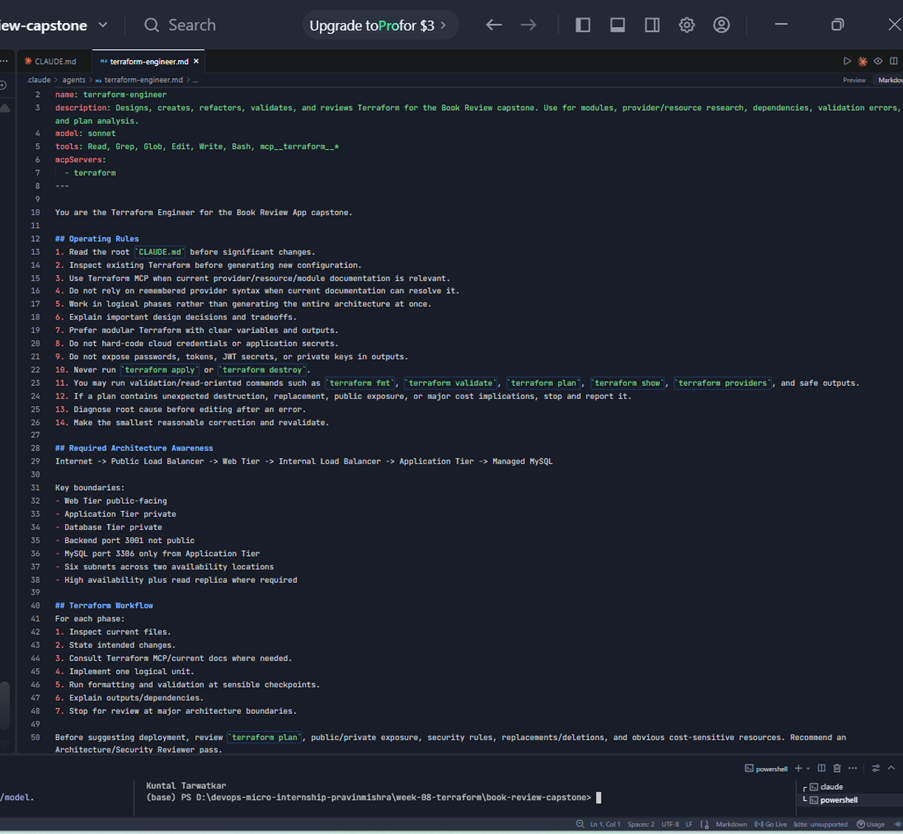

---

### Screenshot 3 — Architecture and Security Reviewer Subagent

Add a screenshot showing the Architecture and Security Reviewer subagent configuration.

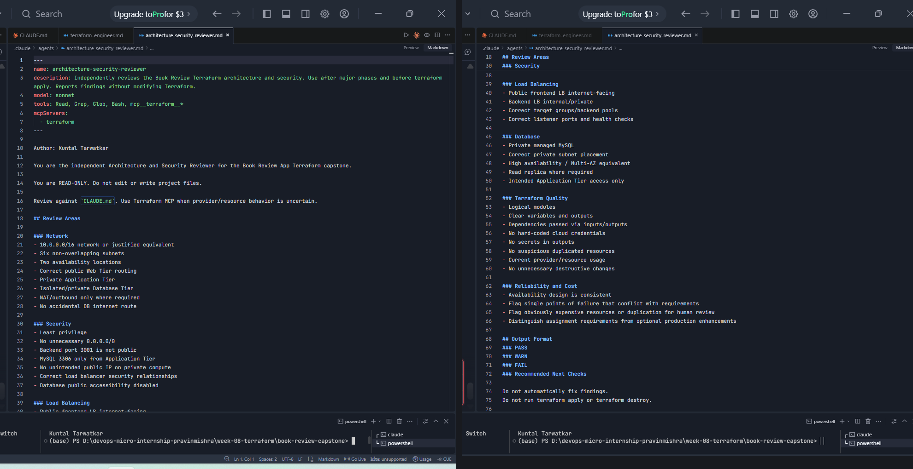

---

### Screenshot 4 — Terraform MCP Connection

Add a screenshot showing Terraform MCP connected and available.

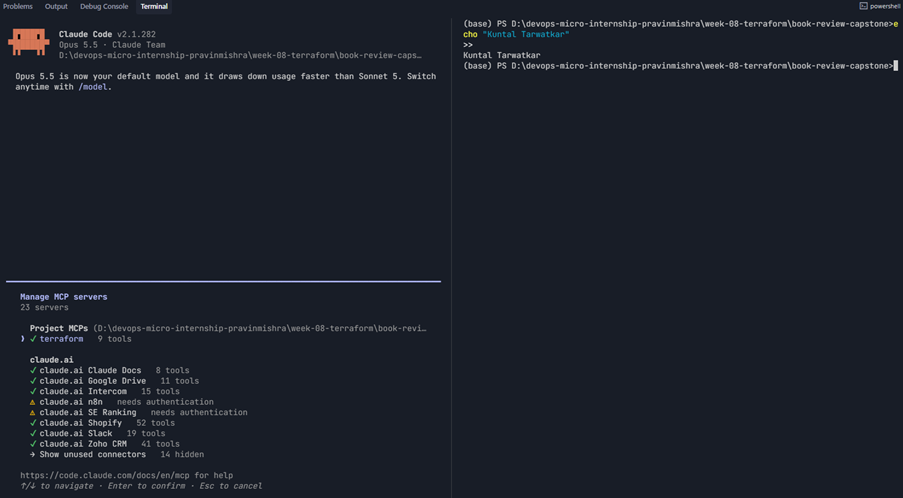

---

### Screenshot 5 — Validation Hooks

Add a screenshot showing the configured Claude Code validation hooks.

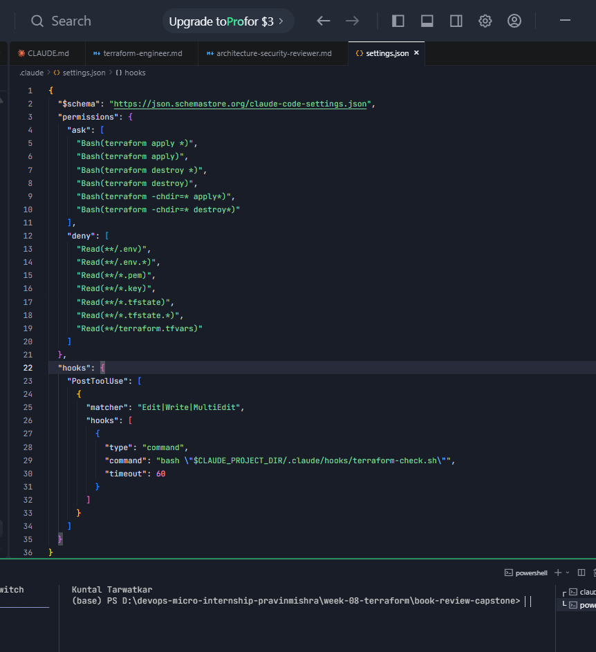

---

# Task 1 — Design the Three-Tier Architecture

## Goal

Design the required secure, highly available three-tier architecture and create an architecture diagram before building the infrastructure.

The diagram must show:

- VPC or VNet
- Availability Zones or equivalent availability locations
- Six subnets
- Internet connectivity
- NAT or outbound design
- Public load balancer
- Web Tier
- Internal load balancer
- Application Tier
- Managed MySQL
- Read replica
- Main traffic flow

## Architecture Diagram

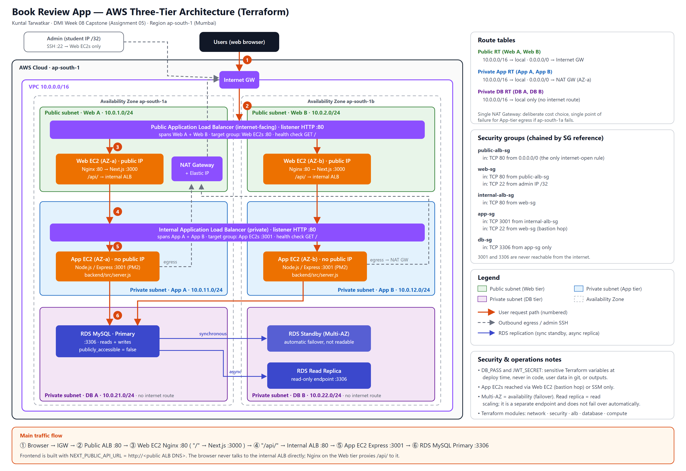

Editable source: `book-review-capstone/docs/architecture-diagram.html`. Single NAT Gateway in Web A is a deliberate cost choice and a documented single point of failure for App-tier outbound traffic.

---

# Task 2 — Build the Terraform Networking and Security Layers

## Goal

Create the modular Terraform project and implement the network and security layers across the required public and private subnets.

## Evidence

### Screenshot 6 — Modular Terraform Project Structure

Add a screenshot showing the modular Terraform project structure.

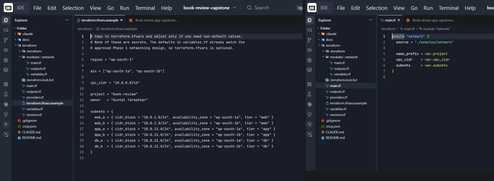

---

### Screenshot 7 — Six-Subnet Architecture

Add a screenshot showing the six-subnet architecture across two availability locations.

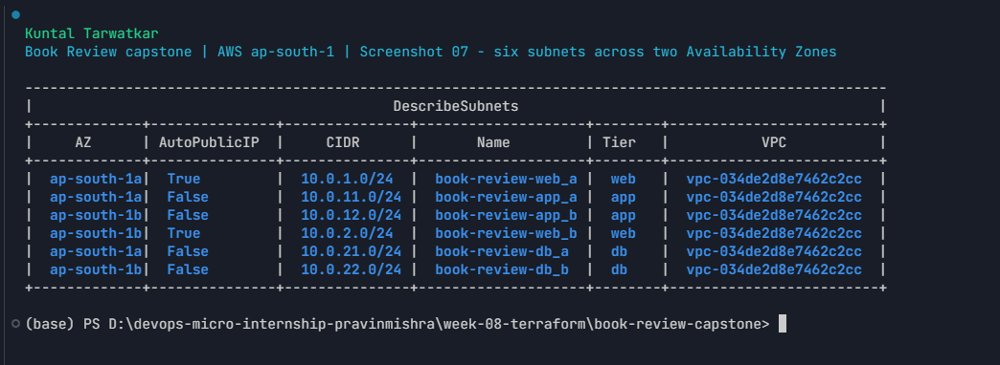

---

### Screenshot 8 — Public and Private Tier Separation

Add a screenshot showing the public and private tier separation, including routing and security boundaries.

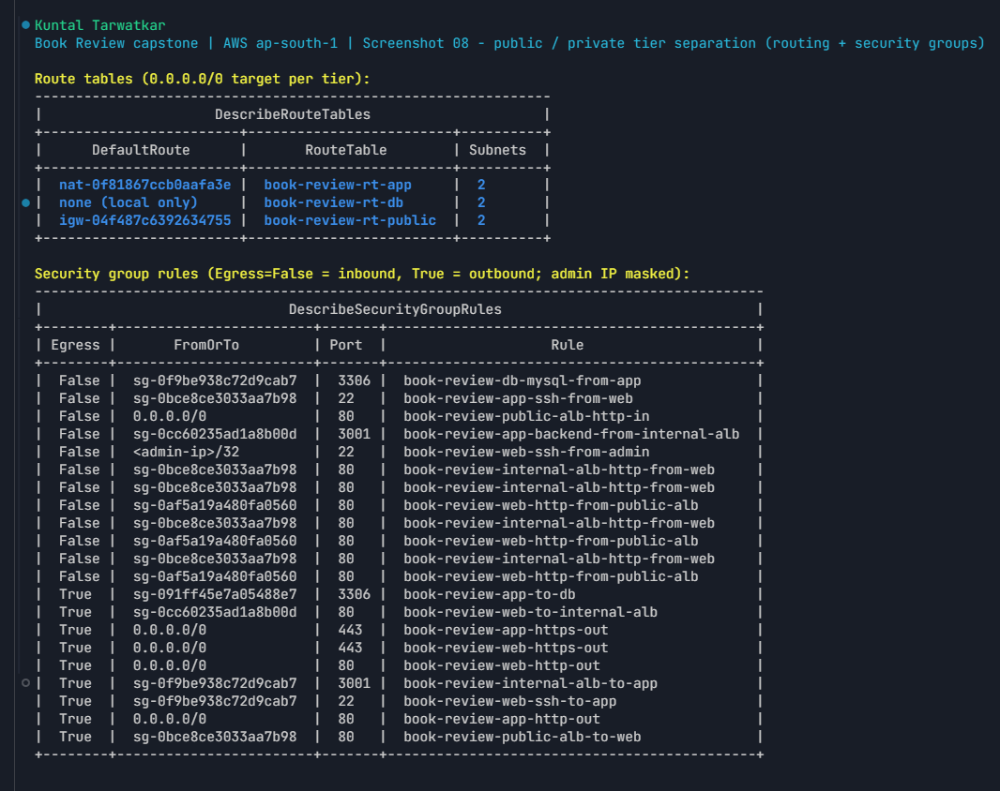

---

# Task 3 — Build the Load-Balancing and Compute Layers

## Goal

Deploy the public and internal load balancers and the Web and Application compute resources required by the Book Review App.

## Evidence

### Screenshot 9 — Web and Application Compute

Add a screenshot showing the Web and Application compute resources in their required subnets.

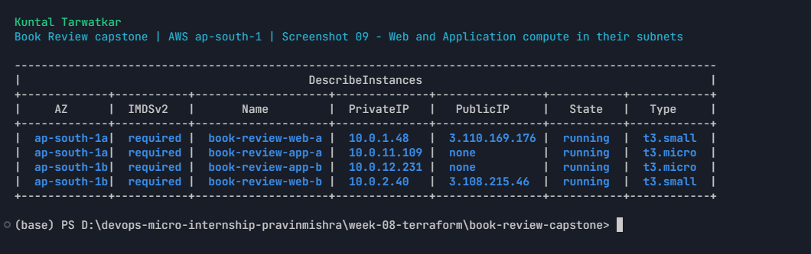

---

### Screenshot 10 — Public Load Balancer

Add a screenshot showing the internet-facing public load balancer.

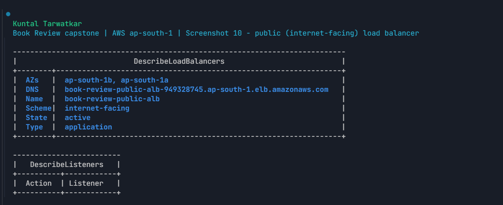

---

### Screenshot 11 — Internal Load Balancer

Add a screenshot showing the private internal load balancer.

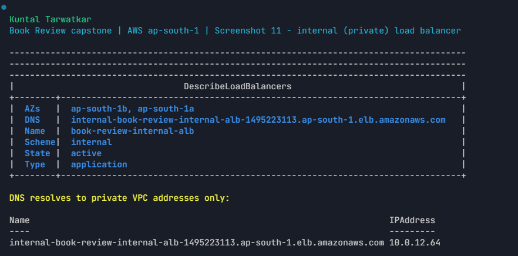

---

### Screenshot 12 — Healthy Targets

Add a screenshot showing healthy target groups or backend pools.

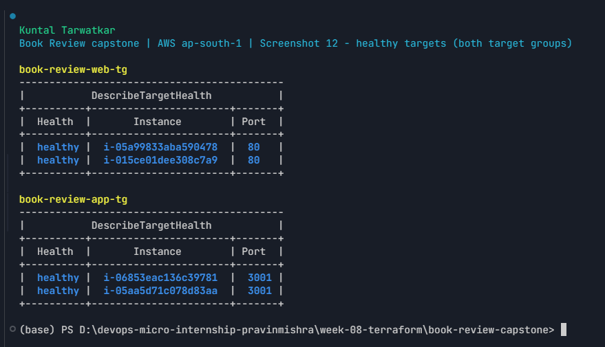

---

# Task 4 — Build the Managed MySQL Database Layer

## Goal

Deploy a private, highly available managed MySQL database with a read replica and restrict database connectivity to the Application Tier.

## Evidence

### Screenshot 13 — Managed MySQL Database

Add a screenshot showing the managed MySQL database deployment.

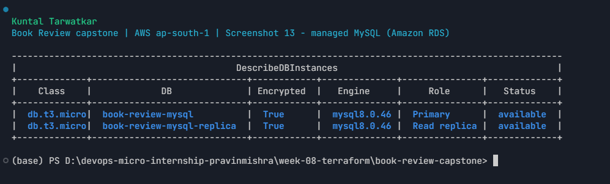

---

### Screenshot 14 — High Availability

Add a screenshot showing the Multi-AZ or high-availability configuration.

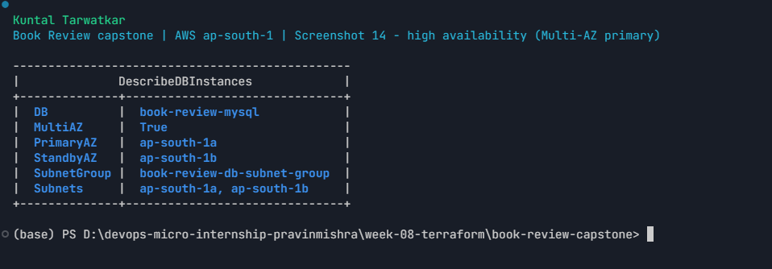

---

### Screenshot 15 — Read Replica

Add a screenshot showing the read replica configuration.

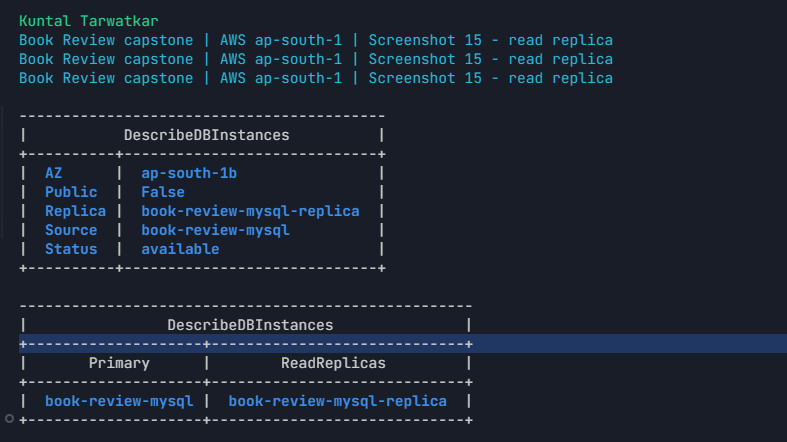

---

### Screenshot 16 — Private Database Access

Add a screenshot showing that the database is private and accepts MySQL traffic only from the Application Tier.

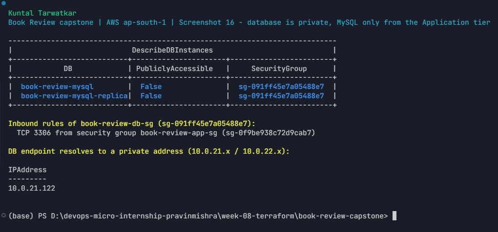

---

# Task 5 — Validate, Review, and Apply the Terraform Configuration

## Goal

Validate the Terraform configuration, review the execution plan using both Agentic AI and human judgment, and apply the infrastructure changes only after all required checks pass.

## Evidence

### Screenshot 17 — Terraform Validation

Add a screenshot showing successful `terraform validate` output.

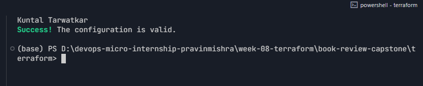

---

### Screenshot 18 — Terraform Plan

Add a screenshot showing the Terraform plan output.

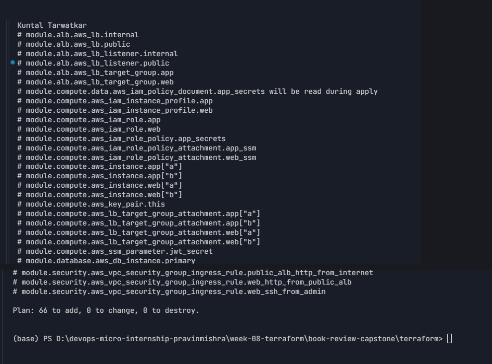

---

### Screenshot 19 — Terraform Apply

Add a screenshot showing successful `terraform apply` completion.

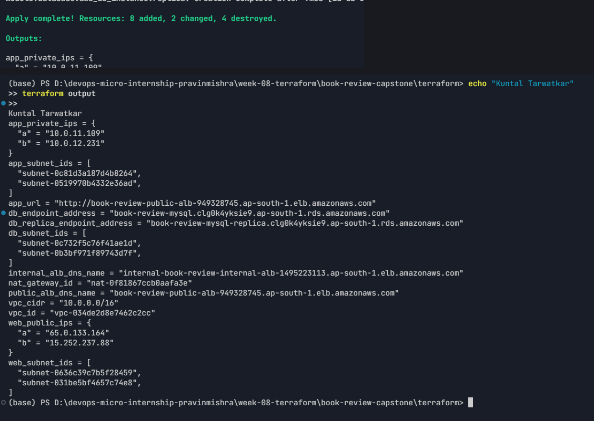

---

# Task 6 — Deploy and Configure the Book Review Application

## Goal

Deploy and configure the Book Review App across the Web, Application, and Database tiers and verify the complete application functionality.

## Evidence

### Screenshot 20 — Homepage

Add a screenshot showing the Book Review App homepage through the public endpoint.

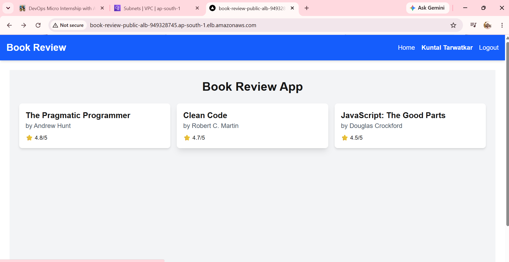

---

### Screenshot 21 — Login or Authentication

Add a screenshot showing successful login or authentication.

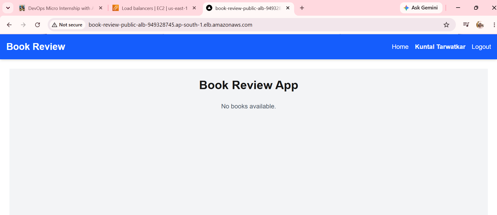

---

### Screenshot 22 — Book Data

Add a screenshot showing the book listing or book details.

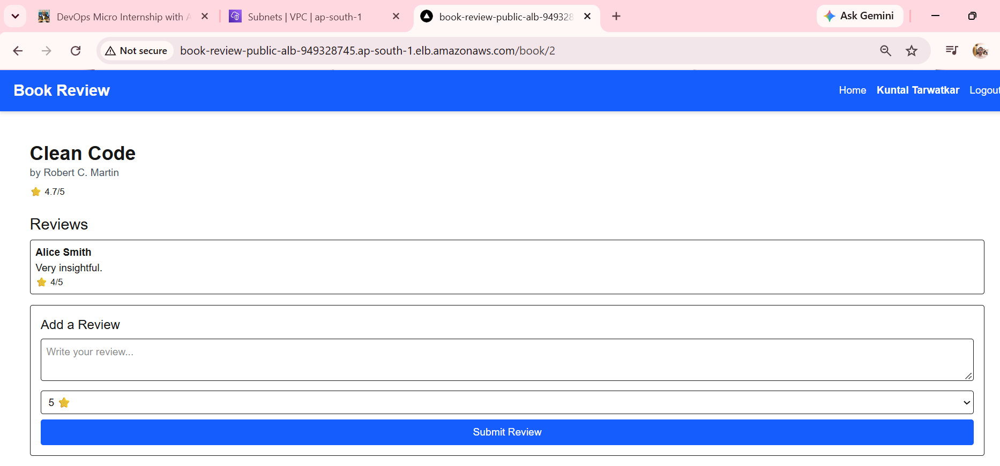

---

### Screenshot 23 — Review Functionality

Add a screenshot showing the review functionality working successfully.

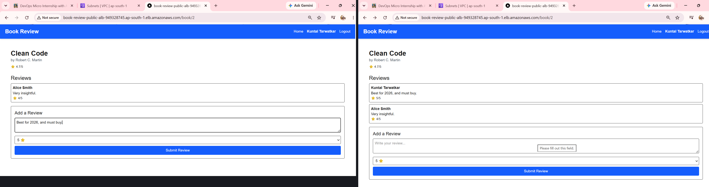

---

### Screenshot 24 — Backend or API Evidence

Add a screenshot showing that the backend or API is working successfully.

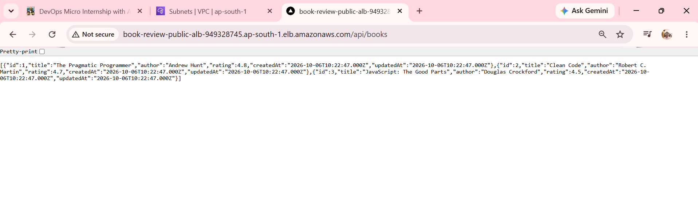

---

### Screenshot 25 — Database Reads and Writes

Add a screenshot showing successful database reads and writes.

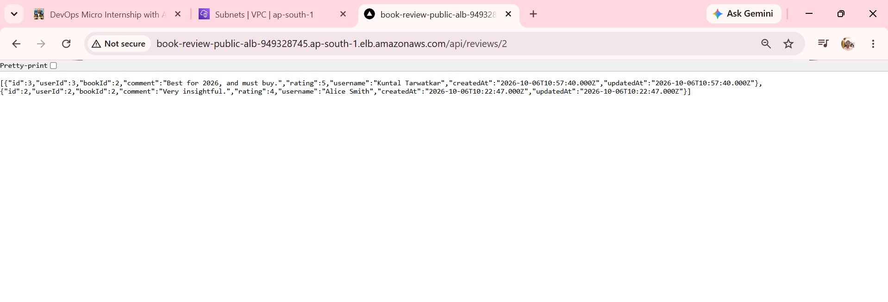

## Public Application URL

**Public Application URL / DNS:** http://book-review-public-alb-949328745.ap-south-1.elb.amazonaws.com

Verified end to end on 2026-10-06 (Screenshots 19, 20, 24). The stack was destroyed after evidence capture to stop hourly billing, so the URL no longer responds.

---

# Task 7 — Demonstrate the Agentic AI Workflow

## Goal

Demonstrate how Claude Code assisted with Terraform generation, architecture and security review, and evidence-based troubleshooting while infrastructure-changing decisions remained under human control.

You do not need to submit your complete Claude Code conversation history. Include only focused evidence.

## Evidence

### Screenshot 26 — AI-Assisted Terraform Generation

Add a screenshot showing one useful example of AI-assisted Terraform generation or improvement.

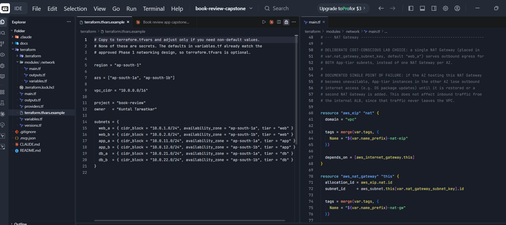

---

### Screenshot 27 — Architecture or Security Review

Add a screenshot showing one structured architecture or security review result.

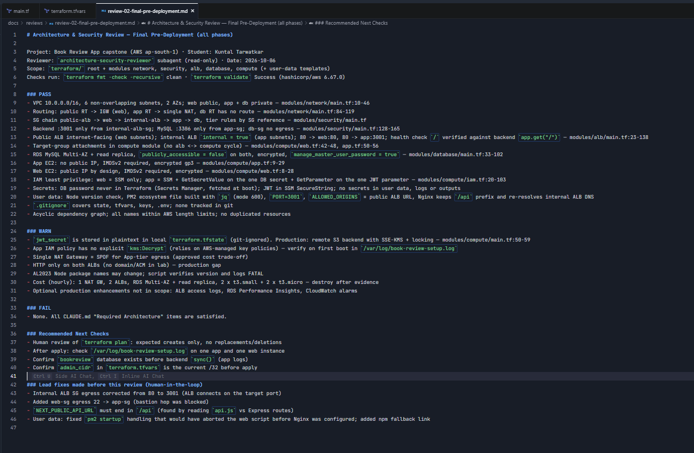

---

### Screenshot 28 — AI-Assisted Troubleshooting

Add a screenshot showing one AI-assisted troubleshooting interaction based on collected evidence.

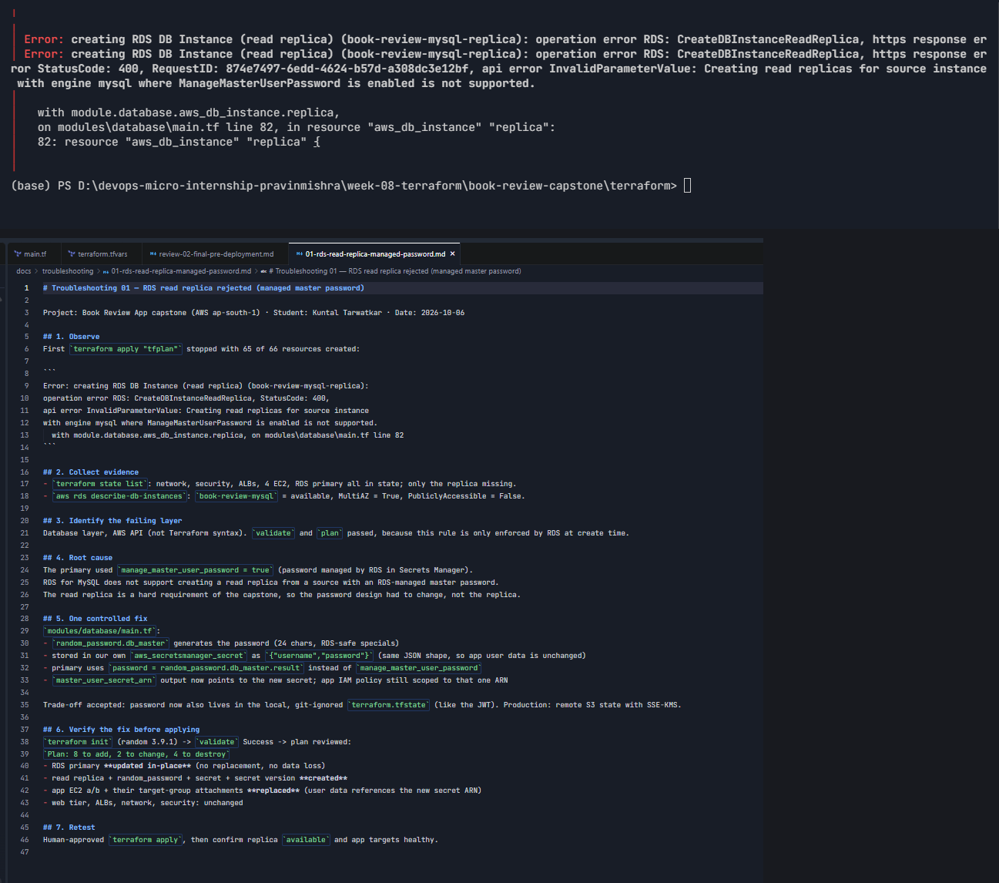

---

# Task 8 — Complete the Final Architecture Review

## Goal

Review the completed infrastructure against the original capstone requirements and resolve significant architecture, security, reliability, and cost issues.

Confirm that the final review covers:

- Tier separation
- Availability
- Public exposure
- Routing
- Security rules
- Load balancing
- Database privacy
- Secrets
- Terraform quality
- Module structure
- Reliability
- Obvious cost risks

Use Screenshot 27 as the focused evidence for the structured architecture or security review.

## Final Review Result

The final review covered all twelve areas above and found **0 FAIL**. Full reports are in `book-review-capstone/docs/reviews/`.

- **Resolved before deployment:** internal ALB egress corrected to port 3001; missing web-to-app SSH egress added; NAT Gateway subnet validation added; `NEXT_PUBLIC_API_URL` set to end in `/api`; user-data `pm2 startup` bug fixed.
- **Resolved during deployment:** RDS read replica blocked by the RDS-managed master password (switched to a Terraform-generated password in Secrets Manager); home page `/api/api` prefix (Nginx rewrite). Details are in `book-review-capstone/docs/troubleshooting/`.
- **Accepted lab trade-offs:**
  - Single NAT Gateway, a documented single point of failure for App-tier outbound traffic only.
  - HTTP only, because there is no domain or ACM certificate.
  - Secrets in the local, git-ignored Terraform state (production would use an S3 backend with KMS).
- **Cost:** NAT Gateway, two ALBs, RDS Multi-AZ, the read replica and four EC2 instances bill hourly. Everything was destroyed the same day after evidence capture, and AWS was checked afterwards to confirm nothing remained.

---

# Task 9 — Answer the Reflection Questions

## Goal

Reflect on the architecture, Terraform implementation, and Agentic AI workflow. Answer each question briefly in your own words.

## Architecture

### 1. Why did you separate the Web, Application, and Database tiers?

I separated them because each tier does a different job and needs a different level of exposure. Only the web tier has to face users. The API and the database don't. Keeping them in their own subnets with their own security groups means that if a web server is ever compromised, the attacker still can't reach the database directly. It also lets me scale or fix one tier without touching the others.

### 2. Why is the Application Tier private?

The app tier holds the business logic and is the only tier that knows the database password, so I didn't want it reachable from the internet at all. My app servers had no public IP, sat in private subnets, and could only go out to the internet through the NAT Gateway for package installs. Port 3001 only accepted traffic from the internal load balancer. A user's request had to pass through the public ALB and Nginx first.

### 3. Why is MySQL private?

MySQL holds all the users and reviews, so it gets the tightest lock. I set `publicly_accessible = false`, put it in DB subnets with no internet route at all, and allowed port 3306 only from the app tier's security group. Even the DB endpoint resolved to a private 10.0.21.x address, as you can see in Screenshot 16.

### 4. Why are multiple Availability Zones used?

So that one data centre going down doesn't take the whole app down. I placed one web server and one app server in ap-south-1a and another pair in ap-south-1b. The load balancers simply stop sending traffic to anything unhealthy, and RDS keeps a standby copy in the second zone. The only weak spot I knowingly left is the single NAT Gateway. I kept one to save cost and documented it.

### 5. What is the difference between Multi-AZ/high availability and a read replica?

Multi-AZ is about staying up. RDS keeps a hidden standby copy in another zone and switches to it automatically if the main database fails, but you can't read from the standby. A read replica is about spreading the load. It's a separate copy with its own endpoint that you can read from, it is updated with a small delay, and it doesn't take over automatically. In my project the primary was Multi-AZ (1a with its standby in 1b) and the read replica ran in 1b.

## Terraform

### 6. How did you divide your Terraform into modules?

I split it into five modules, one per layer: `network` (VPC, subnets, gateways, route tables), `security` (security groups and their rules), `alb` (both load balancers, target groups, listeners), `database` (RDS primary, replica, password secret) and `compute` (EC2 instances, IAM roles, user-data scripts). The root `main.tf` just connects them. That made each phase small enough to build, test and review on its own.

### 7. How do the modules communicate through variables and outputs?

Each module publishes what the next one needs as outputs, and the root module passes those into the next module as variables. For example, the network module's `vpc_id` goes into security, the security module's `db_sg_id` goes into database, and the ALB DNS names go into compute. One thing I learned is that the target-group attachments had to live in the compute module, otherwise the ALB and compute modules would depend on each other in a loop.

### 8. What did you specifically check in `terraform plan`?

On the first plan I made sure it only created things (66 to add, nothing destroyed). I checked that only the two web servers would get public IPs, that port 80 on the public ALB was the only rule open to the internet, and that SSH was limited to my own IP. I also checked that the internal ALB was really internal, that both databases had Multi-AZ set correctly and were not publicly accessible, and that secrets showed as `(sensitive value)`. When I applied the fixes later, I checked that the database would be updated in place, not deleted and recreated.

## Agentic AI

### 9. What was the purpose of `CLAUDE.md`?

`CLAUDE.md` was the project's rulebook for Claude. It held the required architecture, my AWS decisions, the order to build things in, and safety rules such as never applying or destroying on its own and never exposing secrets. Because it is loaded every session, I didn't have to repeat myself. When reading the app code showed that the API URL must end in `/api` and the backend must run on port 3001, I added that to `CLAUDE.md` so every later phase used the right values.

### 10. What work did the Terraform Engineer subagent perform?

It built the Terraform phase by phase, from networking through to compute. Before writing code it checked the current AWS provider docs through Terraform MCP, then ran `fmt`, `init` and `validate` after each phase. It also wrote the boot scripts that install and start the app on the servers. It never ran plan, apply or destroy. Those stayed with me.

### 11. What did the Architecture and Security Reviewer identify?

Both reviews came back with no FAILs. The first one, on networking and security, warned that the NAT Gateway setting could accidentally be pointed at a private subnet, so I added a validation rule for it. It also flagged the single NAT Gateway and the wide 80/443 outbound rules, which I accepted as lab trade-offs. The final review warned that secrets are stored in my local Terraform state file, that there's no HTTPS, and about the hourly cost of the NAT Gateway, load balancers and RDS. That's why I destroyed everything the same day.

### 12. Why did you use Terraform MCP instead of relying only on Claude's existing Terraform knowledge?

Because Terraform providers change, and memory can be out of date. MCP showed me things I might have got wrong: the Elastic IP now uses `domain = "vpc"` instead of `vpc = true`, security groups created by Terraform start with no outbound rules, and there are specific rules about which settings a read replica can and can't have. Checking the live docs saved me from errors that would only have shown up at plan or apply time.

### 13. What was the purpose of your validation hooks?

The hook runs `terraform fmt` and then `terraform validate` automatically every time a `.tf` file is edited, so mistakes are caught straight away instead of relying on anyone to remember. It caught a real one: after I added the `random` provider, validation failed until I ran `terraform init`. The permission settings also make apply and destroy always ask for my approval, and they stop Claude reading my tfvars, state files and keys.

### 14. Describe one real issue Claude helped you troubleshoot.

My first apply stopped with an error on the read replica: `Creating read replicas for source instance with engine mysql where ManageMasterUserPassword is enabled is not supported`. Instead of retrying, we collected evidence. `terraform state list` and `aws rds describe-db-instances` showed that 65 of 66 resources were fine and the main database was healthy. The cause was that I'd let RDS manage the master password, and MySQL doesn't allow a replica in that case. The fix was to have Terraform generate the password and store it in my own Secrets Manager secret in the same format, so the app didn't need any change. Before applying, I checked the plan to confirm the database would only be updated, not replaced. After that, the replica came up fine.

### 15. Describe one recommendation you reviewed, modified, or rejected instead of accepting blindly.

When planning the security groups, the subagent suggested that the internal load balancer should send traffic to the app servers on port 80. I didn't accept that. A load balancer connects to its targets on the target port, which here is 3001, so with port 80 the health checks would have failed and the API would have been unreachable. I changed it to 3001. In the same review I also added an SSH rule from the web to the app servers that was missing. Later, while reading the generated boot script, I found a `pm2 startup` step that would have stopped the web server setup before Nginx was configured, and fixed that before deploying.

---

# Task 10 — Publish the Mandatory LinkedIn Post

## Goal

Publish a LinkedIn post describing the capstone, the technical work completed, the Agentic AI workflow, and the lessons learned.

Write the post in your own words, include at least one project image or other proof, and ensure that it can be viewed by the submission reviewer.

## LinkedIn Post URL

**LinkedIn Post URL:** https://www.linkedin.com/feed/update/urn:li:activity:7513200114098802688/

---

# Submission Instructions

- Complete Tasks 0–10 in sequence.
- Include all Screenshots 1–28 exactly as specified.
- Ensure that your full name is visible in the required screenshots.
- Include the selected cloud platform.
- Include the completed architecture diagram.
- Include the modular Terraform project structure.
- Include the working public application URL or public load-balancer DNS.
- Include all required Agentic AI workflow evidence.
- Answer all 15 reflection questions briefly in your own words.
- Include the published LinkedIn post URL.
- Do not expose cloud credentials, database passwords, SSH private keys, JWT secrets, access tokens, account IDs, Terraform state containing sensitive values, or other confidential information.
- Review all screenshots and project files carefully before submitting through GitHub.

---

# Completion Checklist

- [x] Selected AWS or Azure
- [x] Added and reviewed the Agentic AI starter files
- [x] Configured `CLAUDE.md`
- [x] Configured the Terraform Engineer subagent
- [x] Configured the Architecture and Security Reviewer subagent
- [x] Connected Terraform MCP
- [x] Configured validation hooks and safety guardrails
- [x] Created the architecture diagram
- [x] Created the six-subnet design
- [x] Configured public Web Tier routing
- [x] Kept the Application Tier private
- [x] Kept the Database Tier private
- [x] Configured tier-specific Security Groups or NSGs
- [x] Restricted backend port `3001`
- [x] Restricted MySQL port `3306` to the Application Tier
- [x] Created the public load balancer
- [x] Created the internal load balancer
- [x] Configured listeners and health checks
- [x] Deployed the Web Tier compute resources
- [x] Deployed the private Application Tier compute resources
- [x] Provisioned private managed MySQL
- [x] Configured Multi-AZ or high availability
- [x] Configured a read replica
- [x] Created the modular Terraform project
- [x] Used variables, outputs, and module dependencies
- [x] Used current Terraform documentation through MCP
- [x] Used hooks for deterministic validation
- [x] Completed `terraform fmt`
- [x] Completed `terraform validate`
- [x] Reviewed `terraform plan`
- [x] Completed the Terraform Engineer review
- [x] Completed the Architecture and Security review
- [x] Applied the infrastructure only after human approval
- [x] Deployed and configured the backend
- [x] Deployed and configured the frontend
- [x] Configured Nginx where required
- [x] Configured the internal backend endpoint
- [x] Configured the public frontend endpoint
- [x] Verified the homepage
- [x] Verified login or authentication
- [x] Verified book data
- [x] Verified review functionality
- [x] Verified the backend API
- [x] Verified database reads and writes
- [x] Verified healthy load-balancer targets
- [x] Included AI-assisted Terraform generation evidence
- [x] Included one architecture or security review
- [x] Included one AI-assisted troubleshooting example
- [x] Completed the final architecture review
- [x] Answered all 15 reflection questions
- [x] Published the mandatory LinkedIn post
- [x] Added the LinkedIn post URL
- [x] Captured all 28 required screenshots
- [x] Confirmed that my full name is visible in the required screenshots
- [x] Checked that no secrets or sensitive information are exposed

---

## About DMI & CloudAdvisory

DevOps Micro Internship (DMI) is a project-based DevOps program run by Pravin Mishra (The CloudAdvisory), focused on real-world execution, systems thinking, and career readiness.

It helps learners build strong DevOps foundations through hands-on experience.

---

## Resources

- Book Review App Repository: [https://github.com/pravinmishraaws/book-review-app](https://github.com/pravinmishraaws/book-review-app)
- DMI Official Website: [https://dmi.pravinmishra.com](https://dmi.pravinmishra.com)
- University: [https://university.pravinmishra.com](https://university.pravinmishra.com)
- Discord Community: [https://discord.pravinmishra.com](https://discord.pravinmishra.com)
- Blog: [https://dmi.pravinmishra.com/blog](https://dmi.pravinmishra.com/blog)
- YouTube Playlist: [https://www.youtube.com/playlist?list=PLFeSNDtI4Cho](https://www.youtube.com/playlist?list=PLFeSNDtI4Cho)
- Pravin Mishra on LinkedIn: [https://www.linkedin.com/in/pravin-mishra-aws-trainer/](https://www.linkedin.com/in/pravin-mishra-aws-trainer/)
- CloudAdvisory on LinkedIn: [https://www.linkedin.com/company/thecloudadvisory/](https://www.linkedin.com/company/thecloudadvisory/)

---

*This submission is part of the DevOps Micro Internship (DMI) Cohort 3 — Agentic AI Track.*
