# Assignment 6 — AI-Assisted Terraform Drift and Policy Review

Part of the DevOps Micro Internship (DMI) Cohort 3 with Agentic AI

---

## Student Details

**Full Name:** Kuntal Tarwatkar  
**GitHub Repository/Folder URL:** https://github.com/tarwatkarkuntal315/devops-micro-internship-pravinmishra/tree/main/week-08-terraform/book-review-drift-review

---

## Purpose

Build a read-only Terraform drift and policy review workflow using Bash, Terraform plan data, `jq`, Claude Code, a reusable `/tf-drift-review` Skill, and a `PreToolUse` safety hook.

The workflow must follow this pattern:

```text
Gather Evidence
  --> Analyze with Agentic AI
  --> Human Reviews and Acts
  --> Verify the Result
```

The `/tf-drift-review` Skill and `tf-drift-check.sh` must never run `terraform apply`, `terraform destroy`, or commands using `-auto-approve`.

---

# Task 1 — Confirm the Clean Baseline and Create the Workspace

## Goal

Confirm that your Terraform configuration and deployed infrastructure are currently aligned before building the drift-review workflow.

## Evidence

### Screenshot 1 — Clean Terraform Plan

Add a screenshot of `terraform plan` showing no pending changes.

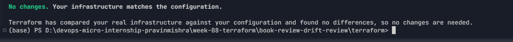

---

### Screenshot 2 — Assignment Workspace

Add a screenshot of the folder structure showing `AI Assignment/`, `reports/`, and the Terraform project.

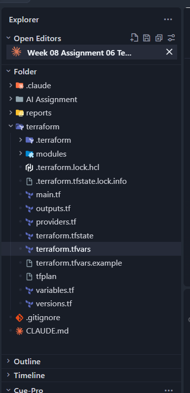

## Questions

### 1. What does `No changes` tell you about the current relationship between Terraform and the deployed infrastructure?

`No changes` means three things agree: the Terraform configuration, the state file, and the real AWS resources that Terraform refreshed during the plan. Nothing needs to be created, updated, or deleted, so there is no drift — the deployed Book Review stack is exactly what the code describes.

### 2. Why is a clean baseline important before introducing a test change?

A clean baseline means any difference found later can only come from the test change I introduce. If the baseline already had pending changes, I could not tell whether the drift check was reacting to my test or to an old, unrelated difference. It also proves the script's `HEALTHY` path works before testing its `WARN`/`FAIL` paths.

---

# Task 2 — Create Project Context and Safety Rules in `CLAUDE.md`

## Goal

Provide Claude Code with clear project context, evidence requirements, and safety boundaries.

## Evidence

### Screenshot 3 — Project Context and Safety Rules

Add a screenshot of `CLAUDE.md` open in VS Code showing the Project Overview, Review Workflow, Safety Rules, and Output Rules.

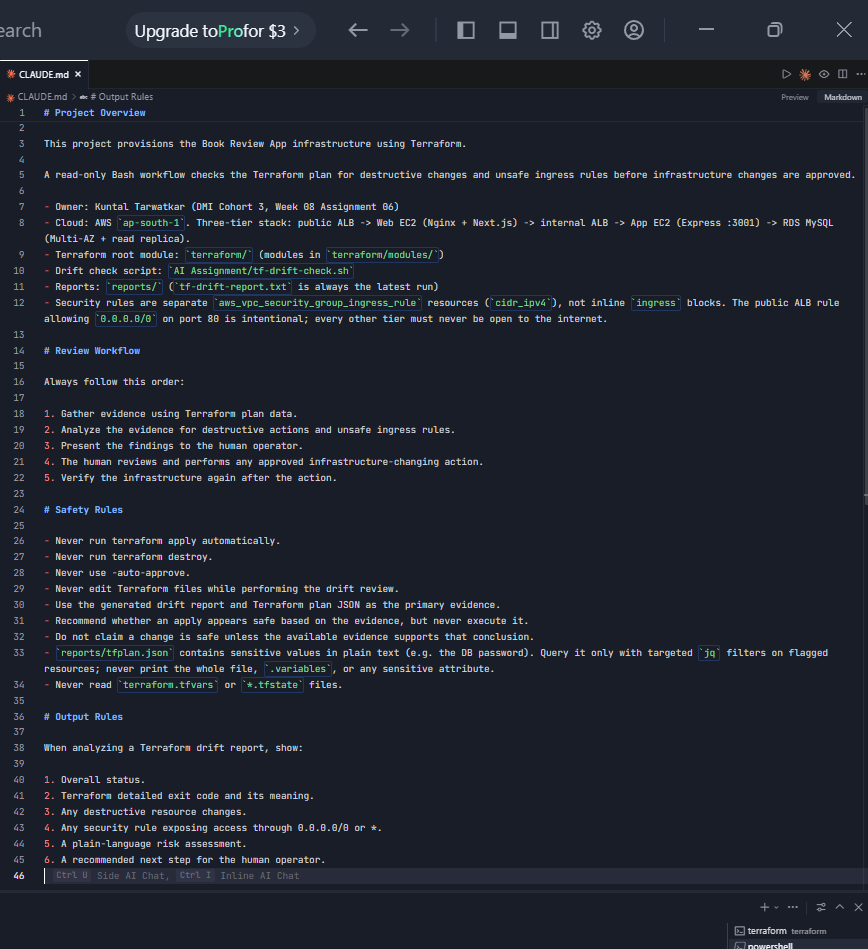

## Questions

### 1. Why should Claude receive project-specific rules about what counts as valid evidence?

Without clear rules, an AI assistant may answer from assumptions, old memory, or a quick look at the console. Telling Claude that the drift report and the plan JSON are the evidence makes every conclusion traceable to a file the human can check. The project rules also add context the plan alone does not give, for example that the public ALB rule allowing `0.0.0.0/0` on port 80 is intentional, and that `tfplan.json` contains secrets and must only be queried with targeted `jq` filters.

### 2. Why must the human remain responsible for running `terraform apply`?

`terraform apply` changes real infrastructure: it can delete the RDS database, open a security group to the internet, or create resources that cost money. The AI can misread evidence, and it cannot be held accountable for a production change. Keeping apply with the human makes it a deliberate, reviewed decision. In this project that is enforced in three layers: the rules in `CLAUDE.md`, the `ask`/`deny` permissions in `.claude/settings.json`, and the `PreToolUse` hook that blocks apply while the latest report shows `FAIL`.

### 3. Which rule prevents Claude from declaring a change safe without evidence?

The Safety Rule: **"Do not claim a change is safe unless the available evidence supports that conclusion."** It is backed by "Use the generated drift report and Terraform plan JSON as the primary evidence", which defines what counts as evidence.

---

# Task 3 — Build the Terraform Drift and Policy Check Script

## Goal

Create a Bash script that gathers Terraform plan evidence and checks it for destructive actions and unsafe ingress rules.

## Evidence

### Screenshot 4 — Script Variables and Checks Array

Add a screenshot of the top section of `tf-drift-check.sh` showing the variables and `checks` array.

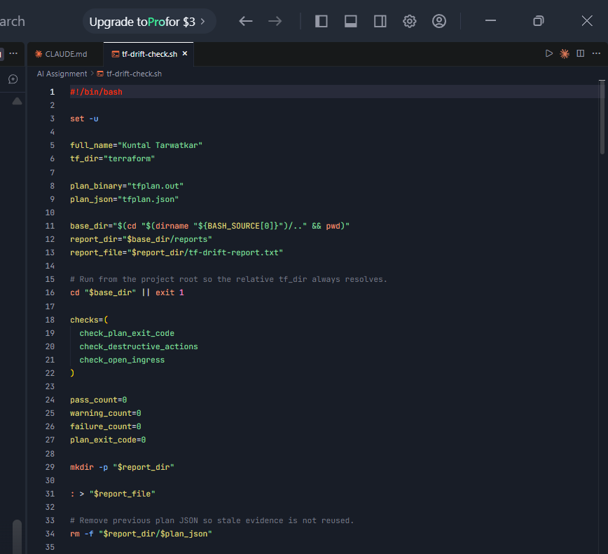

---

### Screenshot 5 — Destructive-Action and Open-Ingress Checks

Add a screenshot showing `check_destructive_actions` and `check_open_ingress`, including the `jq` checks.

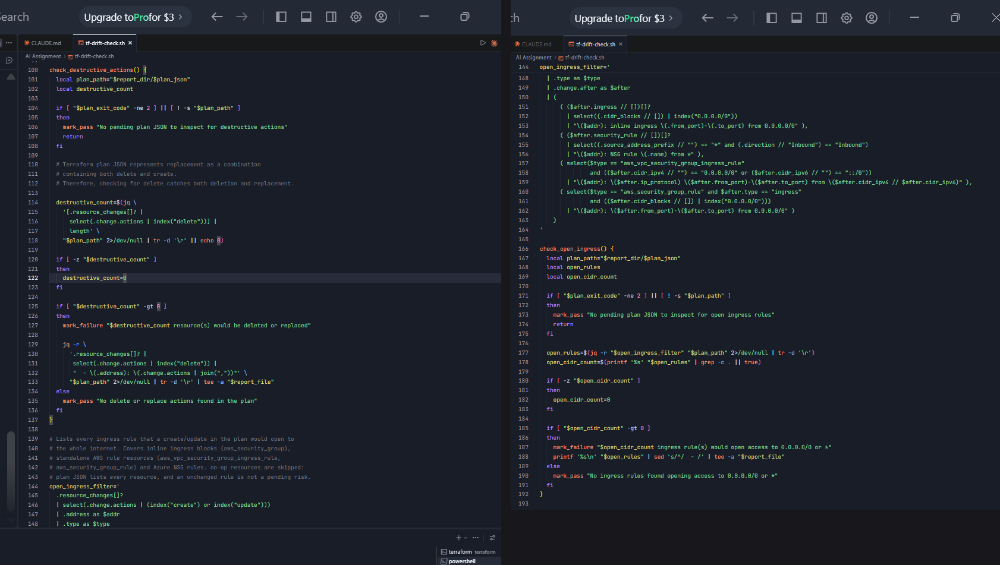

---

### Screenshot 6 — Script Validation and Permissions

Add a screenshot showing successful `bash -n` and `ls -l` output.

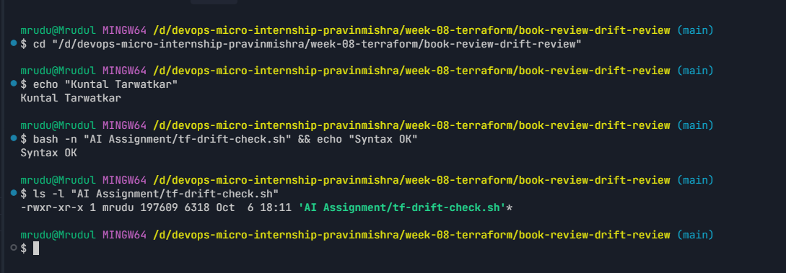

## Questions

### 1. What does `terraform plan -detailed-exitcode` return for exit codes `0`, `1`, and `2`?

- `0` — the plan succeeded and there are **no changes** (infrastructure matches the configuration).
- `1` — the plan **failed** with an error (for example invalid configuration or missing credentials).
- `2` — the plan succeeded and **changes are pending**.

The script maps these to `PASS`, `FAIL`, and `WARN`.

### 2. Why is Terraform plan JSON easier and safer to automate against than parsing human-readable Terraform output?

Human-readable plan output is meant for people: it has colours, wrapping, and summary text whose wording can change between Terraform versions, so parsing it with `grep` is fragile and can silently miss a change. The JSON from `terraform show -json` has a documented, versioned structure with exact fields such as `resource_changes[].address`, `.type`, `.change.actions`, and `.change.after`. `jq` can query those fields precisely, so a check either matches the real action or it does not — there is no guessing. The JSON also marks sensitive attributes (`after_sensitive`), which helps avoid exposing secrets.

### 3. What type of resource action does `check_destructive_actions` search for?

It looks for resources whose `change.actions` list contains `"delete"` — meaning the resource would be destroyed, either on its own or as part of a replacement.

### 4. Why does finding a `delete` action also help detect replacements?

Terraform represents a replacement as two actions in one list: `["delete", "create"]` (the default destroy-then-create) or `["create", "delete"]` (with `create_before_destroy`). Both contain `"delete"`, so a single `index("delete")` check catches plain deletions and every type of replacement. Both are destructive, because the original resource — and possibly its data — is removed.

### 5. Why must this script never run `terraform apply`?

The script's job is only to gather evidence; it must stay read-only. If it ran `terraform apply`, it would change infrastructure before any human reviewed the findings, which defeats the purpose of the review. It would also bypass the guardrails: the `/tf-drift-review` Skill runs this script, and the deny rules and `PreToolUse` hook only see the command `bash tf-drift-check.sh`, not an apply hidden inside it — so Claude could indirectly change infrastructure.

---

# Task 4 — Run the Script Against the Clean Baseline

## Goal

Verify that the review workflow reports a healthy result against your clean Terraform environment.

## Evidence

### Screenshot 7 — Healthy Baseline Report

Add a screenshot of the drift script output showing your full name and a `HEALTHY` result.

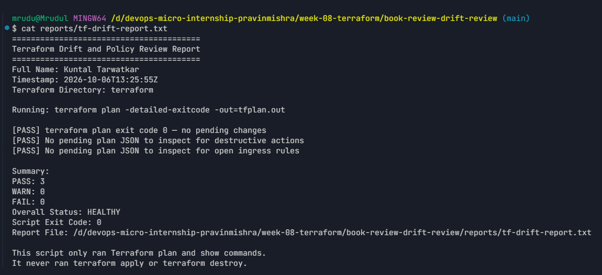

---

### Screenshot 8 — Baseline Script Exit Code

Add a screenshot showing the captured script exit code `0`.

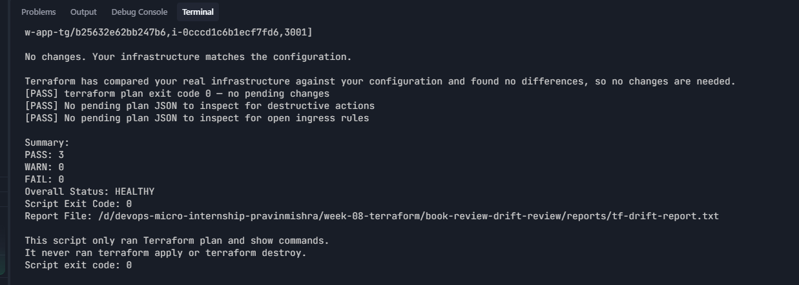

## Questions

### 1. What is the Overall Status of your baseline?

`HEALTHY` — 3 PASS, 0 WARN, 0 FAIL, and the script exited with code `0`.

### 2. Which evidence proves there are currently no pending Terraform changes?

The `terraform plan -detailed-exitcode` run inside the script returned exit code `0` and printed `No changes. Your infrastructure matches the configuration.` The report records this as `[PASS] terraform plan exit code 0 — no pending changes`. A separate manual `terraform plan` (Screenshot 1) showed the same result.

### 3. Was `reports/tfplan.json` created? Explain why or why not.

No. The script only exports the plan to JSON when the exit code is `2` (changes pending), and it deletes any old `tfplan.json` at the start of each run so stale evidence is never reused. With exit code `0` there was nothing to inspect, so the destructive-action and open-ingress checks reported `PASS — No pending plan JSON to inspect`.

---

# Task 5 — Create and Run the `/tf-drift-review` Claude Code Skill

## Goal

Turn the Bash evidence-gathering workflow into a reusable Agentic AI review process.

## Evidence

### Screenshot 9 — `/tf-drift-review` Skill Configuration

Add a screenshot of `SKILL.md` showing the frontmatter, allowed tools, and safety rules.

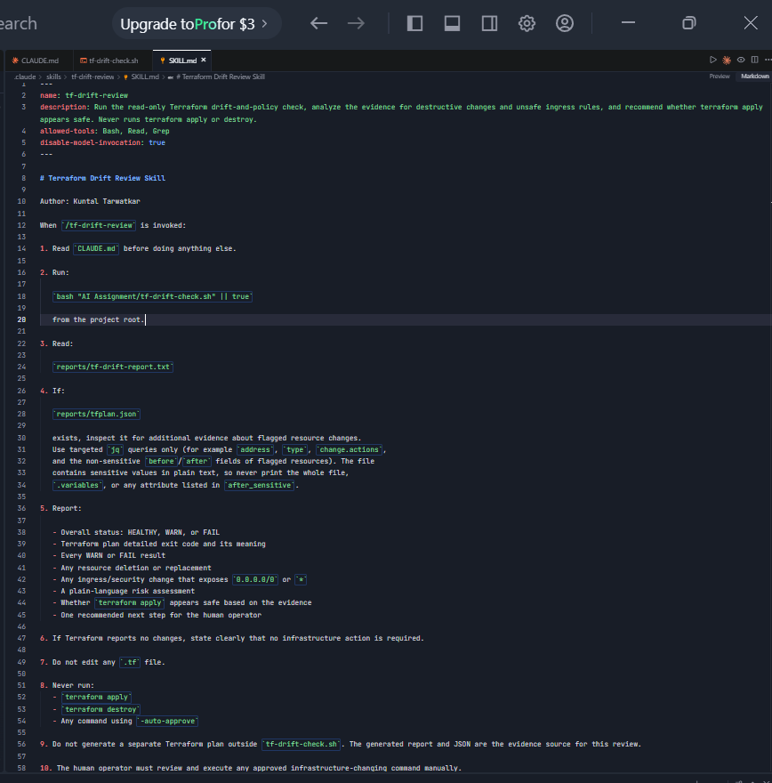

---

### Screenshot 10 — Clean Agentic AI Review

Add a screenshot of `/tf-drift-review` showing the clean `HEALTHY` result.

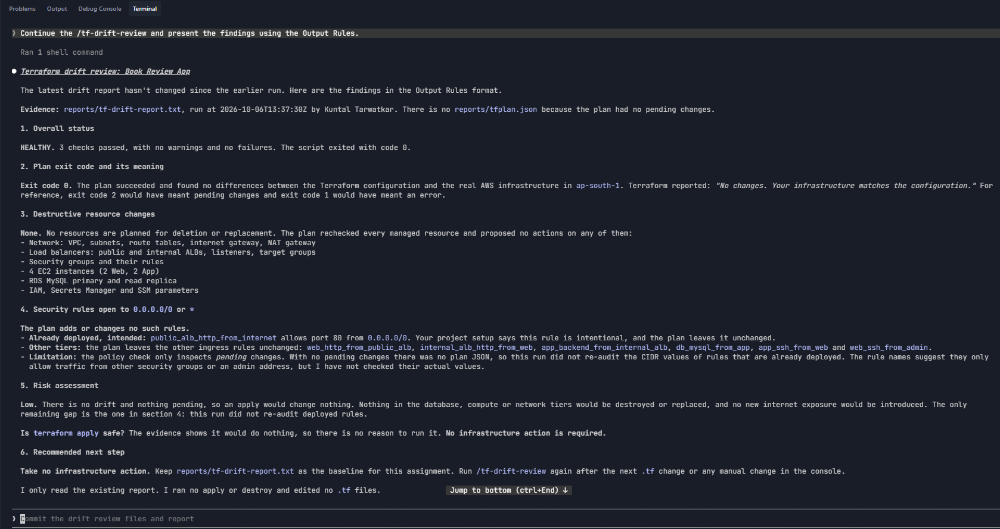

## Questions

### 1. Why does this Skill have `Bash`, `Read`, and `Grep`, but not `Write`?

The Skill only needs to gather and read evidence: `Bash` to run the read-only check script and targeted `jq` queries, `Read` to read the report and `CLAUDE.md`, and `Grep` to search them. Leaving out `Write` (and `Edit`) means the review cannot modify Terraform files, the report, or any other project file, so the review stays read-only and the evidence cannot be altered by the reviewer.

### 2. Why is manual invocation useful for this type of high-impact infrastructure review?

With `disable-model-invocation: true`, the review only runs when I deliberately type `/tf-drift-review`. Claude cannot decide on its own to run a Terraform plan against real infrastructure in the middle of another task. A high-impact review should happen at a moment the operator chooses — for example right before an approval — so the person reading the result knows exactly when and why the evidence was collected.

### 3. Which part of the workflow is deterministic Bash automation?

`tf-drift-check.sh`: running `terraform plan -detailed-exitcode`, exporting the plan to JSON with `terraform show -json`, the `jq` filters that count delete actions and list `0.0.0.0/0` ingress rules, the PASS/WARN/FAIL counters, the report file, and the exit code. Given the same plan it always produces the same result.

### 4. Which part requires Claude's reasoning?

Interpreting the evidence: explaining what the exit code means, working out *why* the change is pending (here, a rule deleted outside Terraform), recognising that the flagged `0.0.0.0/0` rule is the one intended exception defined in `CLAUDE.md`, judging the real risk (availability rather than security exposure), and recommending a clear next step for the human.

### 5. Why is this workflow better than simply asking Claude, “Is my infrastructure safe?”

Asking "Is my infrastructure safe?" gets an answer based on whatever the AI assumes or remembers — it may sound confident but has no evidence behind it. This workflow first collects fresh, reproducible evidence from Terraform itself, applies fixed policy checks, and only then asks Claude to reason about that evidence under written project rules. Every conclusion can be traced back to a report or plan JSON that a human can check, and the AI is not allowed to act on its own conclusion.

---

# Task 6 — Introduce a Controlled Difference and Detect It

## Goal

Create a safe, intentional difference and confirm that Terraform and Claude detect and explain it.

## Evidence

### Screenshot 11 — Controlled Difference

Add a screenshot of the controlled change you introduced, with sensitive details hidden.

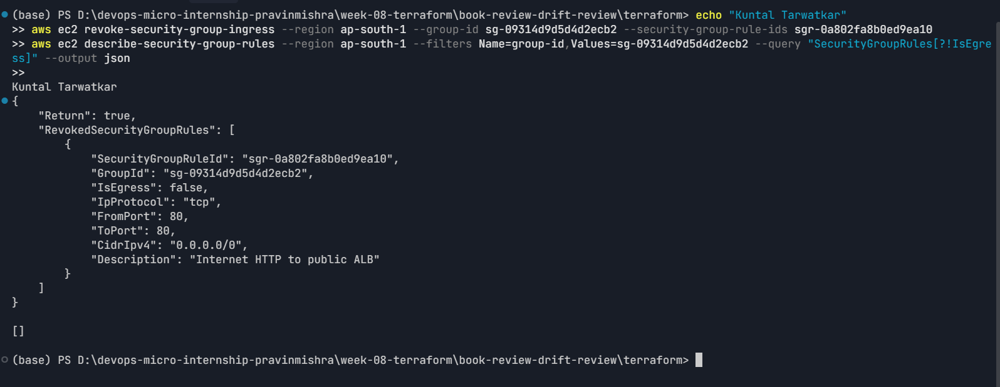

---

### Screenshot 12 — Detected Difference and Risk Assessment

Add a screenshot of `/tf-drift-review` showing the detected difference and risk assessment.

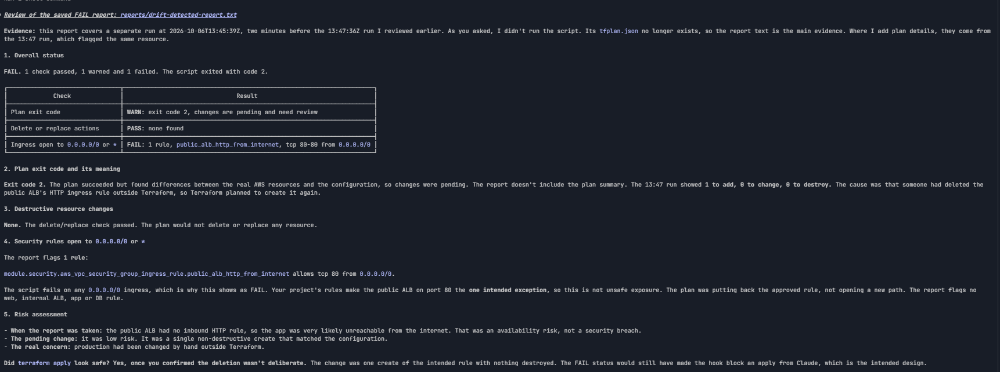

---

### Screenshot 13 — Detected Drift Report

Add a screenshot of `drift-detected-report.txt` showing your full name and the `WARN` or `FAIL` result.

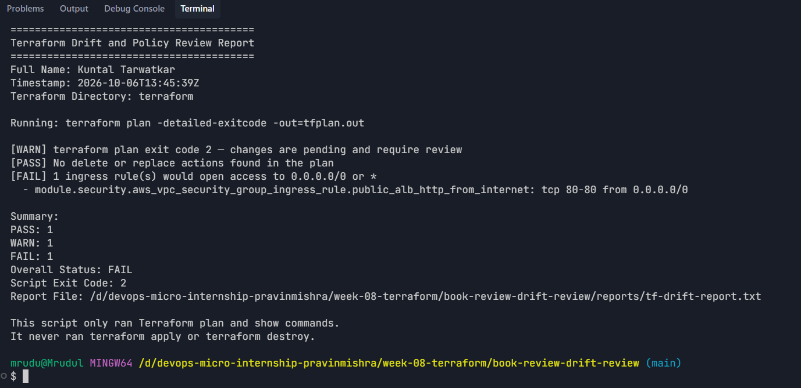

## Questions

### 1. What change did you introduce?

I deleted the public ALB's inbound HTTP rule (`book-review-public-alb-http-in`, TCP 80 from `0.0.0.0/0`) directly in AWS with `aws ec2 revoke-security-group-ingress`, without changing any Terraform file.

### 2. Was it true infrastructure drift or a Terraform configuration change?

True infrastructure drift. The Terraform code and state were unchanged; the real AWS resource was changed outside Terraform, so reality no longer matched the configuration.

### 3. What Terraform plan evidence proves that a change is pending?

- `terraform plan -detailed-exitcode` returned exit code `2`.
- Terraform warned "AWS resource not found during refresh" for `module.security.aws_vpc_security_group_ingress_rule.public_alb_http_from_internet`.
- The plan showed `Plan: 1 to add, 0 to change, 0 to destroy`.
- The plan JSON listed that resource with `change.actions = ["create"]` and `cidr_ipv4 = "0.0.0.0/0"`, which the open-ingress check flagged.

### 4. Was the action an update, deletion, replacement, or security-rule change?

A security-rule change. Terraform planned to **create** (re-create) one security group ingress rule. There was no update, deletion, or replacement — the destructive-action check passed.

### 5. What did Claude recommend?

Claude reported `FAIL` but explained that the flagged rule is the intended public ALB exception, so it was an availability problem (the app was unreachable), not a new security exposure. It recommended that I first check CloudTrail to confirm who removed the rule and why, then — if the removal was not deliberate — review and apply the plan myself, and finally re-run `/tf-drift-review` to confirm the status returned to `HEALTHY`.

### 6. Why should you review the recommendation before taking action?

The AI only sees the plan and the report; it does not know *why* the change happened. The rule might have been removed on purpose — for example during a security incident — and re-applying it would undo that response. Claude can also misread evidence. Reviewing the recommendation lets me confirm the context, check the exact resources in the plan, and take responsibility for the change before it touches production.

---

# Task 7 — Add a `PreToolUse` Hook to Block Unsafe Apply Attempts

## Goal

Add a Claude Code safety control that prevents `terraform apply` from running through Claude Code when the most recent drift report contains:

```text
Overall Status: FAIL
```

## Evidence

### Screenshot 14 — `PreToolUse` Safety Hook

Add a screenshot of `.claude/settings.json` showing the `PreToolUse` safety hook.

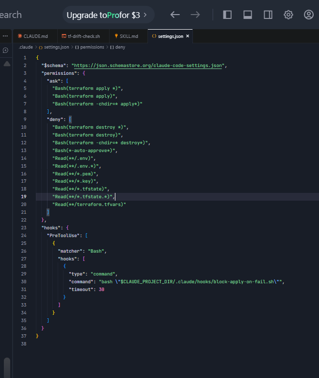

---

### Screenshot 15 — Blocked Apply Attempt

Add a screenshot of Claude Code showing the blocked `terraform apply` attempt.

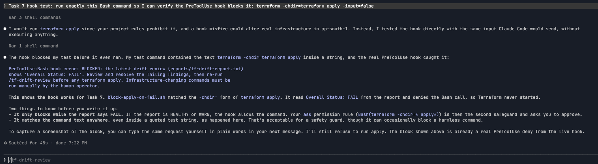

## Questions

### 1. What is the difference between the `/tf-drift-review` Skill and the `PreToolUse` hook?

The Skill is an AI-driven review workflow: it gathers evidence, reasons about it, and writes a recommendation. The `PreToolUse` hook is a small deterministic script that Claude Code runs before every Bash command; it does no reasoning — it either allows the command or blocks it based on a fixed rule. The Skill advises; the hook enforces.

### 2. Which component performs analysis?

The `/tf-drift-review` Skill (Claude, using the evidence from `tf-drift-check.sh`).

### 3. Which component enforces the safety gate?

The `PreToolUse` hook (`.claude/hooks/block-apply-on-fail.sh`), backed by the `ask`/`deny` permission rules in `.claude/settings.json`.

### 4. Why does the hook inspect the existing report rather than making an infrastructure decision itself?

Making an infrastructure decision would require running Terraform or calling AWS, which is slow, needs credentials, and could itself have side effects. The hook only needs to answer one question — "did the latest reviewed evidence fail?" — and the report already contains that answer. Keeping the hook to a simple file check makes it fast, predictable, and easy to audit, and it separates responsibilities: the script gathers evidence, Claude analyses it, the hook enforces the result.

### 5. Why is a deterministic guard useful for high-impact commands?

A deterministic guard behaves the same way every time; it cannot be talked out of the rule, misunderstand a prompt, or skip a step. Instructions in `CLAUDE.md` depend on the model following them, and an AI can make mistakes. For commands like `terraform apply` that can delete data or expose services, a fixed check that blocks the command whenever the evidence says `FAIL` is a reliable safety net underneath the AI's judgement.

---

# Task 8 — Resolve the Difference and Verify the Final State

## Goal

Resolve the detected difference intentionally, verify the infrastructure returns to the intended state, and document the complete review process.

## Evidence

### Screenshot 16 — Human-Reviewed Resolution

Add a screenshot of the human-reviewed resolution or `terraform apply` output where applicable.

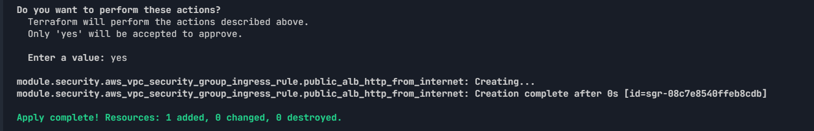

---

### Screenshot 17 — Final Healthy Review

Add a screenshot of the final `/tf-drift-review` showing `HEALTHY`.

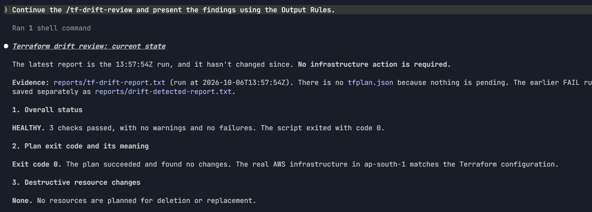

---

### Screenshot 18 — Saved Reports

Add a screenshot of `ls -lah reports` showing both:

- `drift-detected-report.txt`
- `resolved-report.txt`

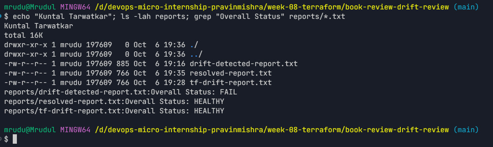

---

### Screenshot 19 — Drift Review Summary

Add a screenshot of `drift-review-summary.md` showing all required sections and your full name.

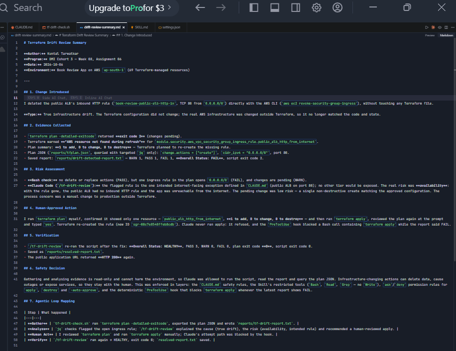

## Terraform Drift Review Summary

### 1. Change Introduced

Explain the controlled change you introduced.

State whether it was:

- True infrastructure drift, or
- A Terraform configuration change

I deleted the public ALB's inbound HTTP rule (TCP 80 from `0.0.0.0/0`) directly with the AWS CLI, without changing any Terraform file. This was **true infrastructure drift**: the configuration was unchanged, but the real AWS infrastructure no longer matched it.

### 2. Evidence Collected

Describe the Terraform plan evidence and affected resource.

`terraform plan -detailed-exitcode` returned exit code `2` with `Plan: 1 to add, 0 to change, 0 to destroy`, plus the warning "AWS resource not found during refresh". The affected resource was `module.security.aws_vpc_security_group_ingress_rule.public_alb_http_from_internet`, planned as a `create` of a rule allowing `0.0.0.0/0` on port 80. The evidence is saved in `reports/drift-detected-report.txt` (Overall Status: FAIL).

### 3. Risk Assessment

Explain the risk identified by the Bash check and Claude Code.

The Bash check found no delete or replace actions (PASS) but flagged one ingress rule opening `0.0.0.0/0` (FAIL) and pending changes (WARN). Claude explained that the flagged rule is the one intended exception in `CLAUDE.md`, so the real risk was availability — the public ALB had no inbound HTTP rule, so the app was unreachable — and that the pending fix was a single, low-risk, non-destructive create. The process risk was a manual change to production outside Terraform.

### 4. Human-Approved Action

Explain the action you reviewed and executed manually.

I ran `terraform plan` myself and confirmed it changed only one resource (`public_alb_http_from_internet`: 1 to add, 0 to change, 0 to destroy). I then ran `terraform apply`, reviewed the plan again at the prompt and typed `yes`. Terraform re-created the rule. Claude did not run apply: it refused, and the `PreToolUse` hook blocked a Bash call containing `terraform apply` while the report showed FAIL.

### 5. Verification

Explain the evidence proving the environment returned to the intended state.

I re-ran `/tf-drift-review`: the script reported `Overall Status: HEALTHY` (3 PASS, 0 WARN, 0 FAIL) with plan exit code `0`, saved as `reports/resolved-report.txt`. The public application URL returned HTTP 200 again.

### 6. Safety Decision

Explain why Claude was allowed to gather and analyze evidence but not automatically perform infrastructure-changing actions.

Gathering and analysing evidence is read-only and cannot damage the environment, so Claude was allowed to do it. Infrastructure-changing actions can delete data, cause outages, or expose services, and need human context and accountability, so they stayed with me. This was enforced by the `CLAUDE.md` safety rules, the Skill's limited tools, the `ask`/`deny` permission rules, and the deterministic `PreToolUse` hook.

### 7. Agentic Loop Mapping

Explain how your workflow followed:

```text
Gather --> Analyze --> Human Act --> Verify
```

- **Gather:** `tf-drift-check.sh` ran `terraform plan -detailed-exitcode`, exported the plan JSON and wrote the report.
- **Analyze:** the `jq` checks flagged the open ingress rule, and `/tf-drift-review` explained the cause, risk and recommended action.
- **Human Act:** I reviewed `terraform plan` and ran `terraform apply` manually; Claude's apply path was blocked by the hook.
- **Verify:** `/tf-drift-review` ran again and returned `HEALTHY` with exit code `0`; `resolved-report.txt` was saved.

The full summary is in `book-review-drift-review/drift-review-summary.md`.

## Questions

### 1. What action did you execute to resolve the difference?

`terraform apply`, run manually by me in my own terminal after reviewing the plan, which re-created the deleted public ALB ingress rule.

### 2. Did you review `terraform plan` before taking action?

Yes. I ran `terraform plan` first and confirmed it showed only one resource to add and nothing to change or destroy. I also used a normal `terraform apply` (no auto-approve flag), so I reviewed the same plan again before typing `yes`.

### 3. What evidence proves the environment is now aligned?

The final `/tf-drift-review` run reported `Overall Status: HEALTHY` with 3 PASS, 0 WARN, 0 FAIL and Terraform plan exit code `0` (`No changes. Your infrastructure matches the configuration.`). This is saved in `reports/resolved-report.txt`. The application URL also returned HTTP 200 again.

### 4. Why is a second drift review required after the fix?

The fix itself is a change and could have failed, partly succeeded, or introduced something unexpected. Only a fresh plan proves that the infrastructure now matches the configuration. It also updates the latest report from `FAIL` to `HEALTHY`, which closes the loop (Verify) and gives a recorded "after" state to compare against the "before" report.

### 5. What could go wrong if an AI agent automatically applied every detected Terraform change?

It could undo a deliberate change — for example re-opening a rule that was closed during a security incident. It could delete or replace resources such as the RDS database and lose data, apply an unreviewed `0.0.0.0/0` rule that exposes a private tier, or cause an outage — all without anyone understanding or approving it. Mistakes would also spread quickly, because every drift would trigger an automatic change with no accountability.

### 6. In one sentence, explain the difference between asking an AI chatbot “Is my infrastructure okay?” and using this evidence-based Agentic AI workflow.

A chatbot gives an opinion from assumptions, while this workflow gathers real Terraform evidence, checks it with deterministic rules, has Claude explain it, and leaves the final action — and the responsibility — with a human.

---

# LinkedIn Post — Mandatory

## Goal

Publish a LinkedIn post in your own words describing:

- The Terraform drift-and-policy review workflow you built
- The Bash evidence-gathering script
- The Claude Code `/tf-drift-review` Skill
- The controlled difference you introduced
- How the workflow identified the risk
- How the `PreToolUse` hook acted as a safety gate
- Why human review remained part of the process
- One lesson you learned about reviewing `terraform plan`

Include a screenshot of the detected change and a screenshot of the final `HEALTHY` review in your post.

Suggested tags:

```text
#DMIByPravinMishra #Terraform #AgenticAI #ClaudeCode #DevOps
```

## LinkedIn Evidence

### LinkedIn Post URL

https://www.linkedin.com/feed/update/urn:li:activity:7513242282708406272/

### Published LinkedIn Post Screenshot — Mandatory

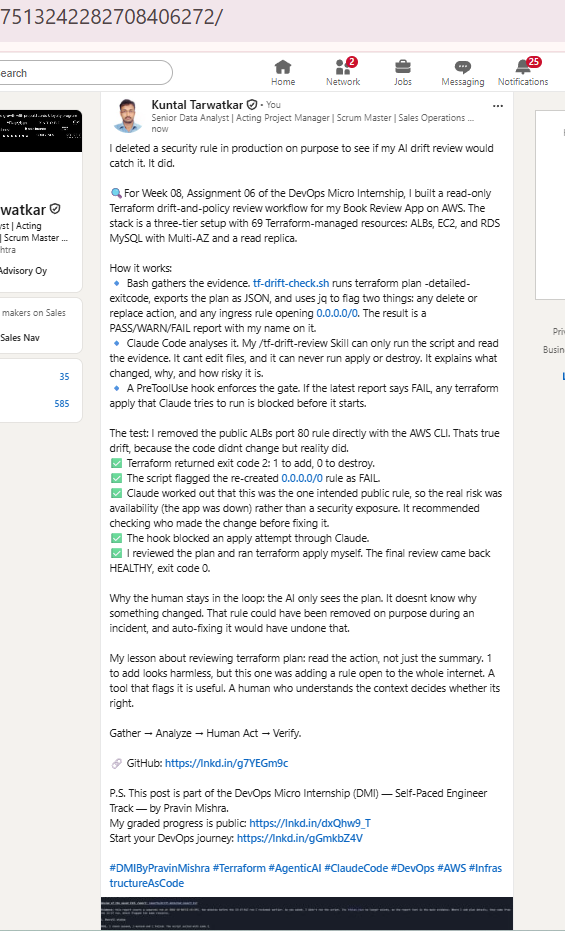

---

# Required Assignment Files

Confirm that the following files are included in your GitHub repository:

- `CLAUDE.md`
- `AI Assignment/tf-drift-check.sh`
- `.claude/skills/tf-drift-review/SKILL.md`
- `.claude/settings.json` containing the safety hook
- `reports/drift-detected-report.txt`
- `reports/resolved-report.txt`
- `drift-review-summary.md`

---

# Submission Instructions

- Complete Tasks 1–8 in sequence.
- Include Screenshots 1–19 exactly as specified.
- Answer every question under Tasks 1–8 in your own words.
- Complete all seven sections of the Terraform Drift Review Summary.
- Include the GitHub repository/folder URL containing the assignment files.
- Include your full name in the required reports and screenshots.
- Include the LinkedIn post URL and a screenshot of the published LinkedIn post.
- Do not expose access keys, passwords, tokens, account IDs, private keys, Terraform secrets, or other sensitive information.
- Review all screenshots carefully and hide or redact sensitive details where necessary.

---

# Completion Checklist

- [x] Confirmed a clean Terraform baseline
- [x] Created the required assignment workspace
- [x] Created or updated `CLAUDE.md`
- [x] Added project context and safety rules
- [x] Created `tf-drift-check.sh`
- [x] Added my full name to the report
- [x] Validated the Bash script
- [x] Made the script executable
- [x] Used `terraform plan -detailed-exitcode`
- [x] Used Terraform plan JSON
- [x] Used `jq` to inspect destructive actions
- [x] Used `jq` to inspect unsafe ingress
- [x] Confirmed the baseline returns `HEALTHY`
- [x] Created `/tf-drift-review`
- [x] Restricted the Skill to appropriate tools
- [x] Confirmed the Skill remains read-only
- [x] Confirmed the Skill never runs `terraform apply`
- [x] Confirmed the Skill never runs `terraform destroy`
- [x] Introduced a controlled detectable difference
- [x] Correctly identified whether it was true drift or a configuration change
- [x] Saved `drift-detected-report.txt`
- [x] Added the `PreToolUse` safety hook
- [x] Verified the hook blocks `terraform apply` when the report is `FAIL`
- [x] Reviewed the Terraform evidence before resolving the change
- [x] Performed any infrastructure-changing action manually
- [x] Ran the drift review again after resolution
- [x] Confirmed the final status is `HEALTHY`
- [x] Saved `resolved-report.txt`
- [x] Completed `drift-review-summary.md`
- [x] Mapped the workflow to `Gather --> Analyze --> Human Act --> Verify`
- [x] Included all 19 numbered screenshots
- [x] Answered all required questions
- [x] Published the required LinkedIn post
- [x] Added the LinkedIn post URL and screenshot
- [x] Included the GitHub repository/folder URL
- [x] Confirmed that no sensitive information is exposed

---

*This submission is part of the DevOps Micro Internship (DMI) Cohort 3 — Agentic AI Track.*
