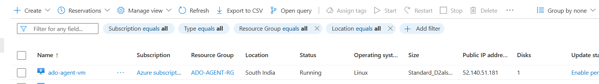
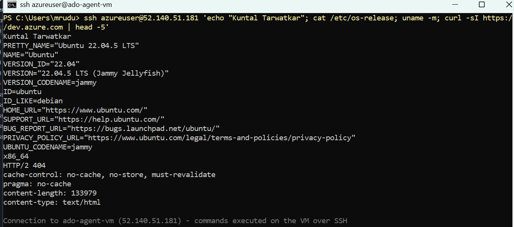
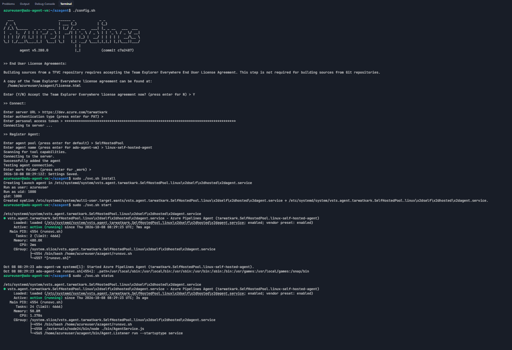
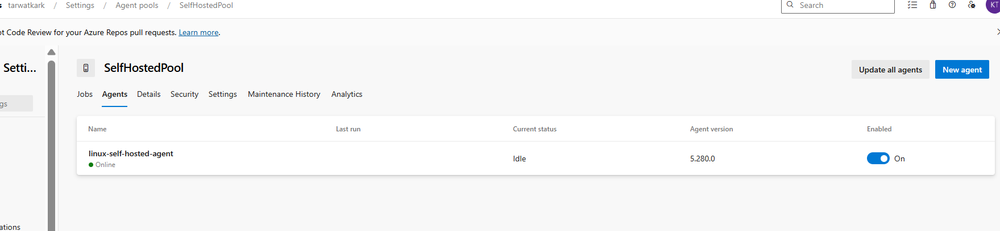
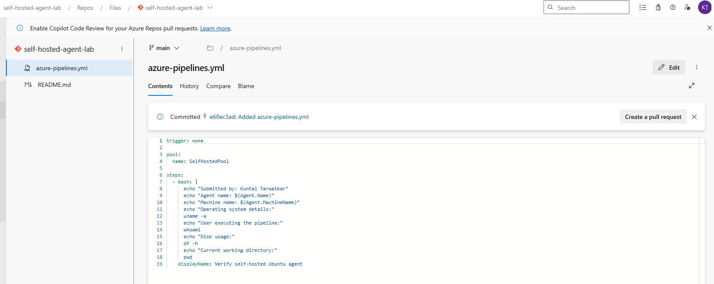
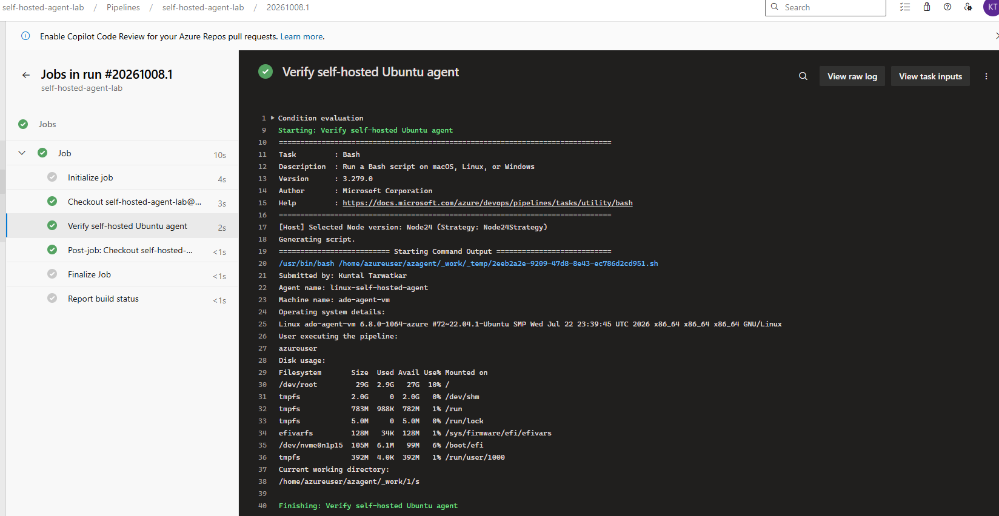
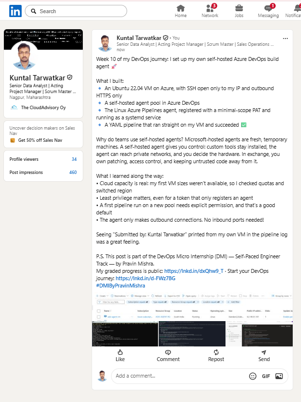

# Assignment 1 — Set Up a Self-Hosted Linux Agent for Azure DevOps (Ubuntu + PAT)

Part of the DevOps Micro Internship (DMI) Cohort 3 with Agentic AI

---

## Student Details

**Full Name:** Kuntal Tarwatkar  
**GitHub Repository/Folder URL:** https://github.com/tarwatkarkuntal315/devops-micro-internship-pravinmishra/tree/main/week-10-azure-devops

---

## Purpose

In this assignment, you will provision an Ubuntu VM in AWS or Azure and configure it as a self-hosted Azure Pipelines agent. The VM is registered in a self-hosted agent pool using a Personal Access Token (PAT), runs the agent as a Linux systemd service, and executes a test YAML pipeline from Azure DevOps.

---

## Summary of What I Configured

I created a new Azure DevOps organization (`tarwatkark`) and a private project (`self-hosted-agent-lab`), then generated a short-lived PAT with only the **Agent Pools (Read & manage)** and **Build (Read & execute)** scopes. In Organization settings I created a self-hosted agent pool named `SelfHostedPool`.

On Azure, I provisioned an Ubuntu 22.04 LTS x64 VM (`ado-agent-vm`) in its own resource group. Its Network Security Group allows inbound SSH (TCP 22) only from my own public IP (`/32`) and outbound HTTPS (TCP 443) to the internet. I did not open any inbound web ports, because the agent only makes outbound HTTPS connections to Azure DevOps.

On the VM, I downloaded the current Linux x64 agent (v5.280.0) from the pool's **New agent** page, installed its dependencies, and registered it with `./config.sh` using the PAT as `linux-self-hosted-agent` in `SelfHostedPool`. I then installed and started it as a systemd service with `svc.sh`, so it keeps running after a reboot or after I disconnect from SSH. The agent showed **Online** and **Enabled** in the pool.

Finally, I committed `azure-pipelines.yml` to an Azure Repos repository, targeting `SelfHostedPool`, and ran it. The run succeeded and the log shows the job ran on my VM: agent name `linux-self-hosted-agent`, machine name `ado-agent-vm`, and user `azureuser`, with the job running from `/home/azureuser/azagent/_work/1/s`.

---

## Environment Values

| Item | Value |
|------|-------|
| Cloud platform | Microsoft Azure (South India, Standard_D2als_v6, Ubuntu 22.04 LTS x64) |
| Organization name | tarwatkark |
| Organization URL | https://dev.azure.com/tarwatkark |
| Project name | self-hosted-agent-lab |
| Agent pool name | SelfHostedPool |
| VM name | ado-agent-vm |
| VM public IP | Redacted / see Screenshot 1 |
| SSH username | azureuser |
| Agent name | linux-self-hosted-agent |

---

# Task 0 — Create or Access Azure DevOps

## Goal

Sign in to Azure DevOps, create an organization if needed, and prepare a project for the assignment.

> No submission screenshot required for this task.

---

# Task 1 — Create a Personal Access Token (PAT)

## Goal

Create a PAT with **Agent Pools (Read & manage)** and **Build (Read & execute)** scopes, using the shortest practical expiration, and store it securely.

> No submission screenshot required. The PAT value must never be captured.

---

# Task 2 — Create a Self-Hosted Agent Pool

## Goal

Create a self-hosted agent pool in **Organization settings → Agent pools**.

> No submission screenshot required at this stage. The online-agent screenshot is captured in Task 5.

---

# Task 3 — Provision and Connect to the Ubuntu VM

## Goal

Create an x64 Ubuntu LTS VM with a public IP, inbound SSH (TCP 22) allowed only from my public IP (`/32`), and outbound HTTPS (TCP 443) allowed. Connect over SSH and verify the OS, architecture, and HTTPS connectivity to Azure DevOps.

```bash
cat /etc/os-release
uname -m
curl -I https://dev.azure.com
```

## Evidence

### Screenshot 1 — Cloud portal showing the Ubuntu VM running (VM name, status, public IP)



---

### Screenshot 2 — SSH terminal showing Ubuntu version, x86_64 architecture, and Azure DevOps HTTPS response



---

# Task 4 — Install and Configure the Azure Pipelines Agent

## Goal

Install basic packages, download the current Linux agent from the **New agent** page, register it with `./config.sh` (PAT authentication), then install and start it as a systemd service.

```bash
sudo ./svc.sh install
sudo ./svc.sh start
sudo ./svc.sh status
```

## Evidence

### Screenshot 3 — Successful agent configuration, service install, service start, and running status



---

# Task 5 — Verify That the Agent Is Online

## Goal

Confirm the service is running on the VM and the agent shows **Online** and **Enabled** in the agent pool.

## Evidence

### Screenshot 4 — Agent pool Agents page showing the agent Online and enabled



---

# Task 6 — Create and Run a Test Pipeline

## Goal

Create `azure-pipelines.yml` in an Azure Repos repository targeting the self-hosted pool, then run it and confirm the Linux commands execute on the VM.

## Completed `azure-pipelines.yml`

```yaml
trigger: none

pool:
  name: SelfHostedPool

steps:
  - bash: |
      echo "Submitted by: Kuntal Tarwatkar"
      echo "Agent name: $(Agent.Name)"
      echo "Machine name: $(Agent.MachineName)"
      echo "Operating system details:"
      uname -a
      echo "User executing the pipeline:"
      whoami
      echo "Disk usage:"
      df -h
      echo "Current working directory:"
      pwd
    displayName: Verify self-hosted Ubuntu agent
```

## Evidence

### Screenshot 5 — `azure-pipelines.yml` open in the Azure Repos editor



---

### Screenshot 6 — Successful pipeline run with the expanded verification step output



---

## Notes — Issues Faced and How I Resolved Them

1. **VM size not available.** Creating the VM in Central India failed for `Standard_B1s`, `Standard_B2s` and `Standard_B2ats_v2`: either "SkuNotAvailable (capacity restrictions)" or "AllocationFailed", and `Standard_B2s_v2` failed because my subscription had a 0-core quota for that family. I checked the quota for each VM family with `az vm list-usage` and moved to South India, where `Standard_D2als_v6` (2 vCPU, 4 GB, x64) deployed successfully.
2. **`dev.azure.com` redirected to the marketing page.** Because I was not signed in to Azure DevOps, it opened the Azure DevOps product page instead. Opening `https://aex.dev.azure.com` took me straight to the sign-in and organization page.
3. **HTTP 500 right after creating my profile.** The error page said my user identifier was not found. The new Azure DevOps profile had not finished setting up on Microsoft's side; after waiting a moment and refreshing, the "Create new organization" page loaded normally.
4. **"Agent Pools" scope not listed when creating the PAT.** The PAT form shows only common scopes at first. I clicked **Show all scopes** to find **Agent Pools → Read & manage**.
5. **PAT partly visible in a screenshot.** A screenshot of the PAT success dialog showed the beginning of the token. As a precaution, I revoked that token and created a new one for agent registration, and I made sure no PAT appears in any submitted screenshot.
6. **Interactive "Which services should be restarted?" prompt.** During `apt install` and `installdependencies.sh`, Ubuntu's `needrestart` stopped and asked which services to restart. I chose "none of the above", so `ssh.service` was not restarted and my SSH session stayed connected.
7. **`libicu78/76/74` "Unable to locate package" messages.** `installdependencies.sh` tries newer ICU versions first; Ubuntu 22.04 provides `libicu70`, which the script then found already installed. The script ended with "Finish Install Dependencies", so no action was needed.
8. **Pipeline waiting for permission.** The first run stopped with "This pipeline needs permission to access a resource". I had not granted the pool to all pipelines, so I clicked **View → Permit** to authorize `SelfHostedPool` for this pipeline only, and the job then ran on my agent.

---

# LinkedIn Post

**LinkedIn Post URL:** https://www.linkedin.com/feed/update/urn:li:activity:7513877127381798912/



---

# Submission Instructions

- Add all required screenshots in your submission
- Do not display the PAT, SSH private key, passwords, cloud account IDs, or other secrets in screenshots or logs

---

# Completion Checklist

- [x] Azure DevOps organization and project are ready (Task 0)
- [x] PAT created with required scopes and stored securely (Task 1)
- [x] Self-hosted agent pool created (Task 2)
- [x] Ubuntu LTS VM running, SSH restricted to my public IP, outbound HTTPS working (Screenshots 1–2)
- [x] Agent registered and running as a systemd service (Screenshot 3)
- [x] Agent Online and enabled in the pool (Screenshot 4)
- [x] Same pool name used in registration and pipeline YAML
- [x] `azure-pipelines.yml` committed in Azure Repos (Screenshot 5)
- [x] Pipeline Succeeded and shows my full name and Linux command output (Screenshot 6)
- [x] Completed `azure-pipelines.yml` contents included
- [x] LinkedIn post URL and screenshot added
- [x] No PAT, SSH private key, password, or other secret visible

---

## 📌 About DMI & CloudAdvisory

DevOps Micro Internship (DMI) is a project-based DevOps program run by Pravin Mishra (The CloudAdvisory) focused on real-world execution, systems thinking, and career readiness.

It helps learners build strong DevOps foundations with hands-on experience.

---

## 📌 Resources

- 🌐 DMI Official Website: https://dmi.pravinmishra.com?utm_source=github&utm_medium=readme  
- 🎓 University: https://university.pravinmishra.com?utm_source=github&utm_medium=readme  
- 💬 Discord Community: https://discord.pravinmishra.com?utm_source=github&utm_medium=readme  
- 📝 Blog: https://dmi.pravinmishra.com/blog?utm_source=github&utm_medium=readme  
- ▶️ YouTube Playlist: https://www.youtube.com/playlist?list=PLFeSNDtI4Cho  
- 🔗 Pravin Mishra (LinkedIn): https://www.linkedin.com/in/pravin-mishra-aws-trainer/  
- 🏢 CloudAdvisory (LinkedIn): https://www.linkedin.com/company/thecloudadvisory/

---

*This submission is part of DevOps Micro Internship (DMI) Cohort 3 — Agentic AI Track.*
