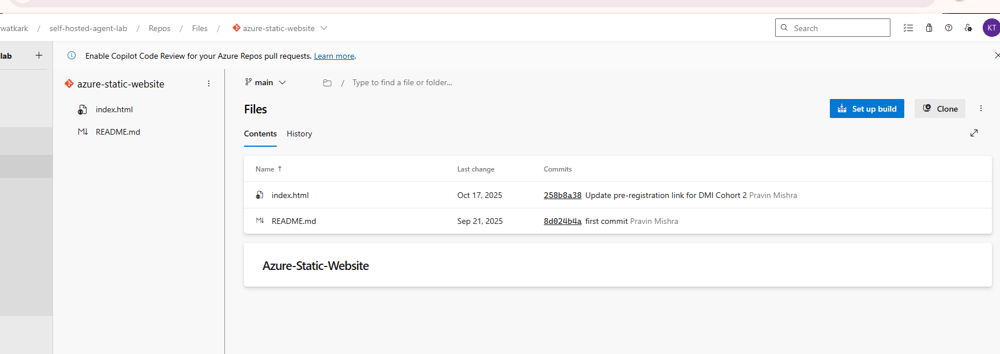
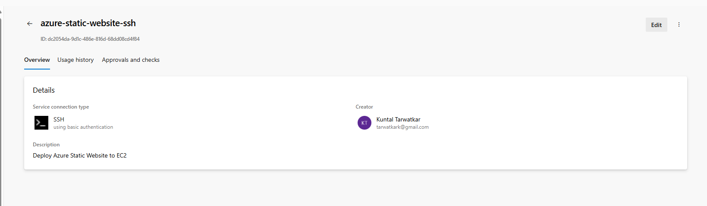
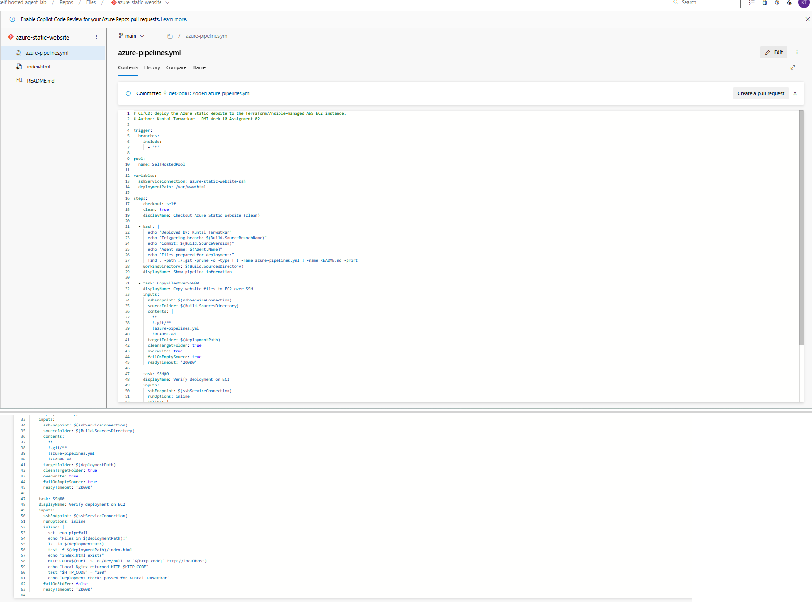
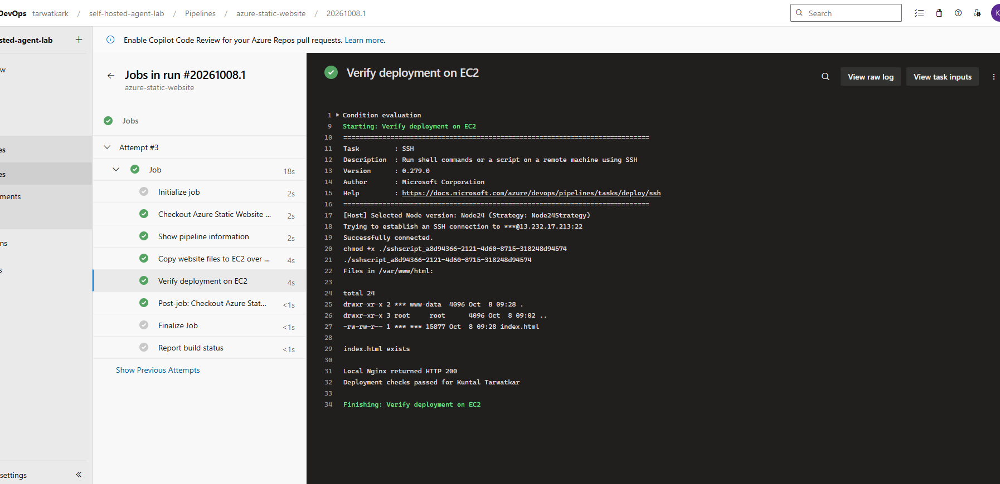
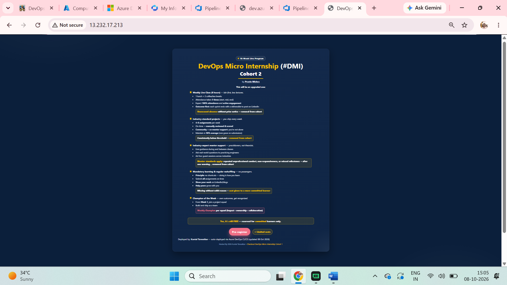
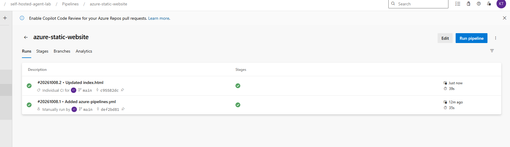
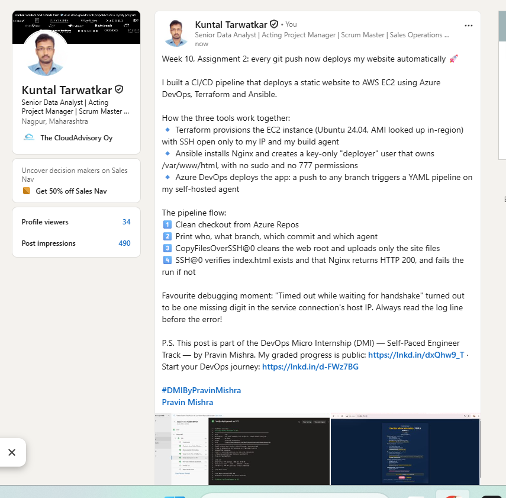

# Assignment 2 — Deploy Static Website to AWS EC2 Using an Azure DevOps CI/CD Pipeline

Part of the DevOps Micro Internship (DMI) Cohort 3 with Agentic AI

---

## Student Details

**Full Name:** Kuntal Tarwatkar  
**GitHub Repository/Folder URL:** https://github.com/tarwatkarkuntal315/devops-micro-internship-pravinmishra/tree/main/week-10-azure-devops

---

## Purpose

In this assignment, you will import the Azure Static Website into Azure Repos and create an Azure DevOps YAML pipeline that automatically deploys it to an AWS EC2 instance. Terraform provisions the EC2 instance, Ansible installs and configures Nginx and prepares a deployment user, and the pipeline uses an SSH service connection to copy the website to `/var/www/html` and verify it on every pushed commit.

---

## Summary of the Completed CI/CD Workflow

I imported the Azure Static Website from GitHub into a new Azure Repos repository (`azure-static-website`) and added my name to `index.html`.

**Terraform** (run from my Windows workstation against AWS `ap-south-1`) created the deployment target:
- A `t3.micro` Ubuntu 24.04 LTS instance. The AMI comes from a `data "aws_ami"` lookup of Canonical's latest image in the region, so no AMI ID is hard-coded.
- A key pair and a security group that allows HTTP (80) from anywhere and SSH (22) only from my own IP and the public IP of my Assignment 1 Azure DevOps agent VM.
- An output with the public IP.

**Ansible** configured the instance. Ansible cannot run natively on Windows, so it ran from a small Docker-based controller. The playbook:
- Installs and starts Nginx.
- Creates a dedicated `deployer` user with key-only login: no password, and SSH password authentication left disabled.
- Gives `deployer` ownership of `/var/www/html` (`deployer:www-data`, `0755`) so it can write there and Nginx can read it, without `777` permissions.
- Publishes the initial website.
- Validates the setup with `nginx -t` and a local HTTP 200 check.

**Azure DevOps** handles delivery:
- An SSH service connection, `azure-static-website-ssh`, authenticates as `deployer` with a dedicated ED25519 private key. This key is separate from the admin key Ansible uses.
- `azure-pipelines.yml` triggers on pushes to any branch and runs on my self-hosted pool `SelfHostedPool`. It keeps the service connection name and deployment path in variables.
- The pipeline does a clean checkout, prints my name, the branch, the commit, the agent and the files to deploy, and copies the site with `CopyFilesOverSSH@0`. The copy cleans the target first, overwrites files, and excludes `.git`, `azure-pipelines.yml` and `README.md`.
- An `SSH@0` step then lists `/var/www/html`, checks that `index.html` exists, and fails unless `curl http://localhost` returns 200.

The first run succeeded after I authorized the pool and the service connection. A later commit to `index.html` triggered run `#20261008.2` automatically, and the updated text appeared at http://13.232.17.213.

---

## Environment Values

| Item | Value |
|------|-------|
| Azure DevOps organization URL | https://dev.azure.com/tarwatkark |
| Azure DevOps project | self-hosted-agent-lab |
| Azure Repos repository | azure-static-website |
| Self-hosted agent pool | SelfHostedPool (agent `linux-self-hosted-agent` from Assignment 1) |
| AWS region | ap-south-1 (Mumbai) |
| Target EC2 instance | `azure-static-website-web` (t3.micro, Ubuntu 24.04 LTS) |
| Target EC2 public IP | 13.232.17.213 |
| SSH username (service connection) | deployer |
| SSH authentication method | SSH private key (ED25519, dedicated deploy key) |
| SSH service connection name | azure-static-website-ssh |
| Deployment path | /var/www/html |
| Website URL | http://13.232.17.213 |

---

## Project Files

All infrastructure and configuration code is in [`assignment-02-static-website-ec2/`](assignment-02-static-website-ec2/):

```text
assignment-02-static-website-ec2/
├── terraform/
│   ├── versions.tf               # AWS provider ~> 6.0, default tags
│   ├── variables.tf              # region, instance type, key path, SSH source CIDRs
│   ├── main.tf                   # Ubuntu AMI lookup, key pair, security group, EC2 instance
│   ├── outputs.tf                # public IP, website URL, SSH command
│   └── terraform.tfvars.example  # real terraform.tfvars is git-ignored
├── ansible/
│   ├── ansible.cfg
│   ├── inventory.ini.example     # real inventory.ini is git-ignored
│   ├── site.yml                  # Nginx, deployer user, /var/www/html permissions, initial site
│   ├── run-ansible.ps1           # runs the playbook from a Docker-based Ansible controller
│   └── controller/Dockerfile     # python:3.12-slim + ansible-core + ansible.posix
└── azure-pipelines.yml           # copy of the pipeline committed to Azure Repos
```

No SSH private key, Terraform state or `terraform.tfvars` is committed (see `assignment-02-static-website-ec2/.gitignore`).

---

# Task 0 — Verify the Existing Tooling and Self-Hosted Agent

## Goal

Confirm Terraform, Ansible, AWS CLI and SSH are available, AWS authentication works, and the Assignment 1 self-hosted agent is Online.

> No submission screenshot required for this task.

---

# Task 1 — Import and Personalize the Azure Static Website Repository

## Goal

Import `https://github.com/pravinmishraaws/Azure-Static-Website.git` into Azure Repos and add my full name to `index.html`.

## Evidence

### Screenshot 1 — Azure Repos showing the imported Azure Static Website repository, project files and `index.html`



---

# Task 2 — Provision and Configure the Target EC2 Instance

## Goal

Provision the EC2 instance with Terraform (SSH only from approved sources, HTTP open), configure it with Ansible (Nginx, deployment user, writable document root), and verify the target before creating the service connection.

> No submission screenshot required for this task.

---

# Task 3 — Create the SSH Service Connection

## Goal

Create the SSH service connection `azure-static-website-ssh` to the EC2 instance using private-key authentication.

## Evidence

### Screenshot 2 — Saved SSH service connection Overview page



---

# Task 4 — Create the Azure DevOps YAML Pipeline

## Goal

Author `azure-pipelines.yml` with an all-branches push trigger, the self-hosted pool, reusable variables, a clean checkout, a pipeline information step, `CopyFilesOverSSH@0` and `SSH@0` verification.

## Completed `azure-pipelines.yml`

```yaml
# CI/CD: deploy the Azure Static Website to the Terraform/Ansible-managed AWS EC2 instance.
# Author: Kuntal Tarwatkar — DMI Week 10 Assignment 02

trigger:
  branches:
    include:
      - '*'

pool:
  name: SelfHostedPool

variables:
  sshServiceConnection: azure-static-website-ssh
  deploymentPath: /var/www/html

steps:
  - checkout: self
    clean: true
    displayName: Checkout Azure Static Website (clean)

  - bash: |
      echo "Deployed by: Kuntal Tarwatkar"
      echo "Triggering branch: $(Build.SourceBranchName)"
      echo "Commit: $(Build.SourceVersion)"
      echo "Agent name: $(Agent.Name)"
      echo "Files prepared for deployment:"
      find . -path ./.git -prune -o -type f ! -name azure-pipelines.yml ! -name README.md -print
    workingDirectory: $(Build.SourcesDirectory)
    displayName: Show pipeline information

  - task: CopyFilesOverSSH@0
    displayName: Copy website files to EC2 over SSH
    inputs:
      sshEndpoint: $(sshServiceConnection)
      sourceFolder: $(Build.SourcesDirectory)
      contents: |
        **
        !.git/**
        !azure-pipelines.yml
        !README.md
      targetFolder: $(deploymentPath)
      cleanTargetFolder: true
      overwrite: true
      failOnEmptySource: true
      readyTimeout: '20000'

  - task: SSH@0
    displayName: Verify deployment on EC2
    inputs:
      sshEndpoint: $(sshServiceConnection)
      runOptions: inline
      inline: |
        set -euo pipefail
        echo "Files in $(deploymentPath):"
        ls -la $(deploymentPath)
        test -f $(deploymentPath)/index.html
        echo "index.html exists"
        HTTP_CODE=$(curl -s -o /dev/null -w '%{http_code}' http://localhost)
        echo "Local Nginx returned HTTP $HTTP_CODE"
        test "$HTTP_CODE" = "200"
        echo "Deployment checks passed for Kuntal Tarwatkar"
      failOnStdErr: false
      readyTimeout: '20000'
```

## Evidence

### Screenshot 3 — `azure-pipelines.yml` open in the Azure Repos editor



---

# Task 5 — Create, Authorize, and Run the Pipeline

## Goal

Run the pipeline on the self-hosted agent, authorize the pool and service connection, and confirm the copy and verification steps succeed.

## Evidence

### Screenshot 4 — Successful pipeline run and log summary showing the copy and verification steps



---

# Task 6 — Verify the Website and Automatic Trigger

## Goal

Confirm the website loads from the EC2 public IP with my full name, and that a new pushed commit automatically triggers a deployment.

## Evidence

### Screenshot 5 — Browser showing the deployed website, the EC2 public IP, my full name and the updated content



### Supporting evidence — automatic CI trigger

Run `#20261008.2` ("Updated index.html", commit `c95582dc`) was started automatically as **Individual CI** by my commit to `main`. Run `#20261008.1` was the first, manual run.



---

## Website URL

**http://13.232.17.213**

---

## Notes — Issues Faced and How I Resolved Them

1. **No earlier Terraform/Ansible project to reuse.** I wrote a small, dedicated project in `assignment-02-static-website-ec2/` (Terraform + Ansible) for this target instead of reusing a larger stack.
2. **Ansible is not supported as a controller on Windows.** I built a minimal Docker image (`python:3.12-slim` + `ansible-core` + `ansible.posix`) and run the playbook through `run-ansible.ps1`. Two follow-up problems:
   - Windows bind mounts look world-writable, so `ssh` refused the key and Ansible ignored `ansible.cfg`. The script mounts the keys and the project read-only, then copies them inside the container and runs `chmod 600` on the key.
   - The first `docker build` hung while pulling the base image. Running `docker pull python:3.12-slim` separately fixed it.
3. **SSH from the self-hosted agent.** The copy and SSH tasks run on my Azure agent VM, not in Microsoft's cloud. The EC2 security group therefore allows port 22 from the agent VM's public IP (`52.140.51.181/32`) as well as from my own IP, and never from `0.0.0.0/0`. Before creating the service connection, I tested this from the agent VM with a TCP check to port 22.
4. **Pipeline paused for permissions.** The first run stopped with "This pipeline needs permission to access 2 resources". I did not grant the pool or the service connection to all pipelines, so I used **View → Permit** to authorize `SelfHostedPool` and `azure-static-website-ssh` for this pipeline only.
5. **"Timed out while waiting for handshake" in the copy step.** The log showed the task connecting to `13.232.17.21`. The host name in the service connection was missing its last digit. I edited the service connection to `13.232.17.213`, reran the failed job, and the copy and verification steps succeeded.
6. **Least privilege for the deployment user.** `deployer` has no sudo rights, so the brief's `sudo nginx -t` check can't run as that user. Ansible ran `nginx -t` as the admin user instead, and `deployer` only needs write access to `/var/www/html`.
7. **Masked username in logs.** The verification log shows `***` instead of `deployer`, because Azure DevOps treats the service connection's username as a secret value and masks it automatically.

---

# LinkedIn Post

**LinkedIn Post URL:** https://www.linkedin.com/feed/update/urn:li:activity:7513895403549806594/



---

# Submission Instructions

- Add all required screenshots in your submission
- Do not commit the SSH private key or password to the repository or write it directly in YAML

---

# Completion Checklist

- [x] Azure Static Website repository imported into Azure Repos, `index.html` visible (Screenshot 1)
- [x] My full name added to the website
- [x] EC2 instance provisioned with Terraform (no AMI ID copied from another region, suitable instance size)
- [x] Nginx and the deployment user configured with Ansible
- [x] SSH login works with the selected private-key method; password authentication not enabled
- [x] SSH user can write to `/var/www/html`; ports 22 and 80 configured correctly
- [x] Assignment 1 self-hosted agent Online
- [x] SSH service connection created (Screenshot 2)
- [x] YAML trigger includes all branches and uses the self-hosted pool (Screenshot 3)
- [x] Copy and verification tasks succeeded, pipeline Succeeded (Screenshot 4)
- [x] A new pushed commit triggered the pipeline automatically
- [x] Website loads through the EC2 public IP with my full name and the update (Screenshot 5)
- [x] LinkedIn post URL and screenshot added
- [x] No private key, password, passphrase or other secret exposed

---

## 📌 About DMI & CloudAdvisory

DevOps Micro Internship (DMI) is a project-based DevOps program run by Pravin Mishra (The CloudAdvisory) focused on real-world execution, systems thinking, and career readiness.

It helps learners build strong DevOps foundations with hands-on experience.

---

## 📌 Resources

- 🌐 DMI Official Website: https://dmi.pravinmishra.com?utm_source=github&utm_medium=readme  
- 🎓 University: https://university.pravinmishra.com?utm_source=github&utm_medium=readme  
- 💬 Discord Community: https://discord.pravinmishra.com?utm_source=github&utm_medium=readme  
- 📝 Blog: https://dmi.pravinmishra.com/blog?utm_source=github&utm_medium=readme  
- ▶️ YouTube Playlist: https://www.youtube.com/playlist?list=PLFeSNDtI4Cho  
- 🔗 Pravin Mishra (LinkedIn): https://www.linkedin.com/in/pravin-mishra-aws-trainer/  
- 🏢 CloudAdvisory (LinkedIn): https://www.linkedin.com/company/thecloudadvisory/

---

*This submission is part of DevOps Micro Internship (DMI) Cohort 3 — Agentic AI Track.*
