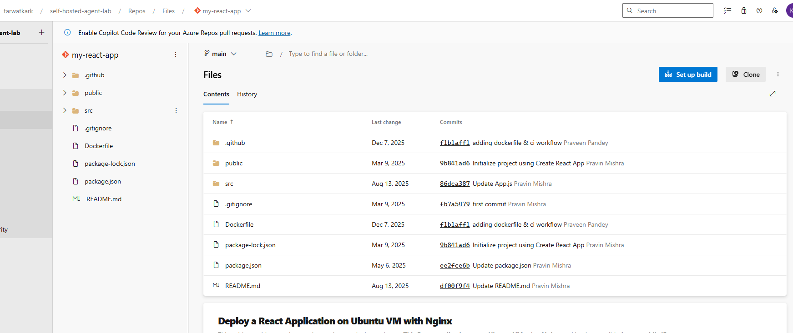
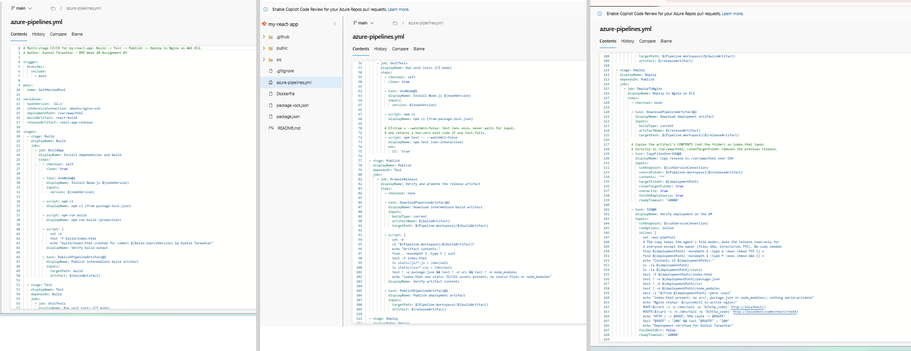
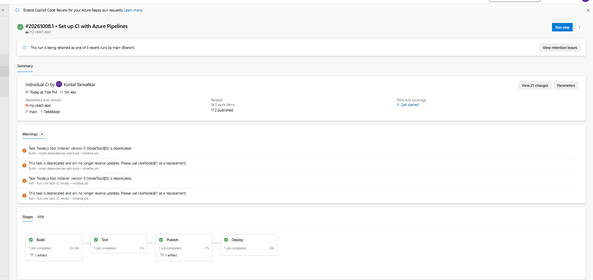
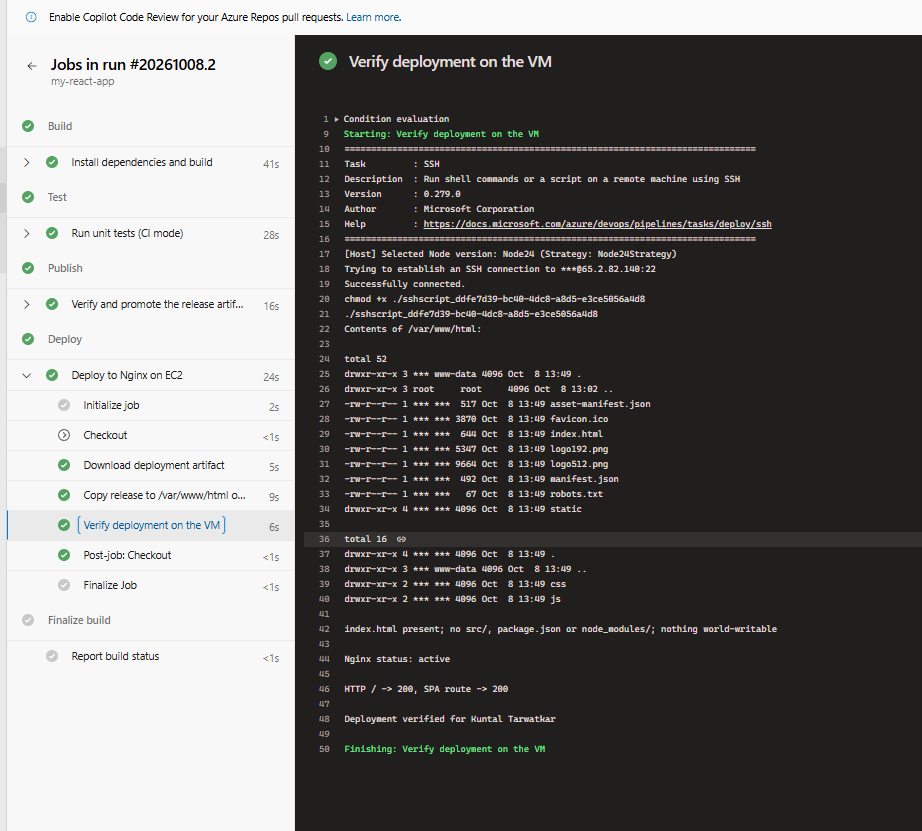
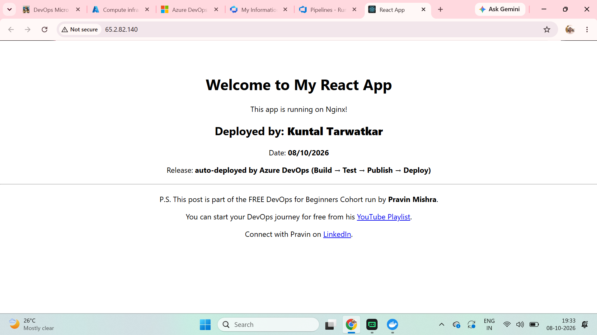
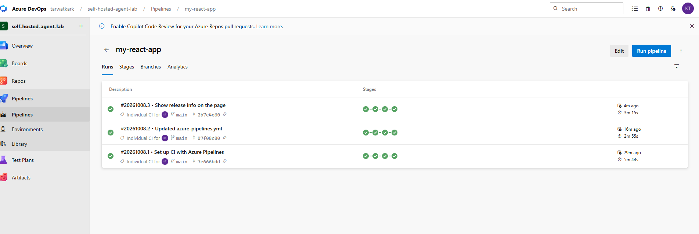
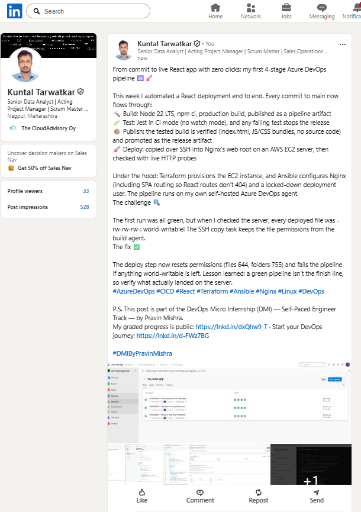

# Assignment 3 — Automate React App Deployment Using Azure DevOps CI/CD

Part of the DevOps Micro Internship (DMI) Cohort 3 with Agentic AI

---

## Student Details

**Full Name:** Kuntal Tarwatkar  
**GitHub Repository/Folder URL:** https://github.com/tarwatkarkuntal315/devops-micro-internship-pravinmishra/tree/main/week-10-azure-devops

---

## Purpose

In this assignment, you will create a multi-stage Azure DevOps pipeline (Build → Test → Publish → Deploy) that builds and tests the `my-react-app` React application on a pipeline agent, moves the production build between stages as a pipeline artifact, and deploys it over SSH to an Nginx web server on an Ubuntu VM provisioned with Terraform and configured with Ansible. Every commit to `main` triggers the pipeline automatically.

---

## Explanation of the CI/CD Workflow

**Source.** I imported `my-react-app` into Azure Repos and changed `src/App.js` to show my name and the date. `azure-pipelines.yml` lives in the same repository, and its trigger includes only `main`, so every commit to `main` starts a run without anyone clicking **Run**.

**Agent.** All stages run on my self-hosted pool `SelfHostedPool` (the Ubuntu agent from Assignment 1). Its public IP is fixed, so the EC2 security group can allow SSH from exactly that address instead of from Microsoft-hosted agents' changing IPs.

**The four stages** (each `dependsOn` the one before, so a failure stops everything after it):

1. **Build** — clean checkout, install Node.js 22 LTS with `UseNode@1`, `npm ci` from `package-lock.json`, `npm run build`, check that `build/index.html` exists, then publish `build/` as the intermediate pipeline artifact `react-build`.
2. **Test** — a fresh checkout and `npm ci`, then `npm test -- --watchAll=false` with `CI=true`, so Jest runs once, never waits for input, and fails the stage if any test fails.
3. **Publish** — no source checkout. It downloads `react-build` from the current run, checks that it contains `index.html` and the compiled `static/js` and `static/css` files and does not contain `src/`, `package.json` or `node_modules/`, then republishes it as the deployment artifact `react-app-release`. This stage is the release boundary: only a build that passed its tests gets promoted.
4. **Deploy** — downloads `react-app-release` and uses `CopyFilesOverSSH@0` with the password-based service connection `ubuntu-nginx-ssh` to copy the artifact's **contents** into `/var/www/html`, so `index.html` sits directly in the web root. `cleanTargetFolder` removes the previous release first. An `SSH@0` step then sets file permissions to 644/755, lists the web root, confirms no source files are present and nothing is world-writable, checks that Nginx is active, and fails unless both `/` and an unknown React route return HTTP 200.

**Target VM.** Terraform created an Ubuntu 24.04 `t3.micro` in `ap-south-1`. The security group allows HTTP from anywhere and SSH only from my IP and the agent VM. Ansible configured it:
- installed Nginx with an SPA site (`try_files $uri $uri/ /index.html`)
- created the `deployer` user with a hashed password supplied at runtime from a file outside the repository
- enabled SSH password login for `deployer` only, through an `sshd` `Match User` rule, leaving every other account key-only
- made `deployer:www-data` the owner of `/var/www/html` with mode 0755

The VM never gets Node.js or the source code; it only receives the tested production build.

**Result.** Three runs, all triggered automatically by commits to `main`, passed all four stages. The last one (`#20261008.3`, "Show release info on the page") published the new release line, which is visible at http://65.2.82.140.

---

## Environment Values

| Item | Value |
|------|-------|
| Organization name / URL | tarwatkark — https://dev.azure.com/tarwatkark |
| Project name | self-hosted-agent-lab |
| Repository name | my-react-app |
| Main branch | main |
| Agent pool | SelfHostedPool (agent `linux-self-hosted-agent`, Assignment 1) |
| SSH service connection | ubuntu-nginx-ssh (password-based) |
| Target VM | AWS EC2 `react-app-web`, t3.micro, Ubuntu 24.04 LTS, ap-south-1 |
| VM public IP | 65.2.82.140 |
| SSH username | deployer |
| Deployment path | /var/www/html |
| Name / date shown in the app | Kuntal Tarwatkar — 08/10/2026 |

---

## Project Files

Infrastructure and configuration code is in [`assignment-03-react-app-ec2/`](assignment-03-react-app-ec2/):

```text
assignment-03-react-app-ec2/
├── terraform/                    # Ubuntu AMI lookup, key pair, security group (22 from my IP + agent VM, 80 open), EC2, outputs
├── ansible/
│   ├── site.yml                  # Nginx + SPA site, deployer user (password), sshd Match rule, web-root ownership, checks
│   ├── run-ansible.ps1           # Docker-based Ansible controller; reads the password from a file outside the repo
│   ├── controller/Dockerfile
│   ├── ansible.cfg
│   └── inventory.ini.example
└── azure-pipelines.yml           # copy of the pipeline committed to Azure Repos
```

The deployment password, SSH private keys, Terraform state, `terraform.tfvars` and the live inventory are not committed.

---

# Task 0 — Verify the Starting Environment

## Goal

Confirm the Azure DevOps project, the self-hosted agent, Terraform/Ansible and cloud authentication are ready.

> No screenshot required for this task.

---

# Task 1 — Import and Personalize the React Application

## Goal

Import `https://github.com/pravinmishraaws/my-react-app` into Azure Repos and add my full name and the date to `src/App.js`.

## Evidence

### Screenshot 1 — Imported React project in Azure Repos (repository name, `main` branch, project files)



---

# Task 2 — Provision and Configure the Target VM

## Goal

Provision a new Ubuntu VM with Terraform and configure Nginx (SPA routing), password-based SSH for the deployment user, and `/var/www/html` permissions with Ansible.

> No separate screenshot required for this task.

---

# Task 3 — Create or Update the SSH Service Connection

## Goal

Create the password-based SSH service connection `ubuntu-nginx-ssh` to the new VM.

> No separate screenshot required for this task.

---

# Task 4 — Author the Multi-Stage Azure Pipeline

## Goal

Author `azure-pipelines.yml` with a `main` trigger and Build, Test, Publish and Deploy stages that pass the production build between stages as pipeline artifacts.

## Completed `azure-pipelines.yml`

```yaml
# Multi-stage CI/CD for my-react-app: Build -> Test -> Publish -> Deploy to Nginx on AWS EC2.
# Author: Kuntal Tarwatkar - DMI Week 10 Assignment 03

trigger:
  branches:
    include:
      - main

pool:
  name: SelfHostedPool

variables:
  nodeVersion: '22.x'
  sshServiceConnection: ubuntu-nginx-ssh
  deploymentPath: /var/www/html
  buildArtifact: react-build
  releaseArtifact: react-app-release

stages:
  - stage: Build
    displayName: Build
    jobs:
      - job: BuildApp
        displayName: Install dependencies and build
        steps:
          - checkout: self
            clean: true

          - task: UseNode@1
            displayName: Install Node.js $(nodeVersion)
            inputs:
              version: $(nodeVersion)

          - script: npm ci
            displayName: npm ci (from package-lock.json)

          - script: npm run build
            displayName: npm run build (production)

          - script: |
              set -e
              test -f build/index.html
              echo "build/index.html created for commit $(Build.SourceVersion) by Kuntal Tarwatkar"
            displayName: Verify build output

          - task: PublishPipelineArtifact@1
            displayName: Publish intermediate build artifact
            inputs:
              targetPath: build
              artifact: $(buildArtifact)

  - stage: Test
    displayName: Test
    dependsOn: Build
    jobs:
      - job: UnitTests
        displayName: Run unit tests (CI mode)
        steps:
          - checkout: self
            clean: true

          - task: UseNode@1
            displayName: Install Node.js $(nodeVersion)
            inputs:
              version: $(nodeVersion)

          - script: npm ci
            displayName: npm ci (from package-lock.json)

          # CI=true + --watchAll=false: Jest runs once, never waits for input,
          # and returns a non-zero exit code if any test fails.
          - script: npm test -- --watchAll=false
            displayName: npm test (non-interactive)
            env:
              CI: 'true'

  - stage: Publish
    displayName: Publish
    dependsOn: Test
    jobs:
      - job: PromoteRelease
        displayName: Verify and promote the release artifact
        steps:
          - checkout: none

          - task: DownloadPipelineArtifact@2
            displayName: Download intermediate build artifact
            inputs:
              buildType: current
              artifactName: $(buildArtifact)
              targetPath: $(Pipeline.Workspace)/$(buildArtifact)

          - script: |
              set -e
              cd "$(Pipeline.Workspace)/$(buildArtifact)"
              echo "Artifact contents:"
              find . -maxdepth 3 -type f | sort
              test -f index.html
              ls static/js/*.js > /dev/null
              ls static/css/*.css > /dev/null
              test ! -e package.json && test ! -d src && test ! -d node_modules
              echo "index.html and static JS/CSS assets present; no source files or node_modules"
            displayName: Verify artifact contents

          - task: PublishPipelineArtifact@1
            displayName: Publish deployment artifact
            inputs:
              targetPath: $(Pipeline.Workspace)/$(buildArtifact)
              artifact: $(releaseArtifact)

  - stage: Deploy
    displayName: Deploy
    dependsOn: Publish
    jobs:
      - job: DeployToNginx
        displayName: Deploy to Nginx on EC2
        steps:
          - checkout: none

          - task: DownloadPipelineArtifact@2
            displayName: Download deployment artifact
            inputs:
              buildType: current
              artifactName: $(releaseArtifact)
              targetPath: $(Pipeline.Workspace)/$(releaseArtifact)

          # Copies the artifact's CONTENTS (not the folder) so index.html lands
          # directly in /var/www/html; cleanTargetFolder removes the previous release.
          - task: CopyFilesOverSSH@0
            displayName: Copy release to /var/www/html over SSH
            inputs:
              sshEndpoint: $(sshServiceConnection)
              sourceFolder: $(Pipeline.Workspace)/$(releaseArtifact)
              contents: '**'
              targetFolder: $(deploymentPath)
              cleanTargetFolder: true
              overwrite: true
              failOnEmptySource: true
              readyTimeout: '20000'

          - task: SSH@0
            displayName: Verify deployment on the VM
            inputs:
              sshEndpoint: $(sshServiceConnection)
              runOptions: inline
              inline: |
                set -euo pipefail
                # The copy keeps the agent's file modes; make the release read-only for
                # everyone except the owner (files 644, directories 755). No sudo needed.
                find $(deploymentPath) -mindepth 1 -type d -exec chmod 755 {} +
                find $(deploymentPath) -mindepth 1 -type f -exec chmod 644 {} +
                echo "Contents of $(deploymentPath):"
                ls -la $(deploymentPath)
                ls -la $(deploymentPath)/static
                test -f $(deploymentPath)/index.html
                test ! -e $(deploymentPath)/package.json
                test ! -d $(deploymentPath)/src
                test ! -d $(deploymentPath)/node_modules
                test -z "$(find $(deploymentPath) -perm -o+w)"
                echo "index.html present; no src/, package.json or node_modules/; nothing world-writable"
                echo "Nginx status: $(systemctl is-active nginx)"
                ROOT=$(curl -s -o /dev/null -w '%{http_code}' http://localhost/)
                ROUTE=$(curl -s -o /dev/null -w '%{http_code}' http://localhost/some/react/route)
                echo "HTTP / -> $ROOT, SPA route -> $ROUTE"
                test "$ROOT" = "200" && test "$ROUTE" = "200"
                echo "Deployment verified for Kuntal Tarwatkar"
              failOnStdErr: false
              readyTimeout: '20000'
```

## Evidence

### Screenshot 2 — Pipeline YAML open in the editor with the trigger and Build, Test, Publish and Deploy sections visible



---

# Task 5 — Run the Pipeline and Resolve Configuration Issues

## Goal

Complete the first successful end-to-end run with all four stages succeeding.

## Evidence

### Screenshot 3 — One pipeline run showing Build, Test, Publish and Deploy all succeeded



---

# Task 6 — Verify the Deployment on the VM

## Goal

Confirm only production-ready files were deployed to `/var/www/html`, Nginx is active, and the local web server responds.

## Evidence

### Screenshot 4 — Pipeline SSH verification log showing the post-deployment contents of `/var/www/html`



---

# Task 7 — Verify the Website and Automatic Trigger

## Goal

Confirm the React app loads from the VM's public IP with my name and date, and that a commit to `main` automatically triggers a new run that updates the site.

## Evidence

### Screenshot 5 — Browser showing the deployed React application, the VM public IP, my full name and the date



### Supporting evidence — automatic trigger on `main`

All three runs show **Individual CI**, meaning a commit to `main` started them, not a manual run:

| Run | Commit message | What changed |
|-----|----------------|--------------|
| `#20261008.1` | Set up CI with Azure Pipelines | First commit of `azure-pipelines.yml` |
| `#20261008.2` | Updated azure-pipelines.yml | `UseNode@1` plus file-permission hardening in Deploy |
| `#20261008.3` | Show release info on the page | Visible change in `src/App.js`; the browser in Screenshot 5 shows it |



---

## Final Application URL

**http://65.2.82.140**

---

## Notes — Issues Faced and How I Resolved Them

1. **Deployed files were world-writable (`-rw-rw-rw-`).** After the first successful run, I checked `/var/www/html` and found every file was mode 666. `CopyFilesOverSSH@0` keeps the file modes from the agent's downloaded artifact. The web-root directory was still 0755, so nobody else could add or delete files, but they could edit existing ones, and the brief says not to make the web root world-writable. I added two `find … -exec chmod` lines at the start of the `SSH@0` step (directories 755, files 644). They need no sudo because `deployer` owns the files. I also added a check that fails the run if `find -perm -o+w` returns anything. Run `#20261008.2` showed every file as `-rw-r--r--`.
2. **`NodeTool@0` deprecation warnings.** The first run passed but showed 4 warnings saying `NodeTool@0` is deprecated. I replaced it with `UseNode@1` (`version: 22.x`) in both the Build and Test stages, and later runs had no warnings.
3. **Stale starter test.** `src/App.test.js` looks for a "learn react" link that is no longer in `App.js`, so it would fail. The project's test script, `react-scripts test tests`, only runs tests whose path contains `tests`, so it runs the two valid tests in `src/tests/App.test.js`, which check text that really is on the page. Before writing the pipeline, I confirmed locally that `CI=true npm test` passes 2 of 2 tests and exits without watch mode.
4. **Ubuntu cloud images disable SSH password login.** The brief needs password-based SSH, but Ubuntu 24.04 images set `PasswordAuthentication no`. Instead of enabling passwords for every account, Ansible adds `/etc/ssh/sshd_config.d/99-deployer-password-auth.conf` containing `Match User deployer` → `PasswordAuthentication yes`. The file is validated with `sshd -t` before SSH restarts. Afterwards, `deployer` was offered `publickey,password` and `ubuntu` only `publickey`, and a real password login as `deployer` worked.
5. **Ansible `validate` error.** My first version used `validate: /usr/sbin/sshd -t -f /etc/ssh/sshd_config`, and Ansible rejected it with "validate must contain %s". I changed it to `sshd -t -f %s` to check the new file and added a separate `sshd -t` task to check the full configuration.
6. **SSH timeout after a break.** My home internet IP changed during a break, so Ansible could not reach the new instance on port 22. I updated `terraform.tfvars`; Terraform changed only that security-group rule in place. I updated the agent VM's Azure firewall rule too.
7. **Garbled characters in the pasted YAML.** Copying the YAML with PowerShell 5.1's `Get-Content` read the UTF-8 file as ANSI, so an em dash in a comment became `â€"`. I replaced it with a plain hyphen, kept the pipeline file ASCII-only, and copied it with `-Encoding UTF8` afterwards.
8. **Keeping the password out of Git and logs.** The password lives only in a file under `~/.ssh` on my workstation and in the Azure DevOps service connection. `run-ansible.ps1` passes it to the container as an environment variable, the Ansible tasks that use it have `no_log: true`, and the pipeline YAML only references the service connection by name. Azure DevOps also masks the username (`***`) in logs.

---

# LinkedIn Post

**LinkedIn Post URL:** https://www.linkedin.com/feed/update/urn:li:activity:7513963693504712704/

### Screenshot 6 — LinkedIn post showing its text and at least one image or link



---

# Submission Instructions

- Add all required screenshots in your submission
- Do not reveal VM passwords, tokens, private keys, or service-connection secrets

---

# Completion Checklist

- [x] Correct React repository imported into Azure Repos (Screenshot 1)
- [x] My full name and date visible in the application
- [x] Pipeline YAML authored by me and committed to the repository
- [x] Commits to `main` trigger the pipeline automatically
- [x] Pipeline contains Build, Test, Publish and Deploy stages (Screenshot 2)
- [x] All four stages succeeded in the same run (Screenshot 3)
- [x] Production build moves between stages as a pipeline artifact
- [x] Deploy stage uses the SSH service connection; no secrets in the YAML
- [x] `index.html` directly inside `/var/www/html`; no source files or `node_modules/` deployed; Nginx active (Screenshot 4)
- [x] Application opens through the VM public IP with my name and date (Screenshot 5)
- [x] Final application URL included
- [x] LinkedIn post published, URL and screenshot included (Screenshot 6)
- [x] No password, token, private key, account ID or other secret visible

---

## 📌 About DMI & CloudAdvisory

DevOps Micro Internship (DMI) is a project-based DevOps program run by Pravin Mishra (The CloudAdvisory) focused on real-world execution, systems thinking, and career readiness.

It helps learners build strong DevOps foundations with hands-on experience.

---

## 📌 Resources

- 🌐 DMI Official Website: https://dmi.pravinmishra.com?utm_source=github&utm_medium=readme  
- 🎓 University: https://university.pravinmishra.com?utm_source=github&utm_medium=readme  
- 💬 Discord Community: https://discord.pravinmishra.com?utm_source=github&utm_medium=readme  
- 📝 Blog: https://dmi.pravinmishra.com/blog?utm_source=github&utm_medium=readme  
- ▶️ YouTube Playlist: https://www.youtube.com/playlist?list=PLFeSNDtI4Cho  
- 🔗 Pravin Mishra (LinkedIn): https://www.linkedin.com/in/pravin-mishra-aws-trainer/  
- 🏢 CloudAdvisory (LinkedIn): https://www.linkedin.com/company/thecloudadvisory/

---

*This submission is part of DevOps Micro Internship (DMI) Cohort 3 — Agentic AI Track.*
