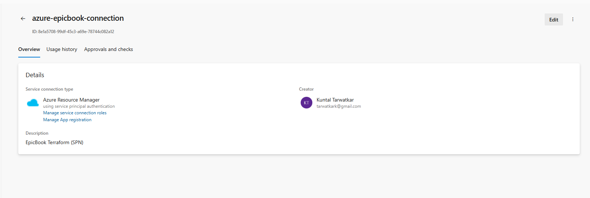
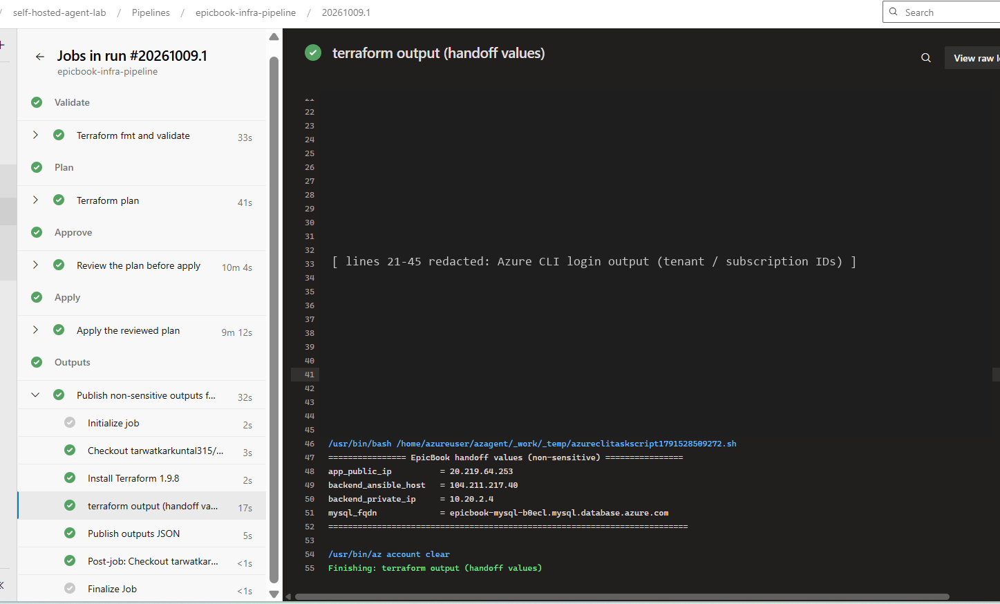
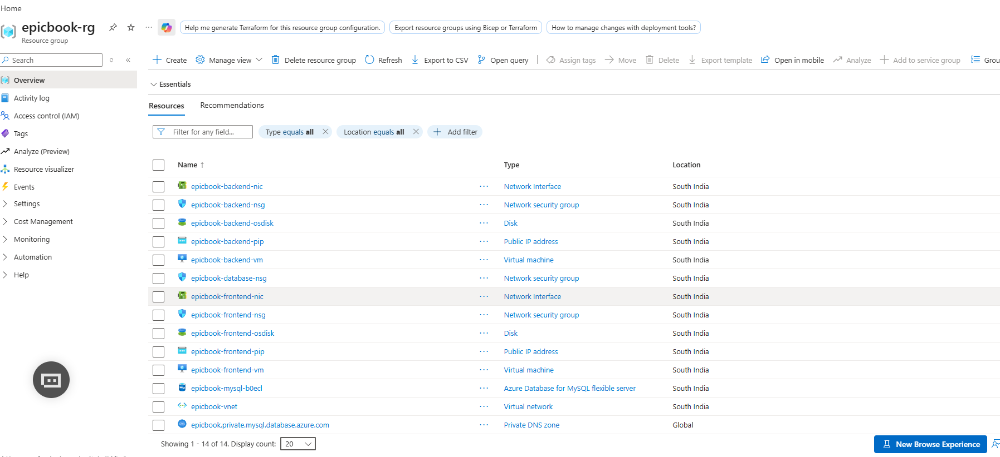
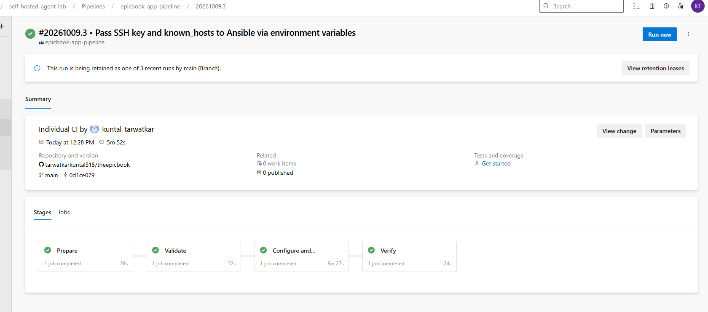
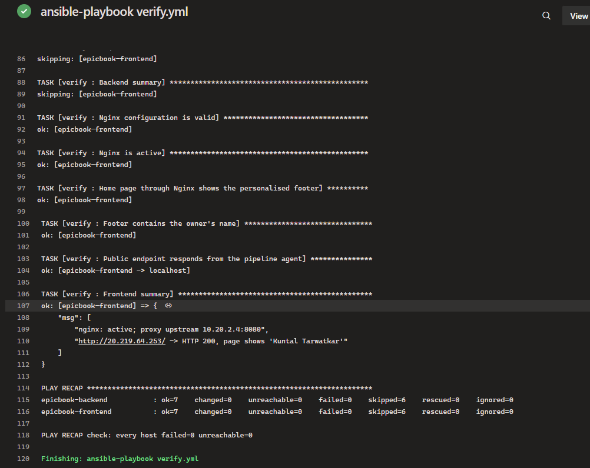
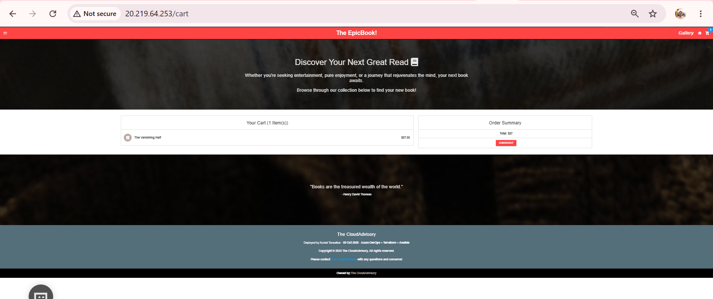
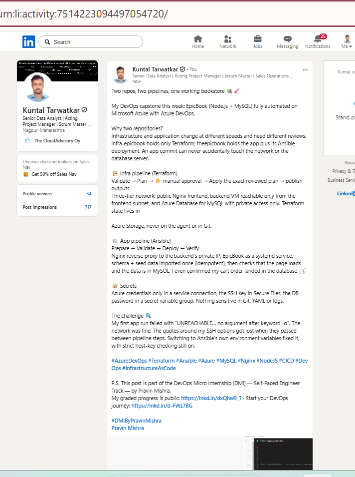

# Assignment 4 — Capstone: Automate EpicBook Deployment with Dual Pipelines

Part of the DevOps Micro Internship (DMI) Cohort 3 with Agentic AI

---

## Student Details

**Full Name:** Kuntal Tarwatkar  
**GitHub Repository/Folder URL:** https://github.com/tarwatkarkuntal315/devops-micro-internship-pravinmishra/tree/main/week-10-azure-devops

---

## Purpose

In this capstone, you will automate EpicBook on Microsoft Azure with two repositories and two Azure DevOps pipelines. The Infrastructure Pipeline uses Terraform (remote state in Azure Storage) to build a three-tier network, frontend and backend VMs and a private Azure Database for MySQL. After a manual handoff of non-sensitive outputs, the Application Pipeline uses Ansible to configure the servers, prepare the database and deploy EpicBook behind Nginx.

---

## Submission Links

| Item | URL |
|------|-----|
| Infrastructure Repository | https://github.com/tarwatkarkuntal315/infra-epicbook |
| Application Repository | https://github.com/tarwatkarkuntal315/theepicbook |
| Final EpicBook application | http://20.219.64.253 |

---

## The Two-Repository Model

- **`infra-epicbook`** contains only Terraform, its pipeline and docs. It owns the Azure network, VMs, MySQL server and remote state. A change here goes through plan, human approval and apply.
- **`theepicbook`** contains the application code plus `ansible/` and its own pipeline. It owns everything **on** the servers: packages, Nginx, the systemd service, the database schema and seed data, and the app itself.

Keeping them apart means application commits can never change infrastructure by accident. Each side has its own trigger, permissions and review rules. In Azure DevOps, the service connection (Azure credentials) is authorised only for the infra pipeline, while the SSH Secure File is used by the app pipeline. The two pipelines share only the database credentials in the `epicbook-secrets` variable group, because Terraform needs them to create the server and Ansible needs them to connect.

## The Manual Terraform-to-Ansible Handoff

1. The infrastructure pipeline's **Outputs** stage printed four non-sensitive values:
   - `app_public_ip` = 20.219.64.253
   - `backend_ansible_host` = 104.211.217.40
   - `backend_private_ip` = 10.20.2.4
   - `mysql_fqdn` = epicbook-mysql-b0ecl.mysql.database.azure.com
2. I copied them by hand into `theepicbook`:
   - **`ansible/inventory.ini`**: the frontend and backend `ansible_host`, the addresses Ansible uses for SSH.
   - **`ansible/group_vars/all.yml`**: `backend_private_ip`, the Nginx upstream, and `mysql_fqdn`, the database host.
3. I committed this as `42a40c6` ("Handoff: add infra-epicbook run 20261009.1 outputs …"). The diff is exactly five lines of addresses: no password, key, state or client secret.
4. That commit to `main` triggered the application pipeline. As a safety net, `site.yml` and the Validate stage refuse to run while any `REPLACE_WITH_…` placeholder remains.

In a mature setup, the infra pipeline would publish `terraform-outputs.json` (it already does, as an artifact), and the app pipeline would consume it automatically, for example through a pipeline resource trigger or a configuration store, without anyone copying values.

---

## Environment Values

| Item | Value |
|------|-------|
| Azure DevOps organization / project | https://dev.azure.com/tarwatkark · self-hosted-agent-lab |
| Infrastructure pipeline | epicbook-infra-pipeline (repo `infra-epicbook`) |
| Application pipeline | epicbook-app-pipeline (repo `theepicbook`) |
| GitHub connection | Azure Pipelines GitHub App, limited to the two repositories |
| Azure service connection | azure-epicbook-connection (Azure Resource Manager, service principal + client secret) |
| SSH Secure File | epicbook_id_rsa |
| Secret variable group | epicbook-secrets (`mysql_admin_username`, `mysql_admin_password` secret) |
| Agent pool | SelfHostedPool (agent `linux-self-hosted-agent`, Assignment 1) |
| Region / resource group | South India · `epicbook-rg` |
| Terraform remote state | `epicbook-tfstate-rg` / storage account `stepicbooktf1k42yi` / container `tfstate` / key `epicbook.terraform.tfstate` |
| Frontend public IP (`app_public_ip`) | 20.219.64.253 |
| Backend Ansible host (`backend_ansible_host`) | 104.211.217.40 (SSH management only) |
| Backend private IP (`backend_private_ip`) | 10.20.2.4 |
| MySQL FQDN (`mysql_fqdn`) | `epicbook-mysql-b0ecl.mysql.database.azure.com` (resolves privately to 10.20.3.4) |
| Name / date shown in EpicBook | Kuntal Tarwatkar · 09 Oct 2026 |

---

# Task 0 — Verify Accounts, Tools, and Pipeline Capacity

> No screenshot required for this task.

---

# Task 1 — Prepare the Two Repositories

> No separate screenshot required for this task.

---

# Task 2 — Configure Azure DevOps Connections, Secure Files, and Secrets

> No separate screenshot required for this task.

### Supporting evidence — Azure Resource Manager service connection (no IDs or secret visible)



---

# Task 3 — Author the Terraform Infrastructure Configuration

> No separate screenshot required for this task.

---

# Task 4 — Author and Run the Infrastructure Pipeline

### Screenshot 1 — Infrastructure Pipeline run with successful `terraform apply` and the non-sensitive outputs



*What it proves:* The infrastructure pipeline authenticated through the service connection and ran Validate, Plan, a manual Approve, Apply (the reviewed `tfplan` artifact) and Outputs in one run. The Outputs stage printed only the four non-sensitive handoff values. I blacked out lines 21–45 because the Azure CLI task logs the tenant and subscription IDs when it signs in.

### Screenshot 2 — Azure Portal resource group overview with the provisioned resources



*What it proves:* Terraform created the `epicbook-rg` resource group in South India: VNet, three NSGs (frontend, backend, database), two Ubuntu VMs with NICs, public IPs and disks, the private DNS zone, and Azure Database for MySQL Flexible Server `epicbook-mysql-b0ecl`. The Essentials panel is collapsed so the subscription ID is hidden.

---

# Task 5 — Complete the Manual Terraform-to-Ansible Handoff

> No separate screenshot required for this task.

---

# Task 6 — Author the Ansible Application Configuration

> No separate screenshot required for this task.

---

# Task 7 — Author and Run the Application Pipeline

### Screenshot 3 — Application Pipeline run summary with all stages succeeded



*What it proves:* My handoff commit to `theepicbook` triggered the application pipeline automatically (Individual CI). All four stages, Prepare, Validate, Configure and Deploy, and Verify, succeeded in one run on the self-hosted agent.

### Screenshot 4 — Ansible play recap and verification output (zero failed, zero unreachable)



*What it proves:* The verification playbook found Nginx active and proxying to the backend **private** IP `10.20.2.4:8080`, and the public URL returning HTTP 200 with my name on the page. The PLAY RECAP shows `failed=0 unreachable=0` for both hosts, and the pipeline also checks the recap explicitly.

---

# Task 8 — Verify the Complete EpicBook Workflow

### Screenshot 5 — EpicBook in the browser through the frontend public IP, with my name and the deployment date



*What it proves:* EpicBook loads through the frontend public IP. The cart shows *The Vanishing Half*, a book stored in MySQL, added through the backend API, and the footer shows "Deployed by Kuntal Tarwatkar · 09 Oct 2026".

### Database proof — the cart action recorded in MySQL

I queried this on the backend VM using the root-only option file `/etc/epicbook/mysql-client.cnf`, so no password appears:

```text
+---------+----------+-------+--------------------+---------------------+
| cart_id | quantity | price | title              | createdAt           |
+---------+----------+-------+--------------------+---------------------+
|       1 |        1 | 27.00 | The Vanishing Half | 2026-10-09 07:13:38 |
+---------+----------+-------+--------------------+---------------------+
books = 54   authors = 53   (schema + seed imported once by Ansible)
```

### Exposure checks from the internet

| Target | Result |
|--------|--------|
| `20.219.64.253:80` (frontend Nginx) | HTTP 200 — the only public application endpoint |
| `104.211.217.40:8080` (backend app port) | blocked (NSG allows 8080 only from the frontend subnet) |
| `epicbook-mysql-b0ecl…:3306` | not reachable (private access, no public endpoint; resolves to 10.20.3.4 only inside the VNet) |

### Questions

**Frontend Application URL:** http://20.219.64.253  
**Infrastructure Repository URL:** https://github.com/tarwatkarkuntal315/infra-epicbook  
**Application Repository URL:** https://github.com/tarwatkarkuntal315/theepicbook

---

## Notes — Issues Faced and How I Resolved Them

1. **SSH options lost their quotes between pipeline steps (app run failed in Validate).** My first design passed `--private-key … -e ansible_ssh_common_args='-o UserKnownHostsFile=… -o StrictHostKeyChecking=yes'` through a pipeline variable. When Azure DevOps expanded it into the next script, the quotes were dropped, and both hosts showed `UNREACHABLE … no argument after keyword "-o"`. I reproduced the ping on the agent to confirm that the network and key were fine. I then switched to `ANSIBLE_PRIVATE_KEY_FILE` and `ANSIBLE_SSH_EXTRA_ARGS`, which Ansible reads natively, so no shell quoting is involved. Host-key checking stays strict, using a job-scoped `known_hosts` built with `ssh-keyscan`. The next run (`#20261009.3`) passed every stage.
2. **Connecting GitHub without over-broad access.** The default "GitHub" option in the new-pipeline wizard asks for OAuth with admin access to webhooks on *all* repositories. Instead, I installed the **Azure Pipelines GitHub App** with *Only select repositories* (`infra-epicbook`, `theepicbook`). Cancelling OAuth inside the wizard led to an Azure DevOps 500 page, so I created the infra pipeline with `az pipelines create` against the existing GitHub App connection `github.com_tarwatkarkuntal315`.
3. **An accidental early app-pipeline run.** The wizard opened `theepicbook` first, and it was run before the infrastructure existed. I cancelled that run; the playbook's placeholder check would have stopped it anyway.
4. **VM capacity and quota in Indian regions.** Earlier in Week 10, B-series sizes had no capacity in Central and South India. I checked the regional quota (2 of 10 cores used) and chose `Standard_D2als_v6` in South India, the size already proven by the agent VM. v6 sizes need `disk_controller_type = "NVMe"`, so I set it in Terraform.
5. **Azure Database for MySQL requires TLS, but EpicBook connects with a single URL.** The production config uses `JAWSDB_URL`, and `models/index.js` called `new Sequelize(url)` without options, so `dialectOptions.ssl` could never be applied. I made a one-line change, `new Sequelize(url, config)`, and added `dialectOptions.ssl.rejectUnauthorized: true` to the production config. The password lives only in `/etc/epicbook/epicbook.env` (0640 root:epicbook), loaded by systemd.
6. **Seed files are not idempotent.** `BuyTheBook_Schema.sql` has no `IF NOT EXISTS`, and the seed files are plain `INSERT`s. Ansible imports the schema only when the tables are missing, and each seed only when its table is empty. Azure MySQL lowercases table names (`lower_case_table_names=1`), so the existence check compares `LOWER(table_name)`. After the deployment, MySQL holds 54 books and 53 authors. Any later run skips both imports because the tables are no longer empty.
7. **Database before the app.** Sequelize's `sync()` creates empty tables on start-up, which would make the schema import fail. The play order is therefore common → **database** → backend service → frontend.
8. **Slow first deployment.** Ubuntu's `npm` package pulls in about 400 small `node-*` packages, so the first *Configure and Deploy* took about 3.5 minutes. Later runs skip them. Installing Node.js from NodeSource, which bundles npm, would make the first run faster.
9. **Secrets in pipeline logs and screenshots.** My pipelines print only the four handoff values, but the Azure CLI task logs the tenant and subscription IDs when it signs in. I redacted those lines in Screenshot 1. The service connection username and the MySQL password appear only as `***`.
10. **Terraform plan artifact contains the planned DB password.** Terraform embeds variable values in saved plans, so the `tfplan` artifact used for Apply includes the MySQL password. State is never published. I noted this in the README; in production, access to the plan artifact would be limited to the infrastructure team, or a key vault reference would be used.

---

# LinkedIn Post

**LinkedIn Post URL:** https://www.linkedin.com/feed/update/urn:li:activity:7514223094497054720/

### Screenshot 6 — LinkedIn post



---

# Submission Instructions

- Add all required screenshots in your submission
- Do not commit or expose the Client Secret, SSH private key, database password, or other credentials

---

# Completion Checklist

- [x] Two separate repositories: Terraform + pipeline, and EpicBook + Ansible + pipeline
- [x] Full name and deployment date visible in EpicBook
- [x] Both pipelines use `main`; ARM service connection works; no client secret in Git or YAML
- [x] Terraform uses the Azure Storage remote backend; state never published or committed
- [x] Separate frontend, backend and database subnets; HTTP 80 public on frontend only; SSH restricted
- [x] Backend app port not open to the internet; MySQL uses private access
- [x] Infra pipeline validates, plans, waits for approval, applies the reviewed plan and publishes outputs (Screenshot 1)
- [x] Azure resources visible in the portal (Screenshot 2)
- [x] Only non-sensitive outputs copied to the application repository
- [x] SSH key in Secure Files; MySQL password in a secret variable group
- [x] App pipeline reaches both VMs and completes with failed=0 unreachable=0 (Screenshots 3–4)
- [x] Nginx proxies to the backend private IP; EpicBook runs as a systemd service
- [x] Schema and seed data present; products load from MySQL; cart action recorded in MySQL
- [x] Browser shows my name and the deployment date (Screenshot 5)
- [x] LinkedIn post published, URL and screenshot included (Screenshot 6)
- [x] No secret or sensitive identifier exposed

---

## 📌 About DMI & CloudAdvisory

DevOps Micro Internship (DMI) is a project-based DevOps program run by Pravin Mishra (The CloudAdvisory) focused on real-world execution, systems thinking, and career readiness.

It helps learners build strong DevOps foundations with hands-on experience.

---

## 📌 Resources

- 🌐 DMI Official Website: https://dmi.pravinmishra.com?utm_source=github&utm_medium=readme  
- 🎓 University: https://university.pravinmishra.com?utm_source=github&utm_medium=readme  
- 💬 Discord Community: https://discord.pravinmishra.com?utm_source=github&utm_medium=readme  
- 📝 Blog: https://dmi.pravinmishra.com/blog?utm_source=github&utm_medium=readme  
- ▶️ YouTube Playlist: https://www.youtube.com/playlist?list=PLFeSNDtI4Cho  
- 🔗 Pravin Mishra (LinkedIn): https://www.linkedin.com/in/pravin-mishra-aws-trainer/  
- 🏢 CloudAdvisory (LinkedIn): https://www.linkedin.com/company/thecloudadvisory/

---

*This submission is part of DevOps Micro Internship (DMI) Cohort 3 — Agentic AI Track.*
