# Assignment 5 — AI-Assisted Azure DevOps Dual-Pipeline Failure Triage

Part of the DevOps Micro Internship (DMI) Cohort 3 with Agentic AI

---

## Student Details

**Full Name:** Kuntal Tarwatkar  
**GitHub Repository/Folder URL:** https://github.com/tarwatkarkuntal315/devops-micro-internship-pravinmishra/tree/main/week-10-azure-devops/assignment-05-pipeline-triage

---

## Purpose

In this assignment, you will configure and use a supplied read-only Bash tool and a manually invoked Claude Code `/pipeline-triage` skill. Together they inspect the latest runs of the EpicBook Infrastructure (Terraform) and Application (Ansible) pipelines in Azure DevOps, classify failures from real step-log evidence, and produce a structured health report. You will run a controlled failure drill on the Application Pipeline that follows **Gather → Analyze → Human Act → Verify**.

---

## The Azure DevOps Dual-Pipeline Project

EpicBook (Node.js + MySQL) runs on Azure and is delivered by two pipelines from two GitHub repositories, built in Assignment 4:

- **Infrastructure Pipeline** (`epicbook-infra-pipeline`, ID 5, repository `infra-epicbook`): Terraform with remote state in Azure Storage. Its stages are Validate → Plan → manual Approve → Apply the reviewed plan → Outputs. It builds a three-tier network, a public Nginx frontend VM, a backend VM and a private Azure Database for MySQL.
- **Application Pipeline** (`epicbook-app-pipeline`, ID 4, repository `theepicbook`): Ansible, with stages Prepare → Validate → Configure and Deploy → Verify. It configures both VMs, imports the database schema and seed data, runs EpicBook as a systemd service and verifies it through Nginx.

Both pipelines run on my self-hosted agent pool `SelfHostedPool`.

---

## Environment Values

| Item | Value |
|------|-------|
| Organization URL | https://dev.azure.com/tarwatkark |
| Project | self-hosted-agent-lab |
| Infrastructure Pipeline | `epicbook-infra-pipeline` — **ID 5** (repo `infra-epicbook`) |
| Application Pipeline | `epicbook-app-pipeline` — **ID 4** (repo `theepicbook`) |
| Assignment folder | `week-10-azure-devops/assignment-05-pipeline-triage/` |
| Tools | Bash 5.2.37, Git 2.49, Azure CLI 2.x + azure-devops 1.0.8, jq 1.8.2, curl 8.12, Claude Code 2.1.291 |
| Drill branch | `drill/pipeline-failure` (Application repository only) |

```text
assignment-05-pipeline-triage/
├── CLAUDE.md                              # created in Task 2
├── pipeline-triage.sh                     # supplied; placeholders + documented auth adaptation
├── reports/                               # generated reports and sanitized logs
└── .claude/
    ├── settings.json                      # project permission rules (deny edits and pipeline mutations)
    └── skills/pipeline-triage/SKILL.md    # supplied, unchanged
```

---

# Task 0 — Verify Tools, Authentication, and Pipeline Details

> No screenshot required for this task.

---

# Task 1 — Capture the Healthy Baseline and Prepare the Supplied Files

### Screenshot 1 — Latest completed Infrastructure and Application Pipeline runs, both successful

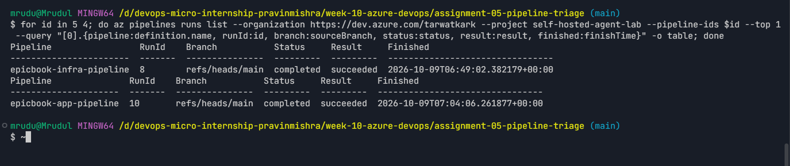

**What proves that both pipelines were healthy before the drill?**

Screenshot 1 shows the latest completed run of each pipeline, queried read-only with `az pipelines runs list`: infrastructure run **8** and application run **10**, both on `refs/heads/main`, with status `completed` and result `succeeded`. The triage script later confirmed the same two runs as `[PASS]`, with Overall Status HEALTHY and exit code 0 (Screenshot 5).

**Why is a healthy baseline necessary before introducing a controlled failure?**

The drill only proves something if the failure is caused by my change. If either pipeline were already failing, the triage report would mix an old problem with the new one, and I could not tell whether the tool found my deliberate failure or something else. A green baseline also gives me a known-good state to return to and to compare against in the recovery check.

---

# Task 2 — Create Project Context and Safety Rules in CLAUDE.md

### Screenshot 2 — CLAUDE.md with Project Overview, Incident Workflow, Safety Rules and Output Rules

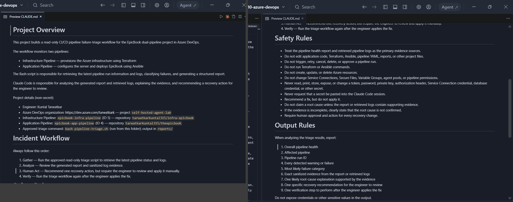

**Purpose of the four sections**

- **Project Overview:** tells Claude what it is looking at. There are two pipelines (Terraform and Ansible) with their IDs and repositories, and the work is split: the Bash script gathers and classifies, Claude analyses and explains.
- **Incident Workflow:** fixes the order Gather → Analyze → Human Act → Verify, so the work always starts from fresh evidence and ends with a second check.
- **Safety Rules:** the boundary. No edits, no pipeline actions, no Terraform or Ansible, no Azure changes, no secrets, and no claimed root cause without evidence.
- **Output Rules:** a fixed nine-point answer (health, pipeline, run ID, findings, category, evidence, cause, one recommendation, one verification), so every triage is complete and comparable.

**Why does Claude need project-specific operational context before analyzing the pipelines?**

Without context, Claude would only see a report and some logs. It would not know that pipeline 4 is the Ansible pipeline and pipeline 5 the Terraform one, which command is the approved one, or what is off-limits. CLAUDE.md gives it the names, IDs, the one approved command and the rules up front. That keeps the analysis specific to this project and stops it from guessing or reaching for tools it should not use.

**Why must the engineer review and apply the recommended fix?**

The pipeline can reach Azure, SSH keys and database credentials, and a change on `main` deploys to running servers. A recommendation can be wrong or incomplete, and only the engineer is accountable for what gets deployed. Reviewing and applying the fix myself means a person checks it against the evidence before it runs. It also keeps the authority to *diagnose* separate from the authority to *change production*.

**Which rules prevent Claude from accessing credentials or changing pipeline resources?**

In CLAUDE.md, three rules cover this:
- "Never read, print, store, expose, or change a token, password, private key, authorization header, Service Connection credential, database credential, or other secret"
- "Never request that a secret be pasted into the Claude Code session"
- "Do not change Service Connections, Secure Files, Variable Groups, agent pools, or pipeline permissions"

The rules against triggering, retrying, cancelling or approving runs, editing YAML, running Terraform or Ansible, and modifying Azure resources cover the rest. `.claude/settings.json` enforces the same boundary technically. It denies `Edit`/`Write`, `az pipelines run`/`cancel`/`build queue`, `az devops service-endpoint`, `az devops invoke`, `az rest`, `az account get-access-token`, `curl`, `terraform`, `ansible`, `git push`, and reading `~/.ssh`, `~/.azure`, `*.pem`, `*.tfvars` and `.env`.

**Why must Claude use report and log evidence before identifying a root cause?**

A guess from symptoms can send the engineer in the wrong direction and waste recovery time. For example, "Bash exited with code 1" alone could be anything. Tying every conclusion to a quoted log line means the diagnosis can be checked, and when the evidence is missing, Claude has to say the root cause is unconfirmed instead of sounding certain.

---

# Task 3 — Configure and Validate the Supplied Pipeline Triage Script

### Screenshot 3 — Script configuration, report filenames, check-function array and read-only log retrieval

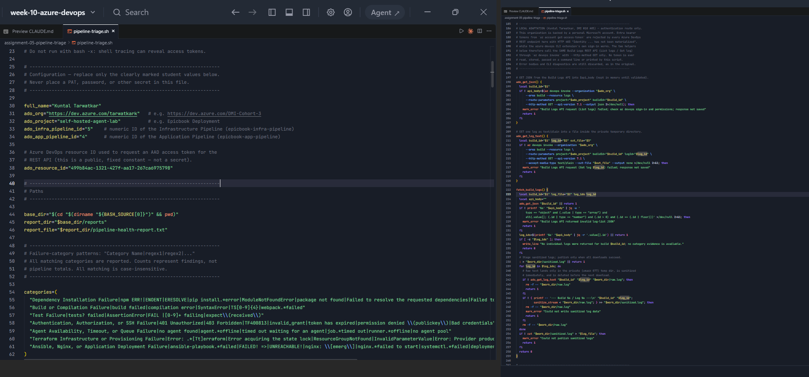

### Screenshot 4 — Bash syntax validation and executable permission

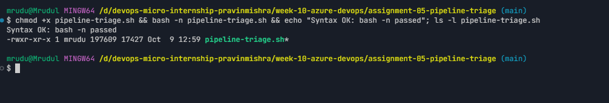

**Configuration changes I made to the supplied script**

1. **Placeholders:** `full_name="Kuntal Tarwatkar"`, `ado_org="https://dev.azure.com/tarwatkark"`, `ado_project="self-hosted-agent-lab"`, `ado_infra_pipeline_id="5"`, `ado_app_pipeline_id="4"`.
2. **Documented authentication adaptation.** My Azure DevOps organization is backed by a personal Microsoft account. The supplied method, an Entra bearer token from `az account get-access-token` sent with `curl`, got **HTTP 403 "Identity … has not been materialized"** on every REST endpoint, while the azure-devops CLI extension's own sign-in worked. I replaced only the token and `curl` helper with two functions that call the **same Build Logs REST API** (List logs / Get log) through `az devops invoke --http-method GET`. Raw log text is written only to the script's private `umask 077` temp directory, sanitized immediately and deleted. The script no longer touches a token at all. All validation, sanitization, state handling and exit codes are unchanged.
3. **Dependency patterns for my stack.** The supplied Dependency category only knew npm and pip messages. I added Ansible Galaxy's errors (`Failed to resolve the requested dependencies`, `Failed to find collection`, `Could not satisfy the following requirements`), because my Application Pipeline installs Ansible collections.

`SKILL.md` is byte-for-byte the supplied file.

**Why are pipeline metadata and step console logs handled separately?**

Run metadata (`az pipelines runs list`) says *what* happened: run ID, branch, status, result and finish time. That is enough to decide whether a run is healthy, queued or failed. It does not contain *why* a step failed; that text is only in the step console logs, which are much larger and may contain sensitive lines. The script therefore reads metadata first and downloads and sanitizes logs only for failed runs. Healthy runs stay fast, and no unnecessary log data is pulled.

**How does the script obtain the actual console logs?**

For a failed run, `fetch_build_logs` calls the Build Logs REST API *List logs* endpoint (`_apis/build/builds/{id}/logs`) to get every log ID. It validates that the JSON is a list of positive integer IDs, then calls *Get log* (`…/logs/{logId}`) with `Accept: text/plain` for each one. Both are GET requests through `az devops invoke`. Each log goes through `sanitize_stream` (redacting private-key blocks, authorization or bearer lines, passwords, client secrets, tokens and connection strings) before it is added to `reports/app-last-run.log` or `infra-last-run.log`.

**How does the check-function array control the classification loop?**

The `categories=( … )` array holds one string per category in the form `"Category Name|regex1|regex2|…"`. `run_category_checks` loops over the array, splits off the name, and runs `grep -m 1 -iE` (case-insensitive) with the patterns against the sanitized log. Every category that matches is reported with its first evidence line. Adding a category or a pattern is therefore just a new array entry; the loop does not change.

**What prevents a failed but unmatched run from being reported as healthy?**

In `process_pipeline`, a result of `failed` always leads to a failure finding. If `run_category_checks` matches nothing, the script records *"Unclassified Pipeline Failure … root cause not confirmed"*. If the log download fails, it records *"Run failed, but log retrieval also failed"*. Only `succeeded` produces a PASS. `queued` or `inProgress`, `canceled` and `partiallySucceeded` produce warnings, and API or configuration problems produce ERROR with exit 3. So a failed run can never be counted as healthy.

**Why are different exit codes useful to another automation tool?**

Another tool can act on the number without parsing text: **0** healthy, **1** warning or incomplete, **2** a pipeline failure, **3** the tool itself could not get trustworthy data. A scheduler could, for example, alert on 2, retry the check later on 1, and page whoever owns the tooling on 3, without ever confusing "pipeline broken" with "triage tool broken".

---

# Task 4 — Run and Understand the Healthy-State Report

### Screenshot 5 — Healthy report with my Full Name, both successful pipelines, Overall Status HEALTHY and exit code 0

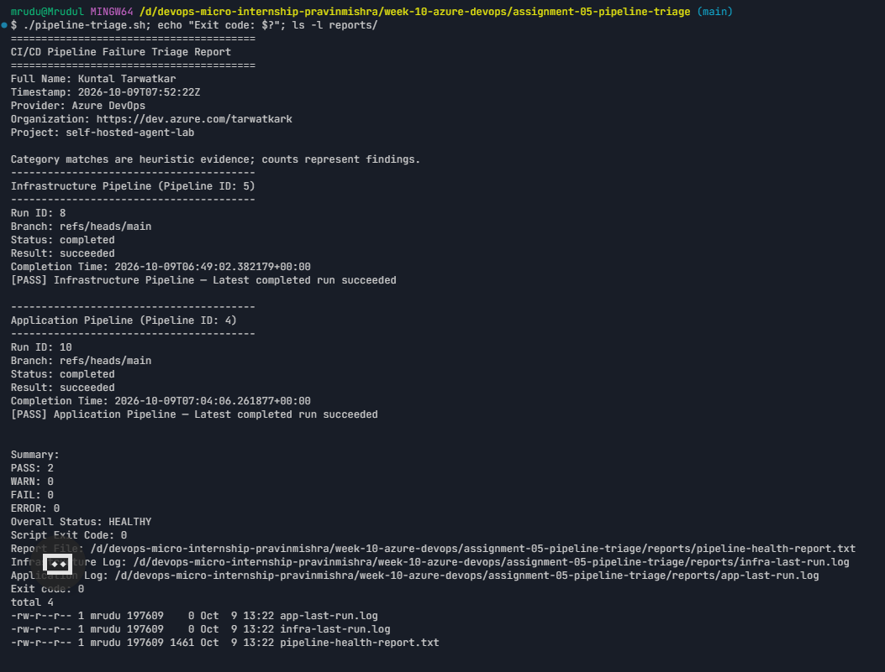

**What evidence proves that both pipelines are healthy?**

The fresh report (timestamp 2026-10-09T07:52:22Z) shows my name, `[PASS]` for infrastructure run 8 and application run 10 (both `completed` and `succeeded` on `main`), counts of PASS 2, WARN 0, FAIL 0 and ERROR 0, **Overall Status: HEALTHY** and **Script Exit Code: 0**. The shell's `echo $?` also printed **Exit code: 0**. Both log files were empty, which is expected because logs are only fetched for failed runs.

**Why must the baseline exit code be verified before the incident drill?**

The exit code is what automation and the skill trust. If the baseline returned 1 or 3, for example because of a sign-in or permission problem, the drill result would be meaningless: I could not tell a real pipeline failure from a broken tool. Seeing 0 on a known-good state proves the tool, authentication and parsing all work before I depend on them.

---

# Task 5 — Configure and Test the Supplied /pipeline-triage Skill

### Screenshot 6 — SKILL.md frontmatter, manual invocation, narrowly scoped tools, safety rules and output structure

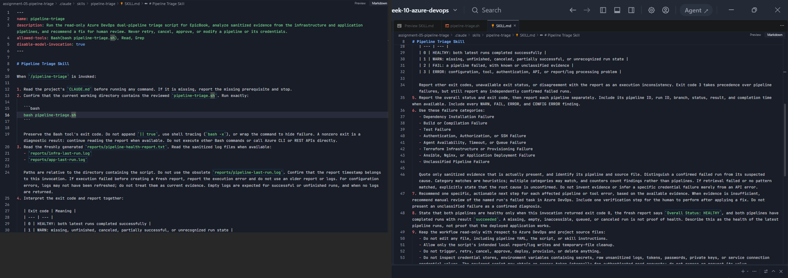

### Screenshot 7 — Healthy /pipeline-triage result

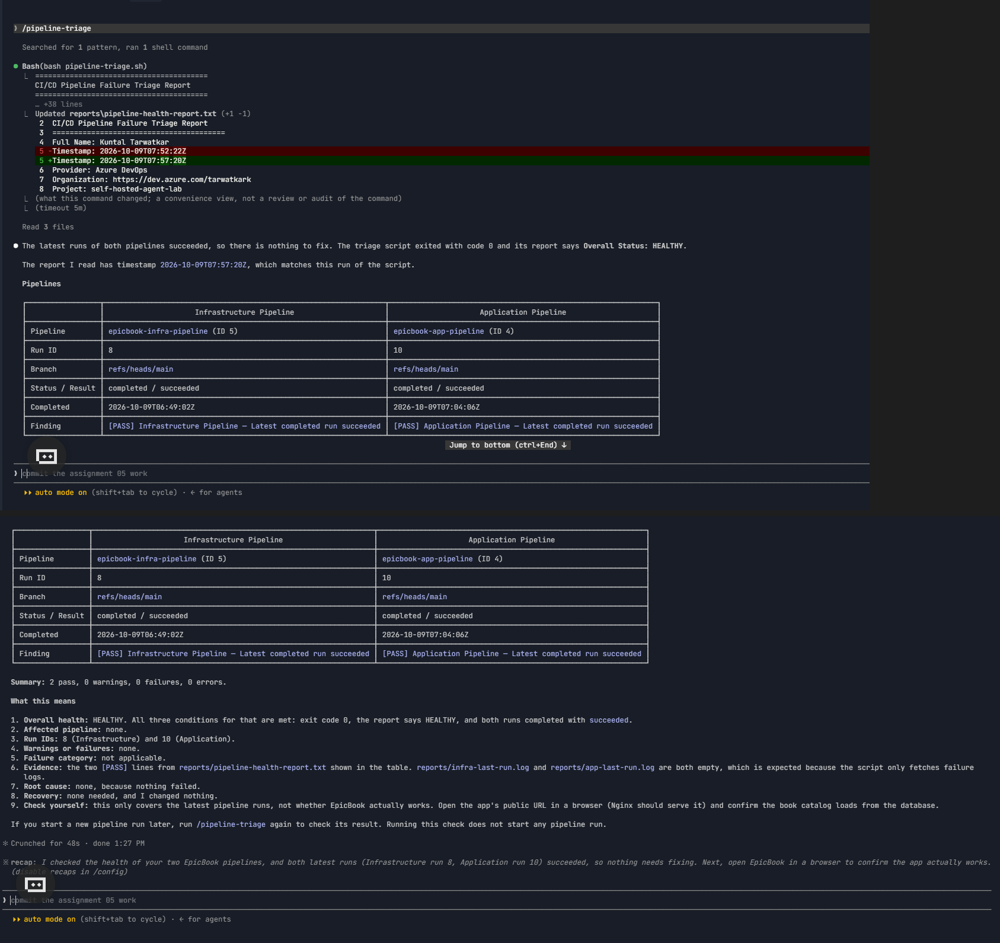

**Why is `disable-model-invocation: true` appropriate for this skill?**

The skill runs a script that queries Azure DevOps, so it should run only when an engineer deliberately asks for a triage. With `disable-model-invocation: true`, Claude cannot decide on its own to start it in the middle of another conversation. Every run is an intentional human request, which matches the human-in-control model of the assignment.

**Why should the skill avoid broad Bash approval?**

`allowed-tools: Bash(bash pipeline-triage.sh), Read, Grep` pre-approves exactly one command. Broad `Bash` approval would let the same session run `az pipelines run`, `git push`, `terraform apply` or read a key file without asking. The point of the skill is that its only power is to gather and read evidence.

**What work is performed by Bash, and what work is performed by Claude?**

**Bash (the script)** does the deterministic work. It reads run metadata, downloads the step logs for failed runs, sanitizes them, pattern-matches the categories, counts findings, writes the report and sets the exit code. **Claude** does the interpretation. It reads CLAUDE.md, the report and the sanitized logs, checks that the report is from this run, explains what failed and why using quoted evidence, picks one recommendation and one verification step, and states the limits ("this covers the latest pipeline runs, not whether EpicBook works").

**Why are permission rules required in addition to written safety instructions?**

Written instructions are guidance that a model can misread or be talked out of, for example by text inside a log, which the skill rightly treats as data, not instructions. Permission rules are enforced by Claude Code itself: a denied `Edit`, `git push` or `az pipelines run` is blocked whatever the prompt says. `allowed-tools` only *pre-approves*; it does not remove other tools. So the deny list in `.claude/settings.json` is what actually closes the door.

---

# Task 6 — Introduce a Safe Failure in the Application Pipeline

### Screenshot 8 — Failed Application Pipeline run on the temporary branch

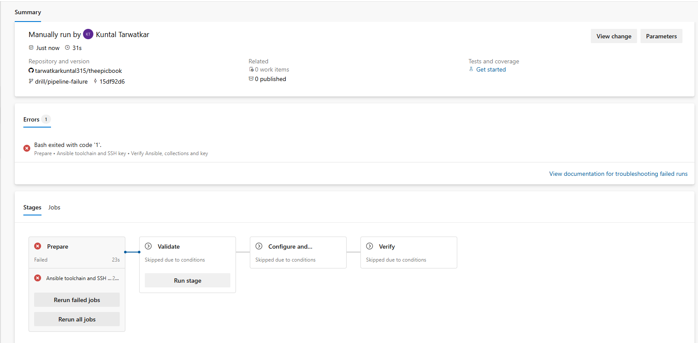

**What exact failure did I introduce?**

On a new branch `drill/pipeline-failure` in the **application** repository only, I added a non-existent Ansible collection to `ansible/requirements.yml`: `- name: dmidrill.does_not_exist`, with a comment marking it as a drill. Commit `15df92d`: "DRILL: add invalid Ansible collection to break Prepare stage (do not merge)". I queued `epicbook-app-pipeline` manually on that branch. Run 11 failed in **Prepare** at *Verify Ansible, collections and key*, where `ansible-galaxy collection install -r requirements.yml` exited with code 1.

**Which category should detect it?**

**Dependency Installation Failure.** The Galaxy error `Failed to resolve the requested dependencies map. Could not satisfy the following requirements` matches the dependency patterns, and no other category matched.

**Why is the failure safe and easily reversible?**

It fails in the first stage, Prepare, before any SSH connection, configuration or deployment. Validate, Configure and Deploy, and Verify were all *skipped*. It needs no change to Terraform, Azure resources, NSGs, service connections, keys, credentials or data. Reverting is a one-line file change.

**How did I prevent the deliberate failure from reaching main or changing the deployed application?**

The pipeline's CI trigger includes only `main`, so pushing the drill branch started nothing. I queued the run manually on the branch and never opened a merge into `main`: `main` stayed at `0d1ce07` throughout. Because the failure stops in Prepare, the Deploy stage never ran for the broken commit, so the servers kept serving the last good release.

---

# Task 7 — Diagnose and Save the Incident Evidence

### Screenshot 9 — /pipeline-triage diagnosis and saved incident report

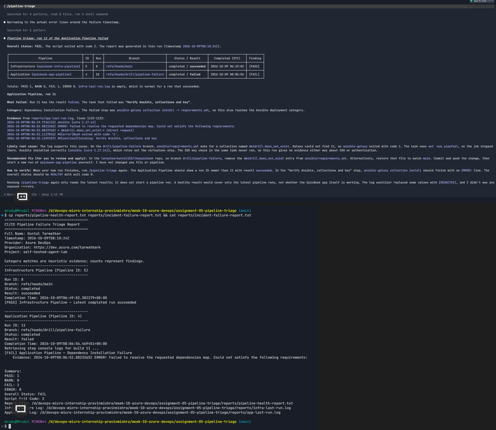

**Which failure category was identified?**

**Dependency Installation Failure** for the Application Pipeline, run 11 on `refs/heads/drill/pipeline-failure`. Overall Status FAIL, exit code 2, while the Infrastructure Pipeline (run 8) still showed PASS.

**What exact evidence supported the diagnosis?**

From the sanitized `reports/app-last-run.log`, quoted by the skill:
```text
2026-10-09T08:06:52.0823365Z ERROR! Failed to resolve the requested dependencies map. Could not satisfy the following requirements:
2026-10-09T08:06:52.0823765Z * dmidrill.does_not_exist:* (direct request)
2026-10-09T08:06:52.1127826Z ##[error]Bash exited with code '1'.
2026-10-09T08:06:52.1159187Z ##[section]Finishing: Verify Ansible, collections and key
```
It also noted that `ansible [core 2.17.14]` had installed correctly, which rules out the virtualenv step, and that the SSH key check never ran, so the run says nothing about SSH or authentication.

**Did Claude apply the fix or rerun the pipeline? Why is that important?**

No. It ended with *"Recommended fix (for you to review and apply) … I have not changed any file or pipeline."* That matters because the person who reviews the evidence should be the one who changes the system. It keeps a clear audit trail of *who* changed *what*, and a wrong diagnosis cannot turn into an automatic, wrong change to a pipeline that has production access.

**Which part represents Gather, and which part represents Analyze?**

**Gather:** `bash pipeline-triage.sh` read the run metadata, downloaded and sanitized the step logs for run 11 (about 78 KB), matched the categories, and wrote `pipeline-health-report.txt` and `app-last-run.log` with exit code 2. **Analyze:** Claude read CLAUDE.md, the report and the log, narrowed the evidence to the error lines around the failure timestamp, explained the cause, and gave one fix and one verification step. Saving the report as `reports/incident-failure-report.txt` preserved the Gather result before the fix.

---

# Task 8 — Apply the Human-Reviewed Fix and Verify Recovery

### Screenshot 10 — Corrected Application Pipeline run on the temporary branch, succeeded

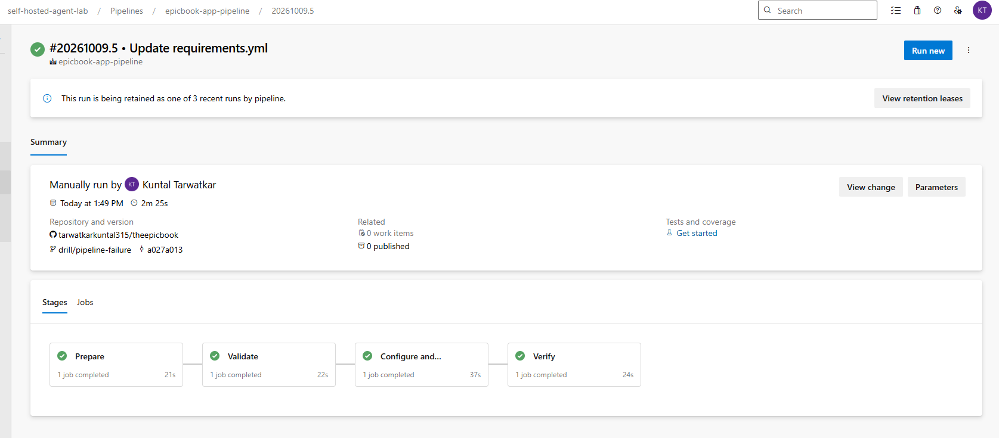

### Screenshot 11 — Recovery /pipeline-triage result: HEALTHY, exit code 0, my name, both saved reports

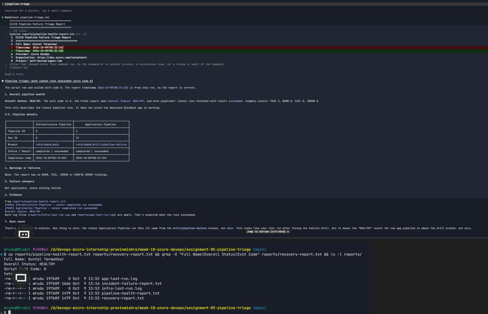

**What exact fix did I apply?**

In the GitHub web editor, on branch `drill/pipeline-failure`, I removed the drill entry from `ansible/requirements.yml`, restoring `collections: []` (commit `a027a01`, "Update requirements.yml"). Then I queued `epicbook-app-pipeline` on the branch again myself.

**Did the fix match Claude's recommendation?**

Yes. Claude recommended removing the `dmidrill.does_not_exist` entry from `ansible/requirements.yml` on `drill/pipeline-failure` (or restoring the file to match `main`), then starting a new run myself. That is exactly what I did, and it matched the quoted evidence naming that collection.

**What evidence proves that the pipeline recovered?**

Run 12 (#20261009.5) on `drill/pipeline-failure` at commit `a027a013` passed all four stages: Prepare, Validate, Configure and Deploy, and Verify. The second `/pipeline-triage` reported Overall Status **HEALTHY**, exit code **0**, PASS 2, FAIL 0, with infrastructure run 8 and application run 12 both succeeded. That result is saved as `reports/recovery-report.txt`, next to `reports/incident-failure-report.txt`.

**Why is a second triage run required after the pipeline becomes green?**

A green badge only says the latest run passed. The second triage checks the same evidence the incident was diagnosed from: that the *newest* run is the one being judged, that both pipelines are healthy together, and that the tool returns exit code 0 again. It closes the Verify step and produces the saved recovery report as proof. The skill also pointed out that this healthy result is for the drill branch, not `main`, which is the kind of detail a quick glance at a green icon would miss.

**What risk would be created if Claude could automatically edit, push, approve, and rerun the pipeline?**

Diagnosis and recovery authority would merge into one unchecked loop. A misread log could lead to a wrong edit being pushed and deployed. A malicious line in a log could trick the assistant into running commands. A "fix" could weaken security, for example by disabling host-key checks or widening a firewall rule, just to make a run green. Repeated reruns could also hide a flaky or dangerous change. With pipeline credentials that reach Azure and production servers, one bad automated decision could cause an outage or a breach, with no human accountable for it.

---

# LinkedIn Post

**LinkedIn Post URL:** https://www.linkedin.com/feed/update/urn:li:activity:7514240991168593920/

### Screenshot 12 — LinkedIn post

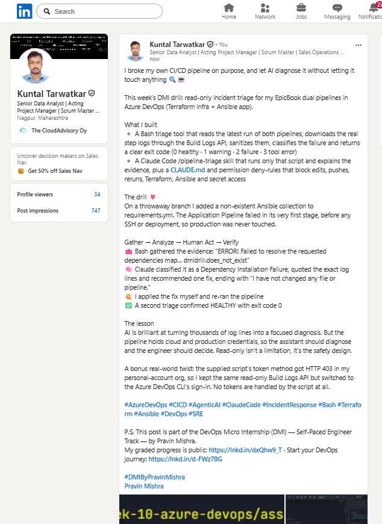

---

# Submission Instructions

- Add all required screenshots in your submission
- Never expose a Personal Access Token, service connection credential, or GitHub token in a screenshot

---

# Completion Checklist

- [x] Both Azure DevOps pipelines were healthy before the drill (Screenshot 1)
- [x] Workspace inside my own Git repository; supplied files in the correct locations
- [x] CLAUDE.md created with Project Overview, Incident Workflow, Safety Rules and Output Rules (Screenshot 2)
- [x] Only the marked placeholders replaced, plus the documented authentication adaptation and Ansible Galaxy dependency patterns
- [x] Script passes `bash -n`, is executable, uses only read-only Azure DevOps operations (Screenshots 3–4)
- [x] Script retrieves metadata for both pipelines and real console logs through the Build Logs API
- [x] Healthy baseline reports HEALTHY with exit code 0 (Screenshot 5)
- [x] `/pipeline-triage` is manually invoked, read-only, and reads CLAUDE.md first (Screenshots 6–7)
- [x] Controlled failure only in the Application Pipeline, before deployment, never merged to main (Screenshot 8)
- [x] Failed-state report saved as `reports/incident-failure-report.txt`; Claude recommended but did not apply the fix (Screenshot 9)
- [x] Human-applied fix; corrected run succeeded; second triage HEALTHY with exit code 0; `reports/recovery-report.txt` saved (Screenshots 10–11)
- [x] LinkedIn post published and URL included (Screenshot 12)
- [x] No secret, token, credential or private key exposed

---

## 📌 About DMI & CloudAdvisory

DevOps Micro Internship (DMI) is a project-based DevOps program run by Pravin Mishra (The CloudAdvisory) focused on real-world execution, systems thinking, and career readiness.

It helps learners build strong DevOps foundations with hands-on experience.

---

## 📌 Resources

- 🌐 DMI Official Website: https://dmi.pravinmishra.com?utm_source=github&utm_medium=readme  
- 🎓 University: https://university.pravinmishra.com?utm_source=github&utm_medium=readme  
- 💬 Discord Community: https://discord.pravinmishra.com?utm_source=github&utm_medium=readme  
- 📝 Blog: https://dmi.pravinmishra.com/blog?utm_source=github&utm_medium=readme  
- ▶️ YouTube Playlist: https://www.youtube.com/playlist?list=PLFeSNDtI4Cho  
- 🔗 Pravin Mishra (LinkedIn): https://www.linkedin.com/in/pravin-mishra-aws-trainer/  
- 🏢 CloudAdvisory (LinkedIn): https://www.linkedin.com/company/thecloudadvisory/

---

*This submission is part of DevOps Micro Internship (DMI) Cohort 3 — Agentic AI Track.*
