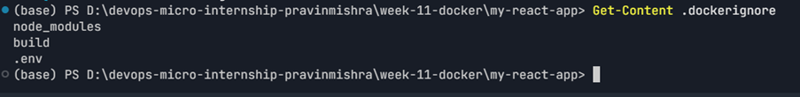
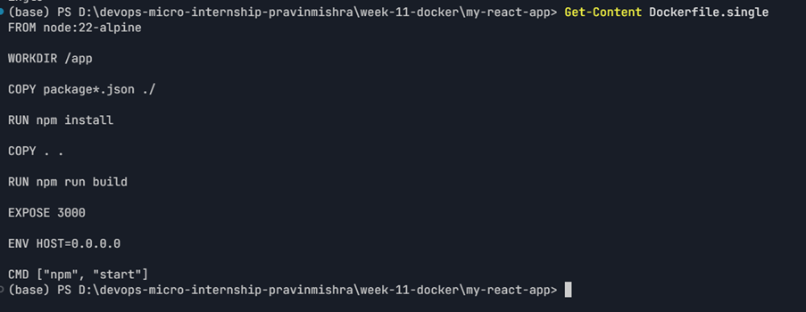
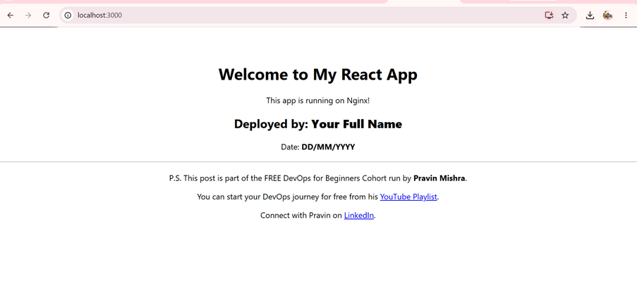
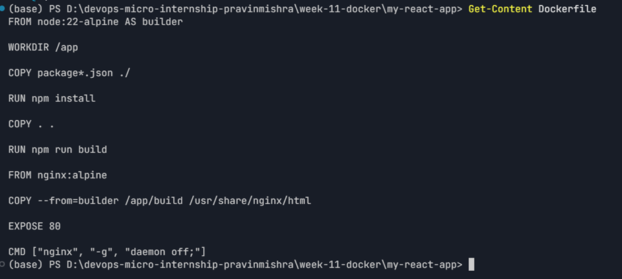
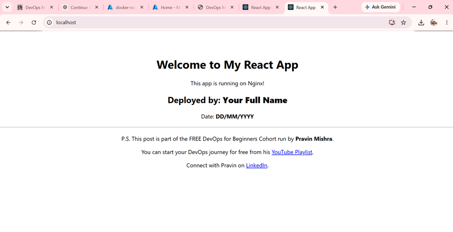
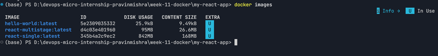
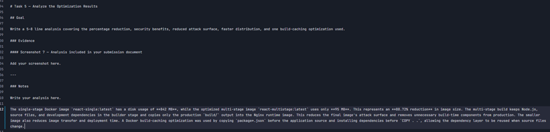
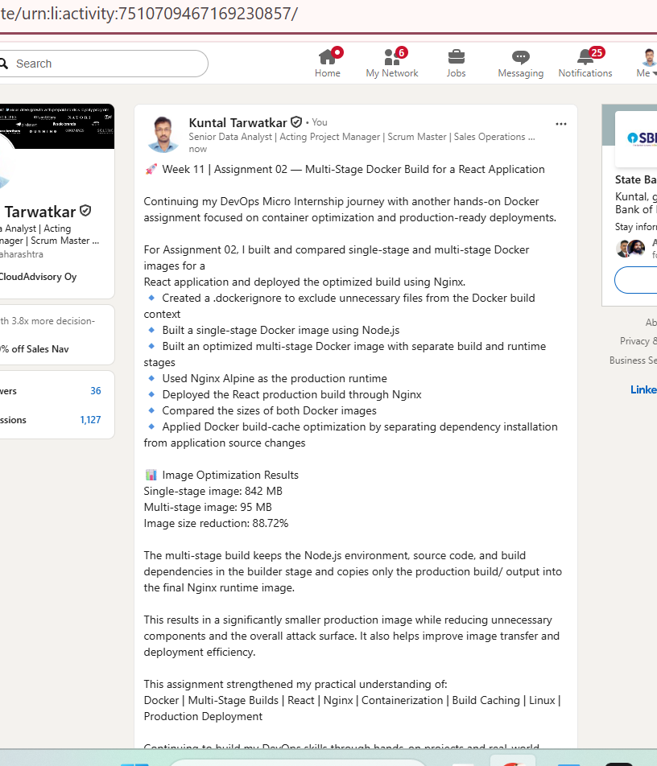

# Assignment 2 — Multi-Stage Docker Build for a React Application

Part of the DevOps Micro Internship (DMI) Cohort 3 with Agentic AI

---

## Purpose

In this assignment, you will build both a single-stage and an optimized multi-stage Docker image for a React application, compare the resulting image sizes, and deploy the optimized version using a production-ready Nginx runtime container.

---

# Task 1 — Prepare the Project

## Goal

Clone `https://github.com/pravinmishraaws/my-react-app.git` and create a `.dockerignore` excluding `node_modules`, `build`, and `.env`.

### Evidence

#### Screenshot 1 — Contents of the `.dockerignore` file



---

# Task 2 — Create a Single-Stage Docker Image

## Goal

Create `Dockerfile.single`, build `react-single`, and run it on port 3000.

### Evidence

#### Screenshot 2 — Contents of `Dockerfile.single`



---

#### Screenshot 3 — Browser displaying the application running from the single-stage container



---

# Task 3 — Create a Multi-Stage Docker Build

## Goal

Create a multi-stage Dockerfile with separate build and Nginx runtime stages, build `react-multistage`, and run it on port 80.

### Evidence

#### Screenshot 4 — Contents of the multi-stage Dockerfile



---

#### Screenshot 5 — Browser displaying the application running from the multi-stage container



---

# Task 4 — Compare Docker Image Sizes

## Goal

Compare the single-stage and multi-stage image sizes and calculate the percentage reduction.

### Evidence

#### Screenshot 6 — Docker image list showing both image sizes



### Image Size Comparison

| Image | Disk Usage |
|---|---:|
| `react-single:latest` | 842 MB |
| `react-multistage:latest` | 95 MB |

### Percentage Reduction

```text
((842 MB - 95 MB) / 842 MB) × 100
= 88.72% 
```

---

# Task 5 — Analyze the Optimization Results

## Goal

Write a 5–8 line analysis covering the percentage reduction, security benefits, reduced attack surface, faster distribution, and one build-caching optimization used.

### Evidence

#### Screenshot 7 — Analysis included in your submission document



---

### Notes

The single-stage Docker image `react-single:latest` has a disk usage of **842 MB**, while the optimized multi-stage image `react-multistage:latest` uses only **95 MB**. This represents an **88.72% reduction** in image size. The multi-stage build keeps Node.js, source files, and development dependencies in the builder stage and copies only the production `build/` output into the Nginx runtime image. This reduces the final image's attack surface and removes unnecessary build-time components from production. The smaller image also reduces image transfer and deployment time. A Docker build-caching optimization was used by copying `package*.json` before the application source and installing dependencies before `COPY . .`, allowing the dependency layer to be reused when source files change.

---

# Task 6 — Explore Additional Production Optimizations (Optional)

## Goal

Optionally configure an Nginx health check, cache headers, parameterized ports via environment variables, or a lighter runtime image, and compare results.

> Screenshot optional.

---

# LinkedIn Post (Optional)

## Goal

Create a LinkedIn post describing what you built, what a multi-stage Docker build is, the image size reduction achieved, and key learnings.

## Evidence

#### LinkedIn Post URL

Paste your LinkedIn post URL here:

https://www.linkedin.com/feed/update/urn:li:activity:7510709467169230857/

---

#### Screenshot — Published LinkedIn post



---

# Submission Instructions

- Add all required screenshots in your submission
- Full name must be visible in required screenshots
- Do not expose sensitive information

---

# Completion Checklist

- [x] Task 1: `.dockerignore` created (Screenshot 1)
- [x] Task 2: Single-stage image built and verified (Screenshots 2–3)
- [x] Task 3: Multi-stage image built and verified (Screenshots 4–5)
- [x] Task 4: Image sizes compared (Screenshot 6)
- [x] Task 5: Analysis written (Screenshot 7 & Notes)
- [x] Task 6: Optional production optimizations explored
- [x] No sensitive information exposed

---

## 📌 About DMI & CloudAdvisory

DevOps Micro Internship (DMI) is a project-based DevOps program run by Pravin Mishra (The CloudAdvisory) focused on real-world execution, systems thinking, and career readiness.

It helps learners build strong DevOps foundations with hands-on experience.

---

## 📌 Resources

- 🌐 DMI Official Website: https://dmi.pravinmishra.com?utm_source=github&utm_medium=readme  
- 🎓 University: https://university.pravinmishra.com?utm_source=github&utm_medium=readme  
- 💬 Discord Community: https://discord.pravinmishra.com?utm_source=github&utm_medium=readme  
- 📝 Blog: https://dmi.pravinmishra.com/blog?utm_source=github&utm_medium=readme  
- ▶️ YouTube Playlist: https://www.youtube.com/playlist?list=PLFeSNDtI4Cho  
- 🔗 Pravin Mishra (LinkedIn): https://www.linkedin.com/in/pravin-mishra-aws-trainer/  
- 🏢 CloudAdvisory (LinkedIn): https://www.linkedin.com/company/thecloudadvisory/

---

*This submission is part of DevOps Micro Internship (DMI) Cohort 3 — Agentic AI Track.*
