# Assignment 3 — Docker Networking

Part of the DevOps Micro Internship (DMI) with Agentic AI

---

## Purpose

In this assignment, you will explore Docker networking by using default bridge, custom bridge, multiple bridge, and host network modes. You will verify container communication, service discovery, network isolation, public access, and host networking on a Linux VM or EC2 instance.

---

# Task 1 — Deploy a Standalone Application Using the Default Bridge Network

## Goal

Deploy an Nginx web server using Docker’s default bridge network and access it through the VM public IP address.

### Evidence

#### Screenshot 1 — Available Docker Networks

Add a screenshot of the terminal showing:

```bash
docker network ls
```

The output must include the default `bridge`, `host`, and `none` networks.

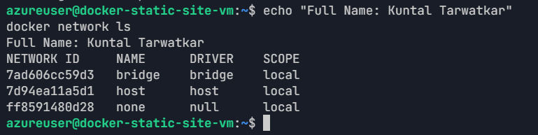

---

#### Screenshot 2 — Nginx Image Pull

Add a screenshot of the terminal showing successful completion of:

```bash
docker pull nginx:alpine
```

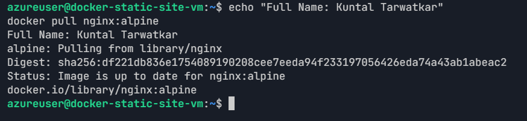

---

#### Screenshot 3 — Running `myweb` Container

Add a screenshot of the terminal showing:

```bash
docker ps
```

The output must show the running `myweb` container with:

```text
0.0.0.0:80->80/tcp
```

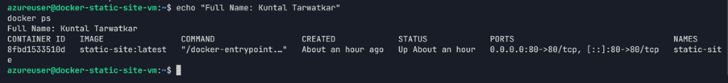

---

#### Screenshot 4 — Nginx Welcome Page

Add a browser screenshot showing the Nginx Welcome Page at:

```text
http://4.224.18.235
```

Ensure that the VM public IP is visible in the address bar. Add your full name as a clear caption directly below the screenshot.

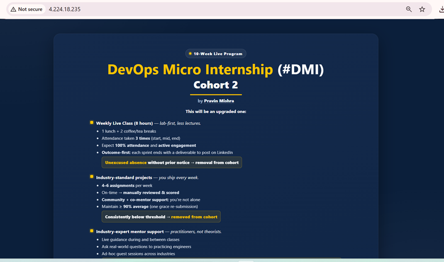

---

# Task 2 — Connect Containers Using a Custom Bridge Network

## Goal

Create a custom bridge network and verify that containers can communicate using container names rather than IP addresses.

### Evidence

#### Screenshot 5 — Custom Bridge Network Created

Add a screenshot of the terminal showing `mynetwork` in:

```bash
docker network ls
```

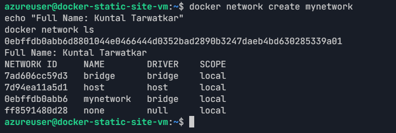

---

#### Screenshot 6 — Running `web` and `client` Containers

Add a screenshot of the terminal showing:

```bash
docker ps
```

The output must show both `web` and `client` containers running without published host ports.

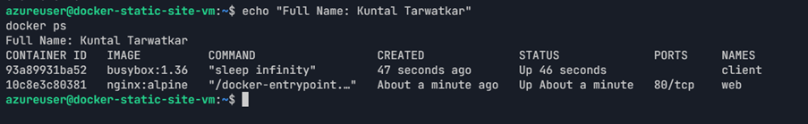

---

#### Screenshot 7 — Service Discovery by Container Name

Add a screenshot of the terminal showing successful output from:

```bash
docker exec client wget -qO- http://web
```

The output must display the Nginx Welcome Page HTML.

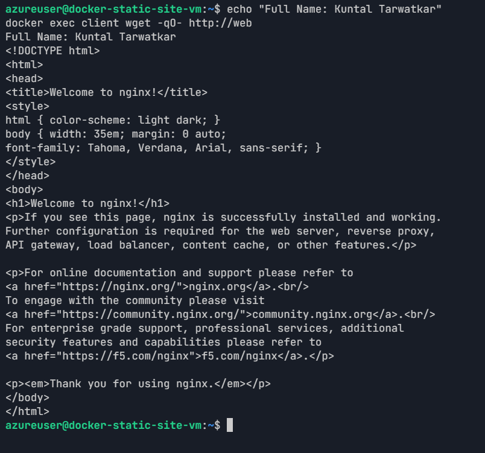

---

#### Screenshot 8 — Custom Network Inspection

Add a screenshot of the terminal showing:

```bash
docker network inspect mynetwork
```

The output must show both `web` and `client` connected to `mynetwork`.

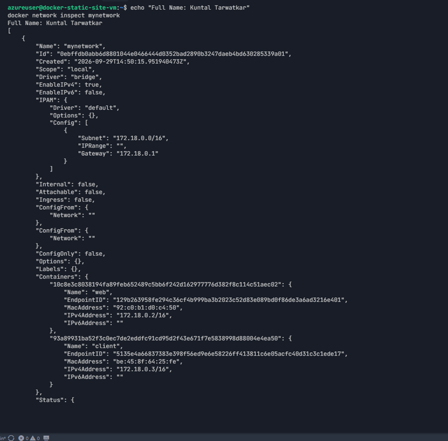

---

# Task 3 — Demonstrate Multi-Network Isolation

## Goal

Deploy frontend, backend, and database containers across two separate Docker networks. Verify allowed communication and confirm that the frontend cannot directly reach the database.

### Evidence

#### Screenshot 9 — Two Docker Networks

Add a screenshot of the terminal showing:

```bash
docker network ls
```

The output must include both `frontend-network` and `backend-network`.

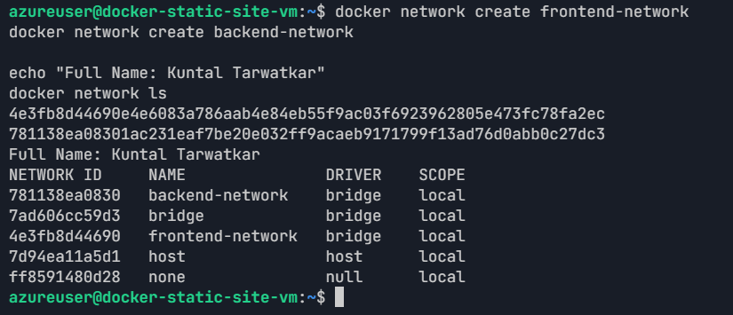

---

#### Screenshot 10 — Running Multi-Network Containers

Add a screenshot of the terminal showing:

```bash
docker ps
```

The output must show:

- `frontend` with the published port mapping `0.0.0.0:80->80/tcp`
- `backend` without a published host port
- `db` without a published host port

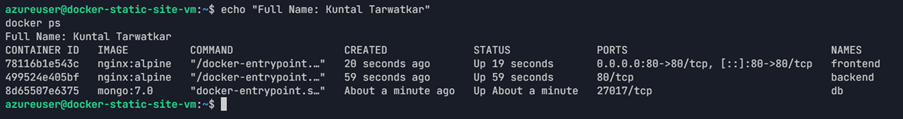

---

#### Screenshot 11 — Frontend Network Inspection

Add a screenshot of the terminal showing:

```bash
docker network inspect frontend-network
```

The output must show `frontend` and `backend`.

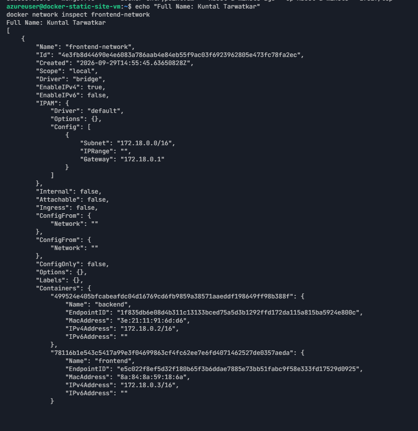

---

#### Screenshot 12 — Backend Network Inspection

Add a screenshot of the terminal showing:

```bash
docker network inspect backend-network
```

The output must show `backend` and `db`.

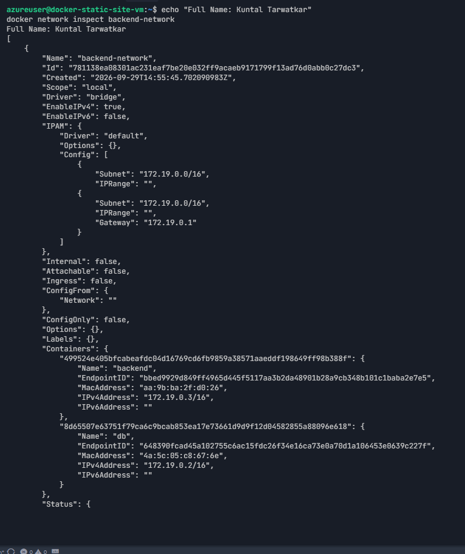

---

#### Screenshot 13 — Frontend-to-Backend Communication

Add a screenshot of the terminal showing successful output from:

```bash
docker exec frontend wget -qO- http://backend
```

The output must display the Nginx Welcome Page HTML.

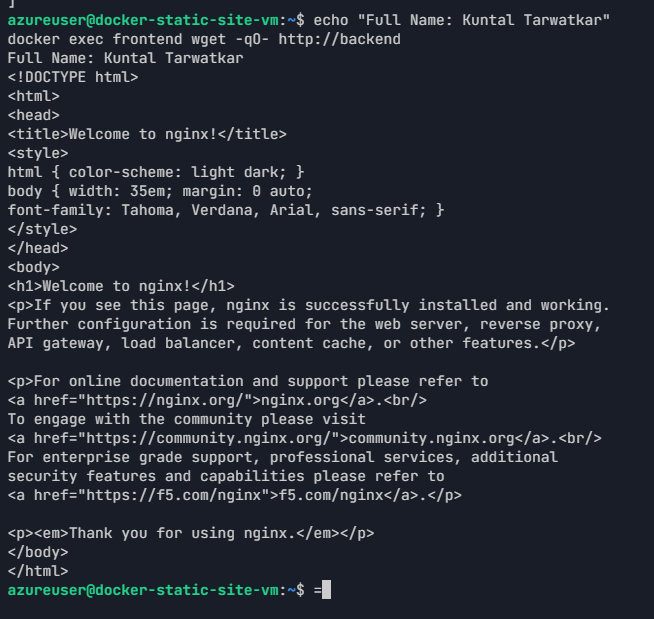

---

#### Screenshot 14 — Backend-to-Database Communication

Add a screenshot of the terminal showing a successful connection to `db` on port `27017` from the `backend` container.

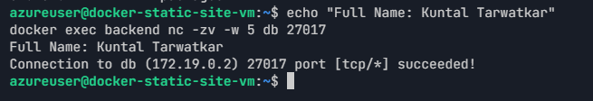

---

#### Screenshot 15 — Frontend-to-Database Isolation

Add a screenshot of the terminal showing that the `frontend` container cannot reach `db` on port `27017`.

The output must include:

```text
Expected result: frontend cannot reach db
```

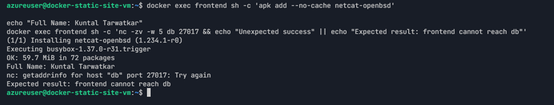

---

#### Screenshot 16 — Public Frontend Access

Add a browser screenshot showing the Nginx Welcome Page from the `frontend` container at:

```text
http://4.224.18.235
```

Ensure that the VM public IP is visible in the address bar. Add your full name as a clear caption directly below the screenshot.

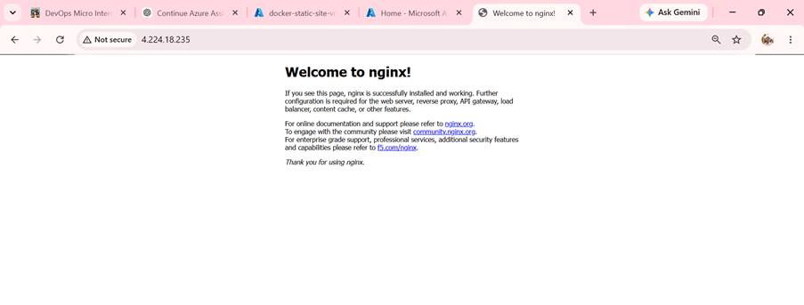

---

# Task 4 — Deploy an Application Using Docker Host Network Mode

## Goal

Run an Nginx container using Docker host network mode and compare it with bridge networking.

### Evidence

#### Screenshot 17 — Running Host-Networked Container

Add a screenshot of the terminal showing:

```bash
docker ps
```

The output must show the running `fastapp` container.

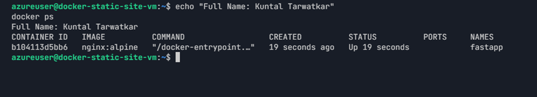

---

#### Screenshot 18 — Host Network Mode Verification

Add a screenshot of the terminal showing output from:

```bash
docker inspect fastapp | grep '"NetworkMode"'
```

The output must confirm:

```text
"NetworkMode": "host"
```

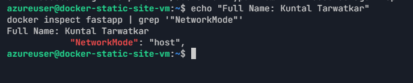

---

#### Screenshot 19 — Host-Networked Nginx Page

Add a browser screenshot showing the Nginx Welcome Page at:

```text
http://4.224.18.235
```

Ensure that the VM public IP is visible in the address bar. Add your full name as a clear caption directly below the screenshot.

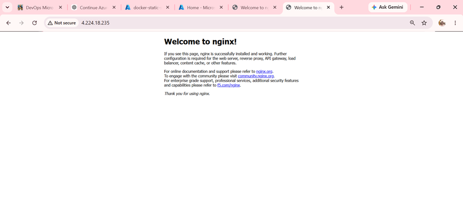

---

#### Screenshot 20 — Host-Networked Container Cleanup

Add a screenshot of the terminal showing successful completion of:

```bash
docker stop fastapp
docker rm fastapp
```

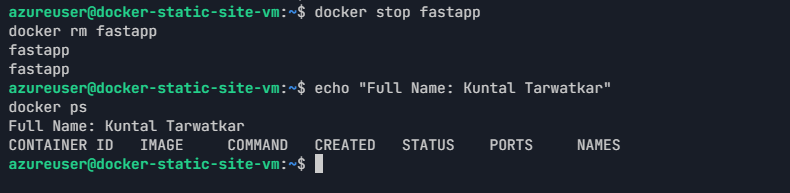

---

# Networking Notes

Write a short note explaining:

- Default bridge networking
- Container-name communication on a custom bridge network
- Why the frontend could not access the database in Task 3
- The difference between bridge mode and host network mode

Write your note here.

---

# LinkedIn Requirement

## Goal

Create a LinkedIn post about the Docker networking modes explored, one key lesson about container isolation, and the learning outcomes from this assignment.

### Evidence

#### LinkedIn Post URL

Paste your LinkedIn post URL here:

https://www.linkedin.com/feed/update/urn:li:activity:7510718651805839361/

---

#### LinkedIn Post Screenshot

Add a screenshot of the published LinkedIn post here.

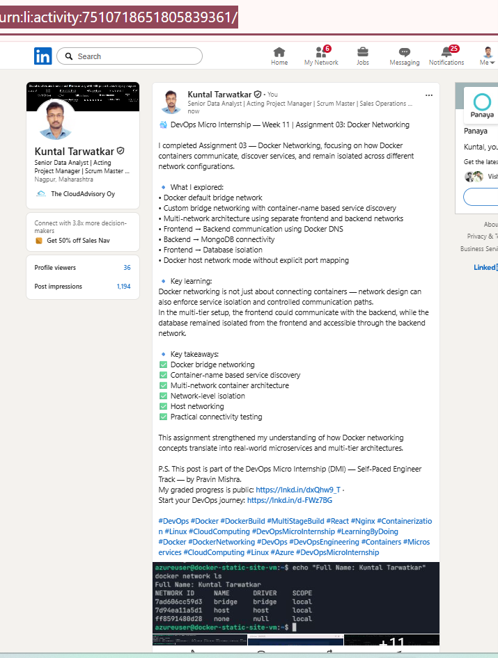

---

# Submission Instructions

- Complete all tasks in sequence.
- Include Screenshots 1–20 exactly as specified.
- Include the Networking Notes section.
- Include the LinkedIn post URL and screenshot.
- Ensure that your full name is visible in all terminal screenshots.
- Add your full name as a caption below each browser screenshot that shows the standard Nginx page.
- Do not expose private keys, passwords, access keys, tokens, account IDs, or other sensitive information.

---

# Completion Checklist

- [x] Completed on a Linux VM or EC2 instance
- [x] Docker Engine is running
- [x] HTTP port 80 is allowed in the VM firewall or cloud security rules
- [x] Default bridge networking verified
- [x] Custom bridge network created
- [x] Container-name communication verified
- [x] `frontend-network` and `backend-network` created
- [x] Frontend-to-backend communication verified
- [x] Backend-to-database communication verified
- [x] Frontend-to-database isolation verified
- [x] Only the frontend published port 80 in Task 3
- [x] Host network mode verified
- [x] All required screenshots included
- [x] Networking Notes completed
- [x] LinkedIn post URL and screenshot included
- [x] Full name visible in terminal screenshots
- [x] Browser screenshots include full-name captions
- [x] No sensitive information exposed

---

## 📌 About DMI & CloudAdvisory

DevOps Micro Internship (DMI) is a project-based DevOps program run by Pravin Mishra (The CloudAdvisory) focused on real-world execution, systems thinking, and career readiness.

It helps learners build strong DevOps foundations with hands-on experience.

---

## 📌 Resources

- 🌐 DMI Official Website: https://dmi.pravinmishra.com?utm_source=github&utm_medium=readme  
- 🎓 University: https://university.pravinmishra.com?utm_source=github&utm_medium=readme  
- 💬 Discord Community: https://discord.pravinmishra.com?utm_source=github&utm_medium=readme  
- 📝 Blog: https://dmi.pravinmishra.com/blog?utm_source=github&utm_medium=readme  
- ▶️ YouTube Playlist: https://www.youtube.com/playlist?list=PLFeSNDtI4Cho  
- 🔗 Pravin Mishra (LinkedIn): https://www.linkedin.com/in/pravin-mishra-aws-trainer/  
- 🏢 CloudAdvisory (LinkedIn): https://www.linkedin.com/company/thecloudadvisory/

---

*This submission is part of DevOps Micro Internship (DMI) — Agentic AI Track.*
