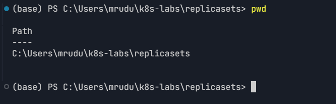
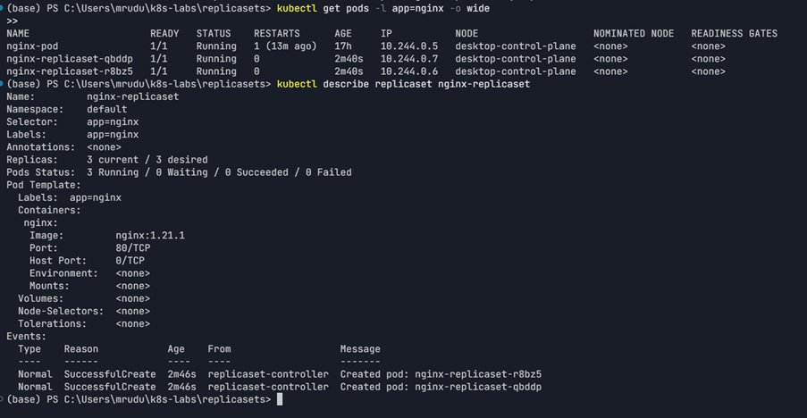
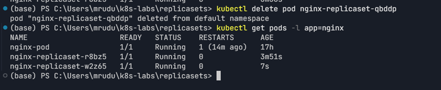
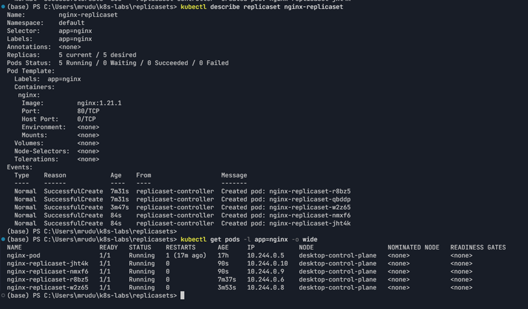

# Assignment 2 — ReplicaSets: Keeping Your Pods Alive

Part of the DevOps Micro Internship (DMI) Cohort 3 with Agentic AI

---

## Purpose

In this guided lab, you will create an NGINX ReplicaSet, verify it maintains three Pods, test its auto-healing behavior by deleting a Pod, and scale it from three to five replicas.

---

# Task 1 — Set Up Your Working Directory

## Goal

Create the `~/k8s-labs/replicasets` working directory.

### Evidence

#### Screenshot 1 — Terminal showing the `~/k8s-labs/replicasets` working directory

---

# Task 2 — Create and Apply the ReplicaSet

## Goal

Write `nginx-replicaset.yaml` (apiVersion `apps/v1`, kind `ReplicaSet`, 3 replicas, `selector.matchLabels` matching `template.metadata.labels` as `app: nginx`, image `nginx:1.21.1`), apply it, and confirm three Pods are created.

### Evidence

#### Screenshot 2 — `nginx-replicaset.yaml` and terminal output showing three running Pods

---

# Task 3 — Test ReplicaSet Auto-Healing

## Goal

Delete one Pod managed by `nginx-replicaset` and confirm Kubernetes creates a replacement, restoring the desired count of three.

### Evidence

#### Screenshot 3 — Terminal showing the deleted Pod and the newly created replacement, with the desired count remaining three

---

# Task 4 — Scale and Inspect the ReplicaSet

## Goal

Change `replicas` from 3 to 5, reapply the manifest, and confirm five Pods are managed, then inspect the ReplicaSet with `describe` and `get pods -o wide`.

### Evidence

#### Screenshot 4 — Terminal showing five Pods and the `nginx-replicaset` details

---

# Submission Instructions

- Add all required screenshots in your submission
- Include the completed `nginx-replicaset.yaml` manifest

---

# Completion Checklist

- [x] Task 1: Lab directory created (Screenshot 1)
- [x] Task 2: ReplicaSet created with three Pods (Screenshot 2)
- [x] Task 3: Auto-healing observed after deleting a Pod (Screenshot 3)
- [x] Task 4: Scaled to five Pods and inspected (Screenshot 4)
- [x] Understood why Deployments are preferred for rolling updates and rollbacks

---

## 📌 About DMI & CloudAdvisory

DevOps Micro Internship (DMI) is a project-based DevOps program run by Pravin Mishra (The CloudAdvisory) focused on real-world execution, systems thinking, and career readiness.

It helps learners build strong DevOps foundations with hands-on experience.

---

## 📌 Resources

- 🌐 DMI Official Website: https://dmi.pravinmishra.com?utm_source=github&utm_medium=readme  
- 🎓 University: https://university.pravinmishra.com?utm_source=github&utm_medium=readme  
- 💬 Discord Community: https://discord.pravinmishra.com?utm_source=github&utm_medium=readme  
- 📝 Blog: https://dmi.pravinmishra.com/blog?utm_source=github&utm_medium=readme  
- ▶️ YouTube Playlist: https://www.youtube.com/playlist?list=PLFeSNDtI4Cho  
- 🔗 Pravin Mishra (LinkedIn): https://www.linkedin.com/in/pravin-mishra-aws-trainer/  
- 🏢 CloudAdvisory (LinkedIn): https://www.linkedin.com/company/thecloudadvisory/

---

*This submission is part of DevOps Micro Internship (DMI) Cohort 3 — Agentic AI Track.*
