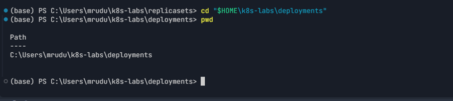
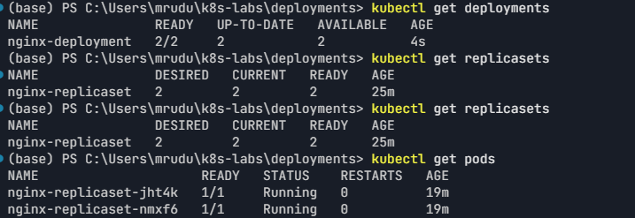
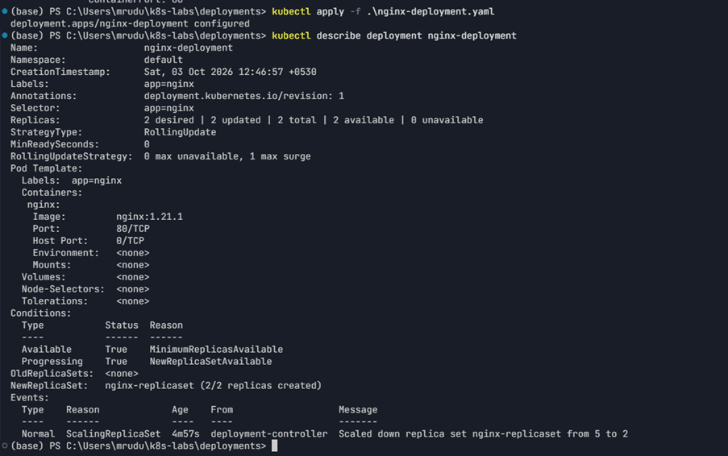
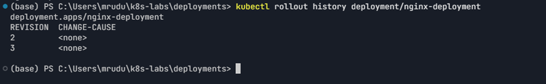
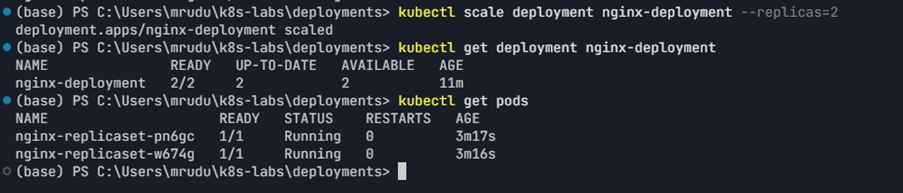

# Assignment 3 — Deployments: From Basics to Rolling Updates

Part of the DevOps Micro Internship (DMI) Cohort 3 with Agentic AI

---

## Purpose

In this guided lab, you will create an NGINX Deployment, add a zero-downtime RollingUpdate strategy, perform an image update, roll it back, and scale the workload.

---

# Task 1 — Set Up the Working Directory

## Goal

Create the `~/k8s-labs/deployments` working directory.

### Evidence

#### Screenshot 1 — Terminal showing the `~/k8s-labs/deployments` working directory

---

# Task 2 — Create the Basic Deployment

## Goal

Create `nginx-deployment.yaml` with two replicas and image `nginx:1.21.1`, apply it, and verify the Deployment, ReplicaSet, and Pods.

### Evidence

#### Screenshot 2 — Manifest plus `kubectl` output showing the Deployment, ReplicaSet, and two Pods

---

# Task 3 — Configure the RollingUpdate Strategy

## Goal

Add `strategy.rollingUpdate` with `maxSurge: 1` and `maxUnavailable: 0` to the Deployment and reapply it.

### Evidence

#### Screenshot 3 — Deployment YAML showing the RollingUpdate strategy and successful apply output

---

# Task 4 — Perform and Roll Back an Image Update

## Goal

Update the image to `nginx:1.23.1` with `kubectl set image`, watch the rollout, then roll it back with `kubectl rollout undo` and check rollout history.

### Evidence

#### Screenshot 4 — Rolling-update status, multiple ReplicaSets, and successful rollback/history output

---

# Task 5 — Scale the Deployment

## Goal

Scale to five replicas, verify, then scale back to two.

### Evidence

#### Screenshot 5 — Terminal showing the scale-up and scale-down results

---

### Notes

Write a short note describing what the lab demonstrated.

This lab demonstrated how Kubernetes Deployments manage ReplicaSets and Pods through declarative desired state. I created a two-replica NGINX Deployment, configured a RollingUpdate strategy with `maxSurge: 1` and `maxUnavailable: 0`, updated the image from `nginx:1.21.1` to `nginx:1.23.1`, verified the rollout and ReplicaSet revision, and successfully rolled back to the previous image. Finally, I scaled the Deployment from 2 to 5 replicas and back to 2.

---

# Submission Instructions

- Add all required screenshots in your submission
- Include the completed YAML manifests used in the lab

---

# Completion Checklist

- [x] Task 1: Lab directory created (Screenshot 1)
- [x] Task 2: Two-replica Deployment applied (Screenshot 2)
- [x] Task 3: RollingUpdate strategy configured (Screenshot 3)
- [x] Task 4: Image updated and rolled back (Screenshot 4)
- [x] Task 5: Scaled up and down (Screenshot 5)
- [x] Reflection notes written (Notes)

---

## 📌 About DMI & CloudAdvisory

DevOps Micro Internship (DMI) is a project-based DevOps program run by Pravin Mishra (The CloudAdvisory) focused on real-world execution, systems thinking, and career readiness.

It helps learners build strong DevOps foundations with hands-on experience.

---

## 📌 Resources

- 🌐 DMI Official Website: https://dmi.pravinmishra.com?utm_source=github&utm_medium=readme  
- 🎓 University: https://university.pravinmishra.com?utm_source=github&utm_medium=readme  
- 💬 Discord Community: https://discord.pravinmishra.com?utm_source=github&utm_medium=readme  
- 📝 Blog: https://dmi.pravinmishra.com/blog?utm_source=github&utm_medium=readme  
- ▶️ YouTube Playlist: https://www.youtube.com/playlist?list=PLFeSNDtI4Cho  
- 🔗 Pravin Mishra (LinkedIn): https://www.linkedin.com/in/pravin-mishra-aws-trainer/  
- 🏢 CloudAdvisory (LinkedIn): https://www.linkedin.com/company/thecloudadvisory/

---

*This submission is part of DevOps Micro Internship (DMI) Cohort 3 — Agentic AI Track.*
