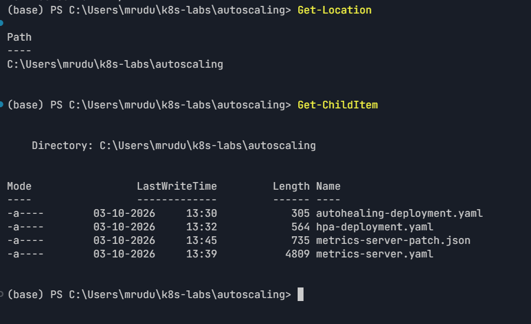
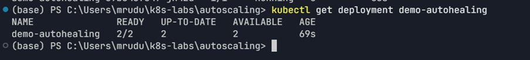
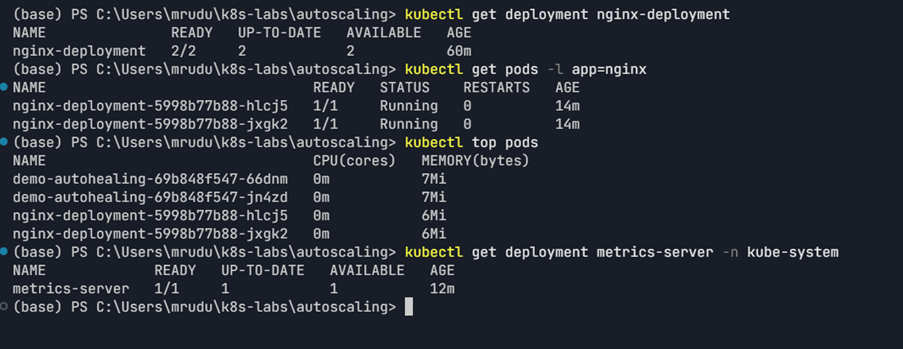
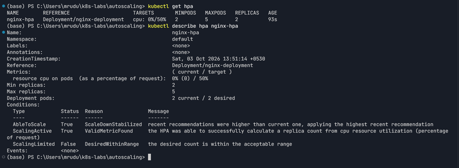
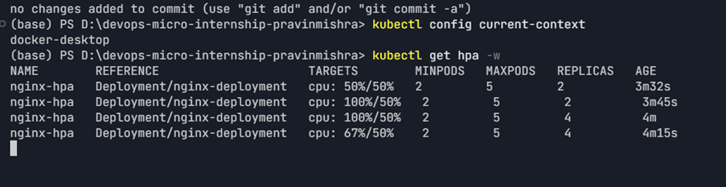

# Assignment 4 — Auto-Scaling & Auto-Healing: Let Kubernetes React for You

Part of the DevOps Micro Internship (DMI) Cohort 3 with Agentic AI

---

## Purpose

In this guided lab, you will prove Deployment auto-healing by deleting a Pod, then configure a CPU-based Horizontal Pod Autoscaler that maintains between two and five NGINX Pods.

---

# Task 1 — Set Up the Lab Directory

## Goal

Create the `~/k8s-labs/autoscaling` working directory.

### Evidence

#### Screenshot 1 — Terminal showing the `autoscaling` directory

---

# Task 2 — Prove Deployment Auto-Healing

## Goal

Create `demo-autohealing` (two replicas), delete one Pod, and confirm the desired count of two is restored automatically.

### Evidence

#### Screenshot 2 — Deleted Pod and replacement Pod with the replica count restored

---

# Task 3 — Create the HPA-Ready Deployment and Enable Metrics

## Goal

Deploy `nginx-deployment` with CPU `requests: 100m` / `limits: 200m`, then enable Metrics Server (Minikube addon or manifest + kubelet TLS patch for kind) and confirm it reports `READY 1/1`.

### Evidence

#### Screenshot 3 — Deployment resources plus successful Metrics Server status

---

# Task 4 — Create and Inspect the HPA

## Goal

Create an HPA (imperatively via `kubectl autoscale` or declaratively via `autoscaling/v2`) targeting `nginx-deployment` with min 2, max 5, and 50% target CPU utilization.

### Evidence

#### Screenshot 4 — `kubectl get hpa` and `kubectl describe hpa nginx-hpa` output

---

# Task 5 — Optionally Generate CPU Load

## Goal

Generate CPU load inside an NGINX Pod (`yes > /dev/null`) and monitor whether the HPA increases replicas.

### Evidence

#### Screenshot 5 — HPA output showing current metrics and any replica increase

---

### Notes

Write a short note describing what the lab demonstrated.

This lab demonstrated the difference between Kubernetes auto-healing and auto-scaling. The `demo-autohealing` Deployment automatically created a replacement Pod after one Pod was deleted, restoring the desired replica count of two.

For auto-scaling, `nginx-deployment` was configured with a CPU request of `100m` and a CPU limit of `200m`. Metrics Server was enabled and verified with `kubectl top pods`. An `autoscaling/v2` HPA was then configured with a minimum of 2 replicas, maximum of 5 replicas, and a target CPU utilization of 50%.

During the optional CPU-load test, CPU utilization increased and the HPA scaled the Deployment from 2 to 4 replicas. After the load was stopped, CPU utilization returned to 0%, while the HPA retained the additional replicas during the observed period.

---

# Submission Instructions

- Add all required screenshots in your submission
- Include the completed YAML manifests used in the lab

---

# Completion Checklist

- [x] Task 1: Lab directory created (Screenshot 1)
- [x] Task 2: Auto-healing observed (Screenshot 2)
- [x] Task 3: HPA-ready Deployment applied and Metrics Server verified (Screenshot 3)
- [x] Task 4: HPA created and inspected (Screenshot 4)
- [x] Task 5: CPU load generated and scaling observed (Screenshot 5, optional)
- [x] Reflection notes written (Notes)

---

## 📌 About DMI & CloudAdvisory

DevOps Micro Internship (DMI) is a project-based DevOps program run by Pravin Mishra (The CloudAdvisory) focused on real-world execution, systems thinking, and career readiness.

It helps learners build strong DevOps foundations with hands-on experience.

---

## 📌 Resources

- 🌐 DMI Official Website: https://dmi.pravinmishra.com?utm_source=github&utm_medium=readme  
- 🎓 University: https://university.pravinmishra.com?utm_source=github&utm_medium=readme  
- 💬 Discord Community: https://discord.pravinmishra.com?utm_source=github&utm_medium=readme  
- 📝 Blog: https://dmi.pravinmishra.com/blog?utm_source=github&utm_medium=readme  
- ▶️ YouTube Playlist: https://www.youtube.com/playlist?list=PLFeSNDtI4Cho  
- 🔗 Pravin Mishra (LinkedIn): https://www.linkedin.com/in/pravin-mishra-aws-trainer/  
- 🏢 CloudAdvisory (LinkedIn): https://www.linkedin.com/company/thecloudadvisory/

---

*This submission is part of DevOps Micro Internship (DMI) Cohort 3 — Agentic AI Track.*
