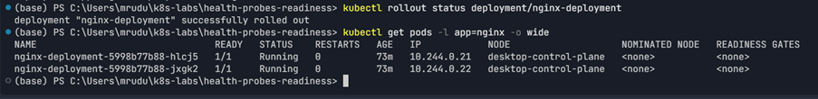
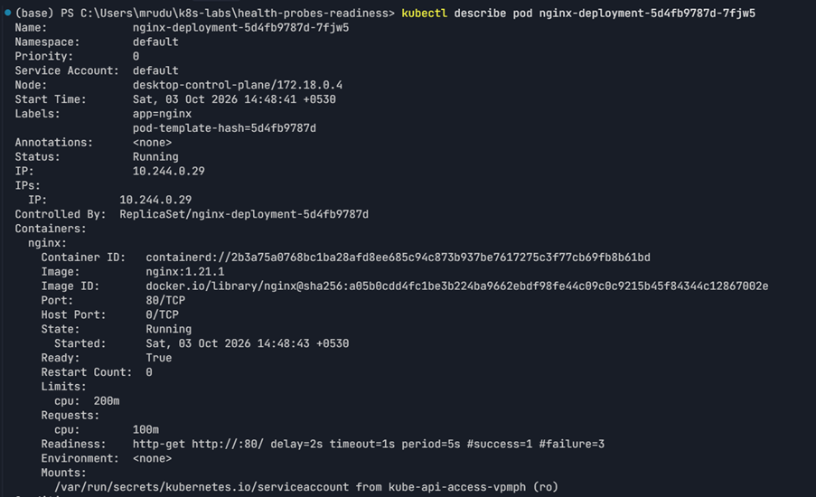
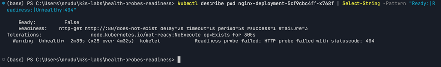
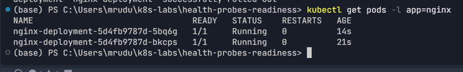
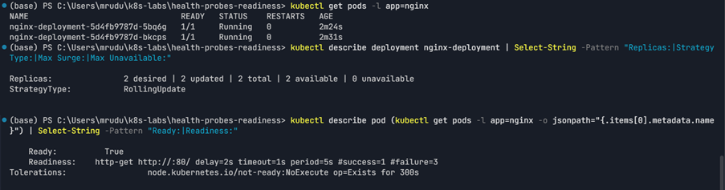

# Assignment 5 — Kubernetes Health Probes (Readiness)

Part of the DevOps Micro Internship (DMI) Cohort 3 with Agentic AI

---

## Purpose

In this guided lab, you will add an HTTP readiness probe to NGINX, intentionally break it, fix it, and prove that readiness gates Pod availability and safe rolling updates.

---

# Task 1 — Create the Baseline Deployment

## Goal

Deploy two NGINX Pods without probes (`00-nginx-deploy-baseline.yaml`) to establish the comparison state.

### Evidence

#### Screenshot 1 — Baseline manifest and healthy two-Pod rollout output

---

# Task 2 — Add the Readiness Probe

## Goal

Add an HTTP readiness probe on `/` port 80 (`01-nginx-deploy-readiness.yaml`) and confirm Pods become Ready only after it succeeds.

### Evidence

#### Screenshot 2 — Pod description showing the readiness probe and `Ready=True`

---

# Task 3 — Break and Fix Readiness

## Goal

Change the readiness path to `/does-not-exist`, observe `NotReady` and a stalled rollout, then restore the good manifest.

### Evidence

#### Screenshot 3 — `NotReady` conditions followed by a successful fixed rollout

---

# Task 4 — Prove Readiness-Gated Rolling Updates

## Goal

Perform a good image update to `nginx:1.21.2`, then attempt an update to `nginx:1.21.3` with a broken readiness patch, and confirm the rollout stalls before restoring the good spec.

### Evidence

#### Screenshot 4 — Successful good rollout, stalled broken rollout, and successful recovery

---

# Task 5 — Review Tuning and Optional Cleanup

## Goal

Review probe timing/thresholds and retain or delete the Deployment.

### Evidence

#### Screenshot 5 — Final healthy Pod state or optional cleanup output

---

### Notes

Write a short note describing what the lab demonstrated.

The lab demonstrated how an HTTP readiness probe controls Pod availability during normal operation and rolling updates. The `/does-not-exist` probe intentionally produced HTTP 404 failures, causing the affected Pod to remain `Ready=False` and preventing the rolling update from completing. Restoring the valid `/` readiness probe allowed the Deployment to recover and complete successfully. The Deployment was left in a healthy state with 2 available replicas, using a RollingUpdate strategy with `maxSurge: 1` and `maxUnavailable: 0`.

During Task 4, the requested `nginx:1.21.2` image tag was unavailable in the container registry, so `nginx:1.21.3` was used for the successful image update before applying the broken readiness configuration. The readiness-gated rollout behavior and recovery were demonstrated successfully.

---

# Submission Instructions

- Add all required screenshots in your submission
- Include the completed YAML manifests used in the lab

---

# Completion Checklist

- [x] Task 1: Baseline Deployment applied (Screenshot 1)
- [x] Task 2: Readiness probe added and verified (Screenshot 2)
- [x] Task 3: Readiness broken and fixed (Screenshot 3)
- [x] Task 4: Readiness-gated rolling update proven (Screenshot 4)
- [x] Task 5: Tuning reviewed / cleanup completed (Screenshot 5)
- [x] Reflection notes written (Notes)

---

## 📌 About DMI & CloudAdvisory

DevOps Micro Internship (DMI) is a project-based DevOps program run by Pravin Mishra (The CloudAdvisory) focused on real-world execution, systems thinking, and career readiness.

It helps learners build strong DevOps foundations with hands-on experience.

---

## 📌 Resources

- 🌐 DMI Official Website: https://dmi.pravinmishra.com?utm_source=github&utm_medium=readme  
- 🎓 University: https://university.pravinmishra.com?utm_source=github&utm_medium=readme  
- 💬 Discord Community: https://discord.pravinmishra.com?utm_source=github&utm_medium=readme  
- 📝 Blog: https://dmi.pravinmishra.com/blog?utm_source=github&utm_medium=readme  
- ▶️ YouTube Playlist: https://www.youtube.com/playlist?list=PLFeSNDtI4Cho  
- 🔗 Pravin Mishra (LinkedIn): https://www.linkedin.com/in/pravin-mishra-aws-trainer/  
- 🏢 CloudAdvisory (LinkedIn): https://www.linkedin.com/company/thecloudadvisory/

---

*This submission is part of DevOps Micro Internship (DMI) Cohort 3 — Agentic AI Track.*
