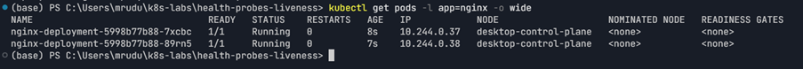
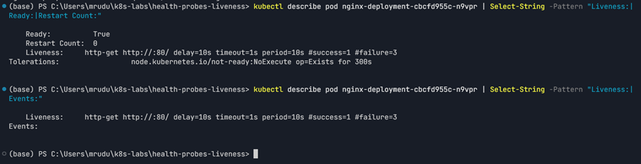
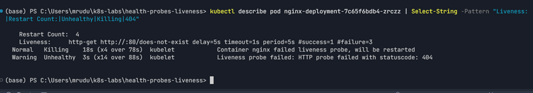
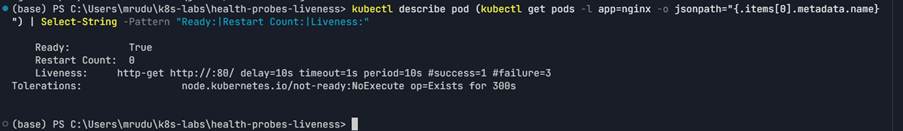
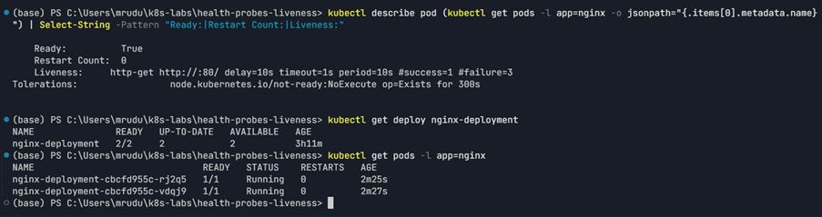

# Assignment 6 — Kubernetes Health Probes (Liveness)

Part of the DevOps Micro Internship (DMI) Cohort 3 with Agentic AI

---

## Purpose

In this guided lab, you will add an HTTP liveness probe to NGINX, force repeated failures, observe container restarts, restore the healthy probe, and review safe tuning.

---

# Task 1 — Create the Baseline Deployment

## Goal

Deploy two NGINX Pods without probes (`00-nginx-deploy-baseline.yaml`).

### Evidence

#### Screenshot 1 — Baseline Deployment and two running Pods

---

# Task 2 — Add the Liveness Probe

## Goal

Add an HTTP liveness probe on `/` port 80 (`01-nginx-deploy-liveness.yaml`) and confirm the kubelet checks it every 10 seconds after the initial delay.

### Evidence

#### Screenshot 2 — Pod description showing the liveness probe

---

# Task 3 — Trigger and Observe a Liveness Restart

## Goal

Change the liveness path to `/does-not-exist`, apply it, and watch `RESTARTS` increase over roughly 20 seconds.

### Evidence

#### Screenshot 3 — Pod RESTARTS increment and the corresponding liveness failure events

---

# Task 4 — Restore and Stabilize the Probe

## Goal

Reapply the good liveness manifest and confirm restart counts stop increasing.

### Evidence

#### Screenshot 4 — Stable Pod state after the fixed manifest is applied

---

# Task 5 — Review Tuning, Troubleshooting, and Cleanup

## Goal

Review recommended probe ranges and retain or delete the Deployment.

### Evidence

#### Screenshot 5 — Final healthy state and any troubleshooting evidence used

---

### Notes

Write a short note describing what the lab demonstrated.

The lab demonstrated how a Kubernetes liveness probe enables kubelet-driven self-healing for an unhealthy container. The healthy NGINX liveness probe checked HTTP `/` on port 80 and allowed the Pods to remain stable.

The `/does-not-exist` failure intentionally returned HTTP 404 responses. The kubelet detected the sustained liveness failures and restarted the NGINX containers, with the restart count increasing to 4 and corresponding `Unhealthy` and `Killing` events. Restoring the healthy liveness configuration stopped the restart behavior and returned the Deployment to a stable 2/2 healthy state.

The lab also demonstrated the distinction between liveness and readiness: liveness is used to restart an unhealthy container, while readiness controls whether a Pod is considered available for traffic.

---

# Submission Instructions

- Add all required screenshots in your submission
- Include the completed YAML manifests used in the lab

---

# Completion Checklist

- [x] Task 1: Baseline Deployment applied (Screenshot 1)
- [x] Task 2: Liveness probe added and verified (Screenshot 2)
- [x] Task 3: Liveness restart triggered and observed (Screenshot 3)
- [x] Task 4: Probe restored and stabilized (Screenshot 4)
- [x] Task 5: Tuning reviewed / cleanup completed (Screenshot 5)
- [x] Reflection notes written (Notes)

---

## 📌 About DMI & CloudAdvisory

DevOps Micro Internship (DMI) is a project-based DevOps program run by Pravin Mishra (The CloudAdvisory) focused on real-world execution, systems thinking, and career readiness.

It helps learners build strong DevOps foundations with hands-on experience.

---

## 📌 Resources

- 🌐 DMI Official Website: https://dmi.pravinmishra.com?utm_source=github&utm_medium=readme  
- 🎓 University: https://university.pravinmishra.com?utm_source=github&utm_medium=readme  
- 💬 Discord Community: https://discord.pravinmishra.com?utm_source=github&utm_medium=readme  
- 📝 Blog: https://dmi.pravinmishra.com/blog?utm_source=github&utm_medium=readme  
- ▶️ YouTube Playlist: https://www.youtube.com/playlist?list=PLFeSNDtI4Cho  
- 🔗 Pravin Mishra (LinkedIn): https://www.linkedin.com/in/pravin-mishra-aws-trainer/  
- 🏢 CloudAdvisory (LinkedIn): https://www.linkedin.com/company/thecloudadvisory/

---

*This submission is part of DevOps Micro Internship (DMI) Cohort 3 — Agentic AI Track.*
