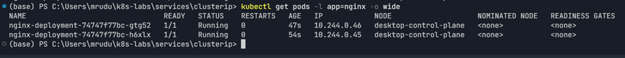
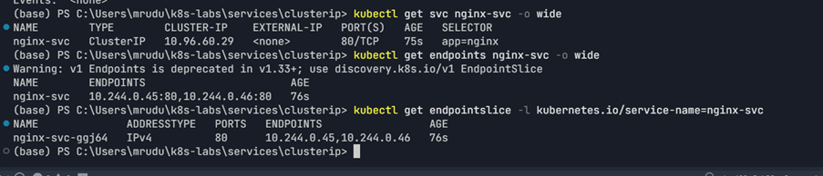
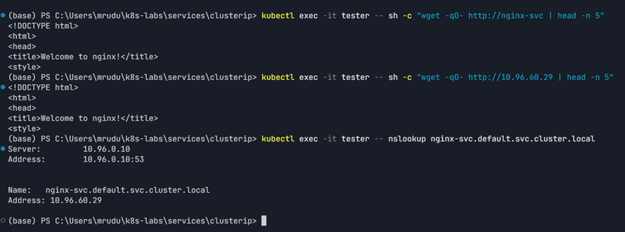
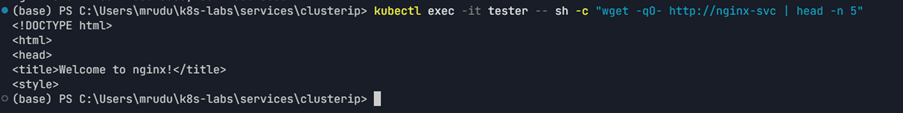
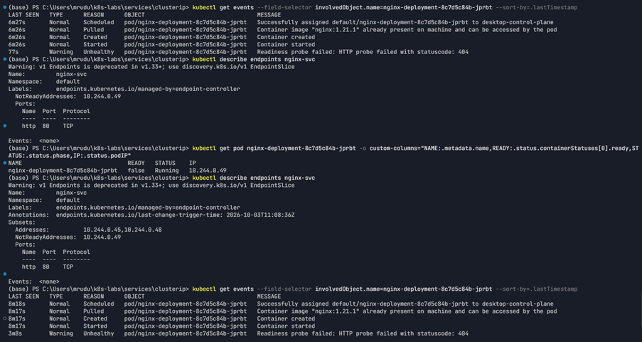
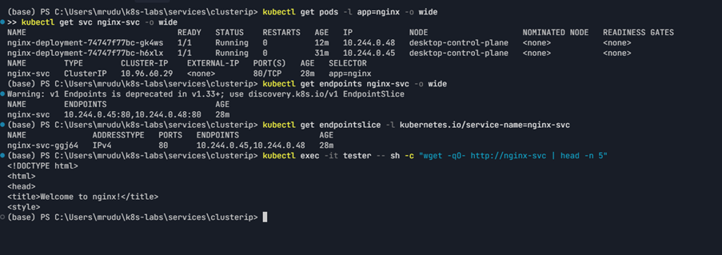

# Assignment 7 — Kubernetes Services (ClusterIP)

Part of the DevOps Micro Internship (DMI) Cohort 3 with Agentic AI

---

## Purpose

In this guided lab, you will create an internal ClusterIP Service for NGINX, call it by DNS and virtual IP, break and fix its selector, and prove readiness-aware endpoint routing.

---

# Task 1 — Deploy the Probed NGINX Workload

## Goal

Create two healthy, labeled NGINX Pods (readiness + liveness probes) as Service backends.

### Evidence

#### Screenshot 1 — Two Ready Pods with labels and IPs

---

# Task 2 — Create and Inspect the ClusterIP Service

## Goal

Create `nginx-svc` (type `ClusterIP`, selector `app: nginx`, port 80) and inspect the Service, Endpoints, and EndpointSlices.

### Evidence

#### Screenshot 2 — Service ClusterIP plus populated Endpoints and EndpointSlices

---

# Task 3 — Call the Service from a Client Pod

## Goal

Create a BusyBox `tester` Pod and call `nginx-svc` by short name, ClusterIP, and both short/FQDN via `nslookup`.

### Evidence

#### Screenshot 3 — Successful `wget` responses and `nslookup` output

---

# Task 4 — Break and Fix the Selector Contract

## Goal

Change the Service selector to `app: does-not-match`, confirm endpoints become empty and requests fail, then restore `app: nginx`.

### Evidence

#### Screenshot 4 — Empty endpoints during failure and restored endpoints after the fix

The broken selector produced no Service endpoints and requests to the ClusterIP failed with `Connection refused`. Restoring the `app: nginx` selector repopulated the endpoints and restored successful NGINX responses.

---

# Task 5 — Prove Readiness-Aware Routing

## Goal

Scale to one replica, apply a broken readiness patch, confirm the NotReady Pod is excluded from Service endpoints, then restore the healthy Deployment.

### Evidence

#### Screenshot 5 — NotReady Pod with excluded endpoint, followed by restored endpoint membership

The intentionally broken readiness probe used `/does-not-exist`, causing HTTP 404 readiness failures. The affected Pod became `Ready: False`, and its IP appeared under `NotReadyAddresses` instead of the ready endpoint list. The healthy Deployment was then restored.

---

# Task 6 — Troubleshoot and Optionally Clean Up

## Goal

Verify the Service path, then optionally delete `tester` and `nginx-svc`.

### Evidence

#### Screenshot 6 — Final verification or optional cleanup output

Final verification showed two Ready NGINX Pods, a ClusterIP Service, populated Endpoints and EndpointSlice records, and successful Service access from the `tester` Pod.

---

### Notes

This lab demonstrated how a Kubernetes ClusterIP Service provides stable internal discovery while Pod IPs remain ephemeral.

The `app: nginx` label and Service selector formed the Service-to-Pod contract. When the selector was intentionally changed to `app: does-not-match`, the Service had no endpoints and requests failed. Restoring the selector immediately restored endpoint membership and routing.

The lab also demonstrated readiness-aware routing. When the readiness probe was intentionally changed to `/does-not-exist`, the affected Pod became NotReady and its IP was excluded from the ready endpoint addresses. Restoring the healthy Deployment returned the Service to two healthy NGINX backends.

---

# Submission Instructions

- Add all required screenshots in your submission
- Include the completed YAML manifests used in the lab

---

# Completion Checklist

- [x] Task 1: Probed NGINX Deployment applied (Screenshot 1)
- [x] Task 2: ClusterIP Service created and inspected (Screenshot 2)
- [x] Task 3: Service reached by DNS and ClusterIP (Screenshot 3)
- [x] Task 4: Selector broken and fixed (Screenshot 4)
- [x] Task 5: Readiness-aware routing proven (Screenshot 5)
- [x] Task 6: Verified / cleaned up (Screenshot 6)
- [x] Reflection notes written (Notes)

---

## 📌 About DMI & CloudAdvisory

DevOps Micro Internship (DMI) is a project-based DevOps program run by Pravin Mishra (The CloudAdvisory) focused on real-world execution, systems thinking, and career readiness.

It helps learners build strong DevOps foundations with hands-on experience.

---

## 📌 Resources

- 🌐 DMI Official Website: https://dmi.pravinmishra.com?utm_source=github&utm_medium=readme  
- 🎓 University: https://university.pravinmishra.com?utm_source=github&utm_medium=readme  
- 💬 Discord Community: https://discord.pravinmishra.com?utm_source=github&utm_medium=readme  
- 📝 Blog: https://dmi.pravinmishra.com/blog?utm_source=github&utm_medium=readme  
- ▶️ YouTube Playlist: https://www.youtube.com/playlist?list=PLFeSNDtI4Cho  
- 🔗 Pravin Mishra (LinkedIn): https://www.linkedin.com/in/pravin-mishra-aws-trainer/  
- 🏢 CloudAdvisory (LinkedIn): https://www.linkedin.com/company/thecloudadvisory/

---

*This submission is part of DevOps Micro Internship (DMI) Cohort 3 — Agentic AI Track.*
