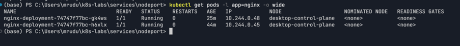
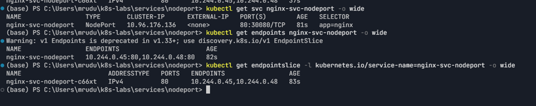
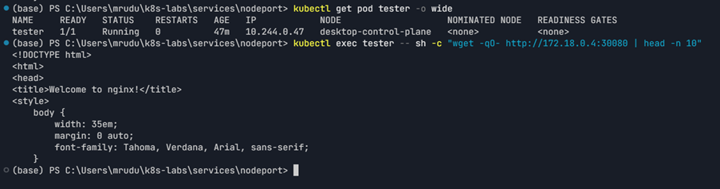
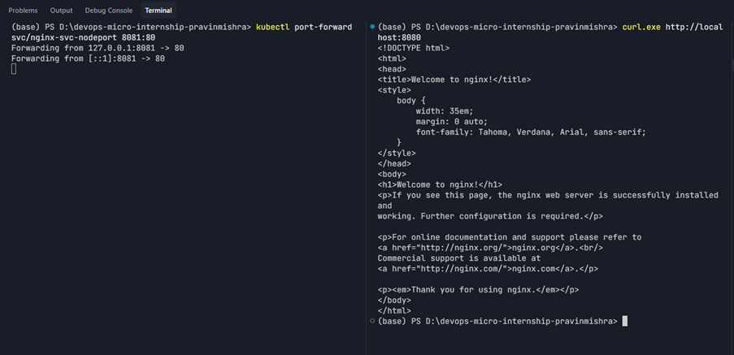
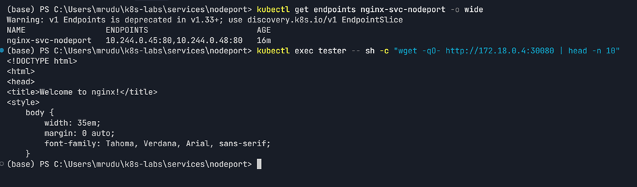
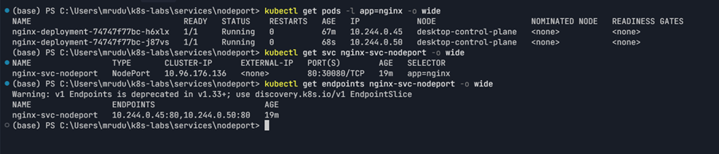

# Assignment 8 — Kubernetes Services (NodePort)

Part of the DevOps Micro Internship (DMI) Cohort 3 with Agentic AI

---

## Purpose

In this guided lab, you will expose NGINX on node port 30080, test it from outside and inside the cluster, break and fix the selector, and verify availability during Pod churn.

---

# Task 1 — Deploy the Probed NGINX Workload

## Goal

Create healthy, labeled NGINX Pods (readiness + liveness probes) for the NodePort Service.

### Evidence

#### Screenshot 1 — Healthy NGINX Pods before Service creation

---

# Task 2 — Create the NodePort Service

## Goal

Create `nginx-svc-nodeport` (type `NodePort`, port 80, `nodePort: 30080`) and inspect the Service and endpoints.

### Evidence

#### Screenshot 2 — Service output showing `80:30080` and populated endpoints

---

# Task 3 — Find a Node IP and Test Access

## Goal

Find a reachable node IP and test `<NODE_IP>:30080` externally (curl) and internally (from a `tester` Pod).

### Evidence

#### Screenshot 3 — Successful external or internal NodePort response

---

# Task 4 — Use the Environment-Specific Access Method

## Goal

Use the appropriate fallback for your cluster environment (`minikube service --url`, or port-forward for kind/Docker Desktop) to validate the Service.

### Evidence

#### Screenshot 4 — Minikube helper URL or local validation result

---

# Task 5 — Break and Fix the Selector

## Goal

Change the selector to `app: does-not-match`, confirm endpoints empty and the request fails, then restore the good selector.

### Evidence

#### Screenshot 5 — Empty then restored endpoint output

---

# Task 6 — Test Pod Churn and Clean Up

## Goal

Delete one backend Pod while calling the NodePort from another terminal, confirm the Service remains available, then optionally clean up.

### Evidence

#### Screenshot 6 — Pod replacement while NodePort remains available

---

### Notes

Write a short note describing what the lab demonstrated.

This lab demonstrated how a Kubernetes NodePort Service exposes an application on a node port and routes traffic to healthy Pods selected by labels. It also demonstrated that incorrect Service selectors result in empty endpoints and failed requests, while restoring the selector restores routing. Finally, Pod churn showed that Kubernetes automatically replaces deleted Pods and updates Service endpoints while maintaining the desired application state.

---

# Submission Instructions

- Add all required screenshots in your submission
- Include the completed YAML manifests used in the lab

---

# Completion Checklist

- [x] Task 1: Probed NGINX Deployment applied (Screenshot 1)
- [x] Task 2: NodePort Service created on 30080 (Screenshot 2)
- [x] Task 3: NodePort tested externally/internally (Screenshot 3)
- [x] Task 4: Environment-specific access method used (Screenshot 4)
- [x] Task 5: Selector broken and fixed (Screenshot 5)
- [x] Task 6: Pod churn tested and Service continuity confirmed (Screenshot 6)
- [x] Reflection notes written (Notes)

---

## 📌 About DMI & CloudAdvisory

DevOps Micro Internship (DMI) is a project-based DevOps program run by Pravin Mishra (The CloudAdvisory) focused on real-world execution, systems thinking, and career readiness.

It helps learners build strong DevOps foundations with hands-on experience.

---

## 📌 Resources

- 🌐 DMI Official Website: https://dmi.pravinmishra.com?utm_source=github&utm_medium=readme  
- 🎓 University: https://university.pravinmishra.com?utm_source=github&utm_medium=readme  
- 💬 Discord Community: https://discord.pravinmishra.com?utm_source=github&utm_medium=readme  
- 📝 Blog: https://dmi.pravinmishra.com/blog?utm_source=github&utm_medium=readme  
- ▶️ YouTube Playlist: https://www.youtube.com/playlist?list=PLFeSNDtI4Cho  
- 🔗 Pravin Mishra (LinkedIn): https://www.linkedin.com/in/pravin-mishra-aws-trainer/  
- 🏢 CloudAdvisory (LinkedIn): https://www.linkedin.com/company/thecloudadvisory/

---

*This submission is part of DevOps Micro Internship (DMI) Cohort 3 — Agentic AI Track.*
