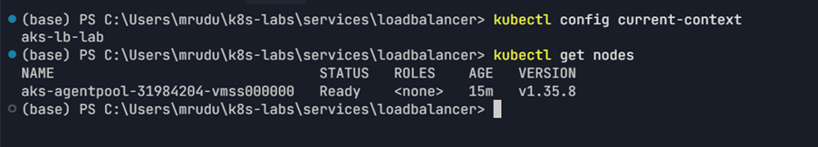
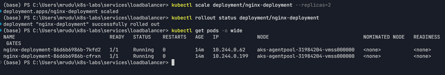
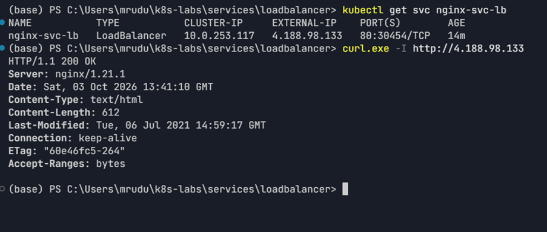
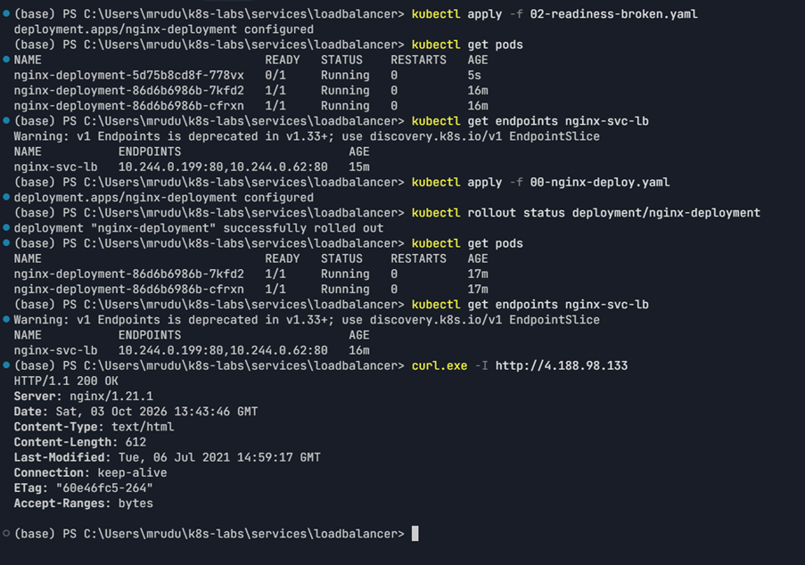
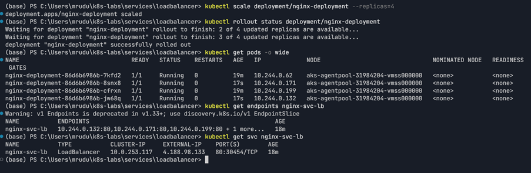
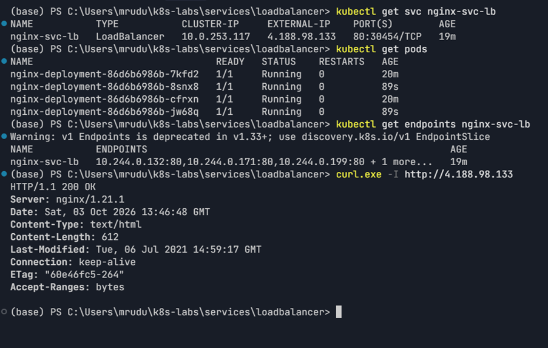

# Assignment 9 — Kubernetes Services (LoadBalancer)

Part of the DevOps Micro Internship (DMI) Cohort 3 with Agentic AI

---

## Purpose

In this guided lab, you will provision a small AKS cluster, deploy probed NGINX Pods, expose them with a public LoadBalancer Service, test the internet endpoint, and observe readiness and scaling.

---

# Task 1 — Provision and Connect to AKS

## Goal

Create resource group `rg-aks-lb-lab` and a one-node AKS cluster `aks-lb-lab` (`westeurope`, `Standard_B2s`), then fetch credentials and verify the node.

### Evidence

#### Screenshot 1 — AKS creation result and Ready node output

---

# Task 2 — Deploy the Probed NGINX Workload

## Goal

Create two healthy, probed NGINX Pods for the public Service.

### Evidence

#### Screenshot 2 — Successful rollout and two Ready Pods

---

# Task 3 — Create and Test the LoadBalancer Service

## Goal

Create `nginx-svc-lb` (type `LoadBalancer`, port 80), wait for `EXTERNAL-IP`, and test it with `curl`.

### Evidence

#### Screenshot 3 — Service with public `EXTERNAL-IP` and successful `curl` output

---

# Task 4 — Prove Readiness Affects Public Traffic

## Goal

Apply a broken readiness patch, confirm the Pod leaves the endpoint set and public availability is affected, then restore health.

### Evidence

#### Screenshot 4 — Endpoint changes and public `curl` behavior before and after recovery

---

# Task 5 — Scale Behind the Stable Public Endpoint

## Goal

Scale to four replicas and confirm the endpoint set grows while the public IP stays the same.

### Evidence

#### Screenshot 5 — Four replicas/endpoints behind the unchanged public endpoint

---

# Task 6 — Troubleshoot and Clean Up

## Goal

Resolve any pending endpoint or unhealthy backend issues, then delete the Kubernetes objects and Azure resource group when finished.

### Evidence

#### Screenshot 6 — Clean final verification or resource deletion command output

---

### Notes

Write a short note describing what the lab demonstrated.

This lab demonstrated how a Kubernetes `LoadBalancer` Service exposes a workload through a stable public endpoint.

The lab also demonstrated that:

1. Kubernetes readiness probes control whether Pods are included in Service endpoints.
2. A failing readiness probe removes the affected Pod from the endpoint set while the Pod can remain in a `Running` state.
3. Restoring the readiness probe causes the healthy Pod to become Ready and return to the Service endpoint set.
4. Scaling the Deployment from two to four replicas expands the endpoint set without changing the Service's public IP.
5. Azure AKS provisioning can depend on subscription-specific region, SKU, and quota availability.

Due to Azure subscription restrictions, the lab environment differed from the original requested `westeurope` / `Standard_B2s` configuration. Central India with `Standard_D4s_v4` was used to complete the same Kubernetes LoadBalancer objectives.

---

# Submission Instructions

- Add all required screenshots in your submission
- Include the completed YAML manifests used in the lab

---

# Completion Checklist

- [x] Task 1: AKS cluster provisioned and connected (Screenshot 1)
- [x] Task 2: Probed NGINX Deployment applied (Screenshot 2)
- [x] Task 3: LoadBalancer Service created and tested (Screenshot 3)
- [x] Task 4: Readiness impact on public traffic proven (Screenshot 4)
- [x] Task 5: Scaled behind the stable endpoint (Screenshot 5)
- [x] Task 6: Verified / cleaned up Azure resources (Screenshot 6)
- [x] Reflection notes written (Notes)

---

## 📌 About DMI & CloudAdvisory

DevOps Micro Internship (DMI) is a project-based DevOps program run by Pravin Mishra (The CloudAdvisory) focused on real-world execution, systems thinking, and career readiness.

It helps learners build strong DevOps foundations with hands-on experience.

---

## 📌 Resources

- 🌐 DMI Official Website: https://dmi.pravinmishra.com?utm_source=github&utm_medium=readme  
- 🎓 University: https://university.pravinmishra.com?utm_source=github&utm_medium=readme  
- 💬 Discord Community: https://discord.pravinmishra.com?utm_source=github&utm_medium=readme  
- 📝 Blog: https://dmi.pravinmishra.com/blog?utm_source=github&utm_medium=readme  
- ▶️ YouTube Playlist: https://www.youtube.com/playlist?list=PLFeSNDtI4Cho  
- 🔗 Pravin Mishra (LinkedIn): https://www.linkedin.com/in/pravin-mishra-aws-trainer/  
- 🏢 CloudAdvisory (LinkedIn): https://www.linkedin.com/company/thecloudadvisory/

---

*This submission is part of DevOps Micro Internship (DMI) Cohort 3 — Agentic AI Track.*
